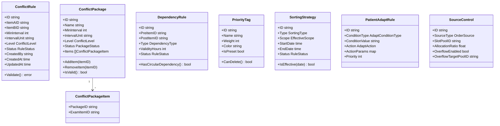

# 规则引擎子系统详细设计

| 项目 | 内容 |
|------|------|
| 模块编号 | MOD-01 |
| 对应规格书 | 4.1 预约规则引擎子系统 |
| 对应限界上下文 | rule |
| 上游依赖 | 无（最底层模块） |
| 下游消费者 | 预约服务子系统、智能效能优化子系统 |

---

## 1 模块定位

规则引擎是预约平台的**决策中枢**，为预约调度提供冲突检测、依赖校验、优先级排序、时间窗口计算、患者适配、来源控制等核心规则能力。**本模块不直接操作号源和预约**，仅提供规则判定结果供上层调用。

---

## 2 领域模型

### 2.1 聚合根与实体



### 2.2 值对象

```go
// ConflictLevel 冲突级别
type ConflictLevel string
const (
    ConflictLevelForbid  ConflictLevel = "forbid"   // 禁止级 - 不可跳过
    ConflictLevelWarning ConflictLevel = "warning"   // 警告级 - 允许确认后继续
)

// DependencyType 依赖类型
type DependencyType string
const (
    DependencyTypeMandatory   DependencyType = "mandatory"   // 强制依赖
    DependencyTypeRecommended DependencyType = "recommended" // 推荐依赖
)

// SortingType 排序策略类型
type SortingType string
const (
    SortingTypeShortestWait SortingType = "shortest_wait" // 等待时间最短
    SortingTypeNearest      SortingType = "nearest"       // 距离最近
    SortingTypePriority     SortingType = "priority"      // 指定优先级
)

// EffectiveScope 生效范围
type EffectiveScope struct {
    CampusIDs     []string // 院区ID列表
    DepartmentIDs []string // 科室ID列表
    DeviceIDs     []string // 设备ID列表
}

// FastingItem 空腹项目标记
type FastingItem struct {
    ExamItemID  string
    IsFasting   bool
    Description string // 最长200字符
}

// AdaptConditionType 适配条件类型
type AdaptConditionType string
const (
    AdaptConditionAge       AdaptConditionType = "age"       // 年龄范围
    AdaptConditionGender    AdaptConditionType = "gender"    // 性别
    AdaptConditionPregnancy AdaptConditionType = "pregnancy" // 孕产妇
)

// AdaptAction 适配动作
type AdaptAction string
const (
    AdaptActionFilterDevice AdaptAction = "filter_device" // 过滤设备
    AdaptActionFilterSlot   AdaptAction = "filter_slot"   // 过滤时段
    AdaptActionFilterDoctor AdaptAction = "filter_doctor"  // 过滤医生
)

// OrderSource 开单来源
type OrderSource string
const (
    OrderSourceOutpatient OrderSource = "outpatient" // 门诊
    OrderSourceInpatient  OrderSource = "inpatient"  // 住院
    OrderSourceReferral   OrderSource = "referral"   // 转诊
)

// RuleStatus 规则状态
type RuleStatus string
const (
    RuleStatusActive   RuleStatus = "active"
    RuleStatusInactive RuleStatus = "inactive"
)
```

### 2.3 聚合边界与不变量

| 聚合根 | 不变量 | 约束来源 |
|--------|--------|----------|
| `ConflictRule` | ItemA ≠ ItemB；MinInterval ∈ [0, 720]；同一项目对不可重复 | 规格书 4.1.2.1 |
| `ConflictPackage` | 包内项目 ≥ 2 个（否则自动失效）；名称唯一 | 规格书 4.1.2.2 |
| `DependencyRule` | 不允许循环依赖；ValidityHours > 0 | 规格书 4.1.2.3 |
| `PriorityTag` | 名称唯一；权重 ∈ [1, 100]；预置标签不可删除 | 规格书 4.1.1.2 |
| `SortingStrategy` | EndDate > StartDate；同范围同时段仅一条生效 | 规格书 4.1.1.1 |

---

## 3 领域服务

### 3.1 ConflictDetectionService（冲突检测服务）

**职责**：给定一组检查项目，检测项目间的冲突关系，返回冲突详情。

```go
type ConflictDetectionService interface {
    // DetectConflicts 检测一组项目间的冲突
    // 输入：待检查的项目ID列表 + 患者近期检查历史
    // 输出：冲突结果列表（项目对 + 冲突级别 + 原因描述）
    DetectConflicts(ctx context.Context, input ConflictDetectionInput) ([]ConflictResult, error)
}

type ConflictDetectionInput struct {
    ExamItemIDs      []string          // 本次待预约的项目ID列表
    PatientHistory   []PatientExamRecord // 患者近期检查记录（用于时间间隔判断）
}

type ConflictResult struct {
    ItemAID     string
    ItemAName   string
    ItemBID     string
    ItemBName   string
    Level       ConflictLevel
    MinInterval int           // 最小间隔（小时）
    ActualInterval int        // 实际间隔（小时），-1表示同次预约
    Reason      string        // 冲突原因描述
    RuleID      string        // 触发的规则ID
}
```

**处理逻辑**：
1. 加载所有启用的冲突规则和冲突包
2. 对项目列表做两两组合遍历
3. 匹配冲突规则（直接规则 + 冲突包展开的规则）
4. 检查患者历史记录中的时间间隔
5. 同一项目对存在多条规则时，取最严格的

### 3.2 DependencyValidationService（依赖校验服务）

**职责**：校验检查项目的前置依赖是否满足。

```go
type DependencyValidationService interface {
    // ValidateDependencies 校验项目的前置依赖
    // 调用HIS接口查询前置项目完成状态
    ValidateDependencies(ctx context.Context, input DependencyValidationInput) ([]DependencyResult, error)
}

type DependencyValidationInput struct {
    ExamItemIDs []string // 待预约的项目ID列表
    PatientID   string   // 患者ID（用于查询前置项目完成状态）
}

type DependencyResult struct {
    PostItemID     string
    PostItemName   string
    PreItemID      string
    PreItemName    string
    Type           DependencyType
    Status         DependencyStatus // passed / blocked / unknown / expired
    ValidityHours  int
    CompletedAt    *time.Time       // 前置项目完成时间
    Reason         string
}

type DependencyStatus string
const (
    DependencyPassed  DependencyStatus = "passed"  // 前置已完成且在时效内
    DependencyBlocked DependencyStatus = "blocked" // 前置未完成
    DependencyExpired DependencyStatus = "expired" // 前置已过时效
    DependencyUnknown DependencyStatus = "unknown" // HIS查询失败
)
```

**处理逻辑**：
1. 查询项目关联的所有依赖规则
2. 对每条强制依赖，调用 HIS 接口查询前置项目完成状态
3. HIS 超时时按 `unknown` 处理，允许预约但标记"待前置验证"
4. 保存时检测循环依赖（DFS/拓扑排序）

### 3.3 TimeWindowCalculator（时间窗口计算服务）

**职责**：给定多个检查项目，计算最优时间组合方案。

```go
type TimeWindowCalculator interface {
    // Calculate 计算最优时间窗口组合
    // 输入：项目列表 + 可用号源 + 患者属性
    // 输出：最多3套候选方案
    Calculate(ctx context.Context, input TimeWindowInput) ([]AppointmentPlan, error)
}

type TimeWindowInput struct {
    ExamItems      []ExamItemInfo    // 项目信息（ID + 耗时 + 空腹标记）
    AvailableSlots []AvailableSlot   // 可用号源列表
    PatientAge     int               // 患者年龄（用于耗时折算）
    Preferences    SchedulePreference // 偏好（时段、日期范围）
}

type AppointmentPlan struct {
    PlanID       string
    PlanType     string            // shortest_time / least_trips / earliest
    Items        []PlanItem        // 各项目的安排详情
    TotalMinutes int               // 总耗时（分钟）
    WaitMinutes  int               // 等待间隙（分钟）
    TripCount    int               // 往返次数
    Score        float64           // 综合评分
}

type PlanItem struct {
    ExamItemID   string
    ExamItemName string
    DeviceID     string
    DeviceName   string
    RoomLocation string
    StartTime    time.Time
    EndTime      time.Time
    IsFasting    bool
}
```

**处理逻辑**：
1. 空腹项目标记前置，必须安排在当日最早时段
2. 遍历可用号源，以总等待时间最短为优化目标
3. 同一时段同一患者不可安排在两个不同检查室
4. 超时 3 秒中止计算，返回部分结果
5. 最多生成 3 套方案（总耗时最短 / 往返最少 / 最早可约）

### 3.4 PatientAdaptService（患者属性适配服务）

```go
type PatientAdaptService interface {
    // FilterByPatientAttr 根据患者属性过滤号源
    // 返回符合患者属性的设备ID和时段
    FilterByPatientAttr(ctx context.Context, patient PatientAttr, slots []AvailableSlot) ([]AvailableSlot, error)
}

type PatientAttr struct {
    Age        int
    Gender     string // male / female / unknown
    IsPregnant bool
}
```

**处理逻辑**：
1. 加载所有启用的适配规则
2. 按患者属性逐条匹配规则
3. 多规则取交集（如孕产妇 + 性别隔离同时满足）
4. 属性缺失时按"普通成人"默认处理

### 3.5 PriorityScorer（优先级评分服务）

```go
type PriorityScorer interface {
    // Score 计算预约请求的优先级权重
    Score(ctx context.Context, tags []string, source OrderSource) (int, error)
}
```

---

## 4 应用服务

### 4.1 规则 CRUD 应用服务

```go
type RuleAppService interface {
    // === 冲突规则 ===
    CreateConflictRule(ctx context.Context, req CreateConflictRuleReq) (*ConflictRuleResp, error)
    UpdateConflictRule(ctx context.Context, id string, req UpdateConflictRuleReq) error
    DeleteConflictRule(ctx context.Context, id string) error
    ListConflictRules(ctx context.Context, req ListConflictRulesReq) (*PageResult[ConflictRuleResp], error)

    // === 冲突包 ===
    CreateConflictPackage(ctx context.Context, req CreateConflictPackageReq) (*ConflictPackageResp, error)
    UpdateConflictPackage(ctx context.Context, id string, req UpdateConflictPackageReq) error
    DeleteConflictPackage(ctx context.Context, id string) error
    ListConflictPackages(ctx context.Context, req ListConflictPackagesReq) (*PageResult[ConflictPackageResp], error)

    // === 依赖规则 ===
    CreateDependencyRule(ctx context.Context, req CreateDependencyRuleReq) (*DependencyRuleResp, error)
    UpdateDependencyRule(ctx context.Context, id string, req UpdateDependencyRuleReq) error
    DeleteDependencyRule(ctx context.Context, id string) error
    ListDependencyRules(ctx context.Context, req ListDependencyRulesReq) (*PageResult[DependencyRuleResp], error)

    // === 优先级标签 ===
    CreatePriorityTag(ctx context.Context, req CreatePriorityTagReq) (*PriorityTagResp, error)
    UpdatePriorityTag(ctx context.Context, id string, req UpdatePriorityTagReq) error
    DeletePriorityTag(ctx context.Context, id string) error
    ListPriorityTags(ctx context.Context) ([]PriorityTagResp, error)

    // === 排序策略 ===
    SaveSortingStrategy(ctx context.Context, req SaveSortingStrategyReq) error
    GetSortingStrategy(ctx context.Context, scope EffectiveScope) (*SortingStrategyResp, error)

    // === 患者属性适配 ===
    SavePatientAdaptRules(ctx context.Context, rules []SavePatientAdaptRuleReq) error
    ListPatientAdaptRules(ctx context.Context) ([]PatientAdaptRuleResp, error)

    // === 开单来源控制 ===
    SaveSourceControls(ctx context.Context, controls []SaveSourceControlReq) error
    ListSourceControls(ctx context.Context) ([]SourceControlResp, error)
}
```

### 4.2 规则校验应用服务

```go
type RuleCheckAppService interface {
    // CheckRules 综合规则校验（供预约服务子系统调用）
    // 一次调用完成：冲突检测 + 依赖校验 + 患者适配 + 空腹前置 + 优先级计算
    CheckRules(ctx context.Context, req RuleCheckReq) (*RuleCheckResp, error)
}

type RuleCheckReq struct {
    PatientID    string       // 患者ID
    PatientAttr  PatientAttr  // 患者属性
    ExamItemIDs  []string     // 检查项目ID列表
    OrderSource  OrderSource  // 开单来源
}

type RuleCheckResp struct {
    Conflicts    []ConflictResult    // 冲突结果
    Dependencies []DependencyResult  // 依赖结果
    HasForbidden bool               // 是否存在禁止级冲突
    HasBlocked   bool               // 是否存在强制依赖未满足
    FastingItems []string            // 空腹项目ID列表（需前置）
    PriorityScore int               // 优先级评分
    FilteredPoolIDs []string         // 适配后的可用号源池ID
    Warnings     []string            // 警告信息列表
}
```

---

## 5 接口设计

### 5.1 HTTP API

#### 冲突规则

| 方法 | 路径 | 说明 | 权限 |
|------|------|------|------|
| POST | `/api/v1/rules/conflicts` | 创建冲突规则 | 管理员 |
| GET | `/api/v1/rules/conflicts` | 查询冲突规则列表 | 管理员 |
| GET | `/api/v1/rules/conflicts/:id` | 查询冲突规则详情 | 管理员 |
| PUT | `/api/v1/rules/conflicts/:id` | 更新冲突规则 | 管理员 |
| DELETE | `/api/v1/rules/conflicts/:id` | 删除冲突规则 | 管理员 |

**创建冲突规则** `POST /api/v1/rules/conflicts`

```json
// Request
{
    "item_a_id": "EXAM001",
    "item_b_id": "EXAM002",
    "min_interval": 48,
    "interval_unit": "hour",
    "level": "warning"
}

// Response 201
{
    "code": 0,
    "message": "success",
    "data": {
        "id": "CR001",
        "item_a_id": "EXAM001",
        "item_a_name": "CT增强",
        "item_b_id": "EXAM002",
        "item_b_name": "MRI增强",
        "min_interval": 48,
        "interval_unit": "hour",
        "level": "warning",
        "status": "active",
        "created_at": "2025-03-19T10:00:00+08:00"
    }
}
```

#### 冲突包

| 方法 | 路径 | 说明 | 权限 |
|------|------|------|------|
| POST | `/api/v1/rules/conflict-packages` | 创建冲突包 | 管理员 |
| GET | `/api/v1/rules/conflict-packages` | 查询冲突包列表 | 管理员 |
| PUT | `/api/v1/rules/conflict-packages/:id` | 更新冲突包 | 管理员 |
| DELETE | `/api/v1/rules/conflict-packages/:id` | 删除冲突包 | 管理员 |

**创建冲突包** `POST /api/v1/rules/conflict-packages`

```json
// Request
{
    "name": "造影剂检查互斥组",
    "item_ids": ["EXAM001", "EXAM002", "EXAM003"],
    "min_interval": 24,
    "interval_unit": "hour",
    "level": "forbid"
}

// Response 201
{
    "code": 0,
    "message": "success",
    "data": {
        "id": "CP001",
        "name": "造影剂检查互斥组",
        "items": [
            {"exam_item_id": "EXAM001", "exam_item_name": "CT增强"},
            {"exam_item_id": "EXAM002", "exam_item_name": "MRI增强"},
            {"exam_item_id": "EXAM003", "exam_item_name": "血管造影"}
        ],
        "min_interval": 24,
        "level": "forbid",
        "status": "active"
    }
}
```

#### 依赖规则

| 方法 | 路径 | 说明 | 权限 |
|------|------|------|------|
| POST | `/api/v1/rules/dependencies` | 创建依赖规则 | 管理员 |
| GET | `/api/v1/rules/dependencies` | 查询依赖规则列表 | 管理员 |
| PUT | `/api/v1/rules/dependencies/:id` | 更新依赖规则 | 管理员 |
| DELETE | `/api/v1/rules/dependencies/:id` | 删除依赖规则 | 管理员 |

**创建依赖规则** `POST /api/v1/rules/dependencies`

```json
// Request
{
    "pre_item_id": "EXAM_BLOOD",
    "post_item_id": "EXAM_GASTRO",
    "type": "mandatory",
    "validity_hours": 72
}
```

#### 优先级标签

| 方法 | 路径 | 说明 | 权限 |
|------|------|------|------|
| POST | `/api/v1/rules/priority-tags` | 创建优先级标签 | 管理员 |
| GET | `/api/v1/rules/priority-tags` | 查询全部标签 | 管理员 |
| PUT | `/api/v1/rules/priority-tags/:id` | 更新标签 | 管理员 |
| DELETE | `/api/v1/rules/priority-tags/:id` | 删除标签 | 管理员 |

#### 排序策略

| 方法 | 路径 | 说明 | 权限 |
|------|------|------|------|
| POST | `/api/v1/rules/sorting-strategies` | 保存排序策略 | 管理员 |
| GET | `/api/v1/rules/sorting-strategies` | 查询排序策略 | 管理员 |

#### 患者属性适配

| 方法 | 路径 | 说明 | 权限 |
|------|------|------|------|
| POST | `/api/v1/rules/patient-adapt` | 保存适配规则 | 管理员 |
| GET | `/api/v1/rules/patient-adapt` | 查询适配规则列表 | 管理员 |

#### 开单来源控制

| 方法 | 路径 | 说明 | 权限 |
|------|------|------|------|
| POST | `/api/v1/rules/source-controls` | 保存来源控制 | 管理员 |
| GET | `/api/v1/rules/source-controls` | 查询来源控制列表 | 管理员 |

#### 规则校验（核心接口）

| 方法 | 路径 | 说明 | 权限 |
|------|------|------|------|
| POST | `/api/v1/rules/check` | 综合规则校验 | 操作员+ |

**规则校验** `POST /api/v1/rules/check`

```json
// Request
{
    "patient_id": "P20250001",
    "patient_attr": {
        "age": 45,
        "gender": "male",
        "is_pregnant": false
    },
    "exam_item_ids": ["EXAM_CT_PLAIN", "EXAM_US_ABDOMEN"],
    "order_source": "outpatient"
}

// Response 200
{
    "code": 0,
    "data": {
        "conflicts": [],
        "dependencies": [
            {
                "post_item_id": "EXAM_CT_PLAIN",
                "pre_item_id": null,
                "status": "passed",
                "reason": "无前置依赖"
            }
        ],
        "has_forbidden": false,
        "has_blocked": false,
        "fasting_items": ["EXAM_US_ABDOMEN"],
        "priority_score": 50,
        "filtered_pool_ids": ["POOL_OUTPATIENT"],
        "warnings": ["腹部彩超为空腹项目，请安排在当日最早时段"]
    }
}
```

---

## 6 数据库设计

### 6.1 表结构

#### conflict_rules — 冲突规则表

```sql
CREATE TABLE conflict_rules (
    id            VARCHAR(36) PRIMARY KEY,
    item_a_id     VARCHAR(36) NOT NULL,
    item_b_id     VARCHAR(36) NOT NULL,
    min_interval  INT         NOT NULL DEFAULT 0,    -- 最小间隔
    interval_unit VARCHAR(10) NOT NULL DEFAULT 'hour', -- hour
    level         VARCHAR(10) NOT NULL,              -- forbid / warning
    status        VARCHAR(10) NOT NULL DEFAULT 'active',
    created_by    VARCHAR(36),
    created_at    TIMESTAMP   NOT NULL DEFAULT NOW(),
    updated_at    TIMESTAMP   NOT NULL DEFAULT NOW(),
    UNIQUE(item_a_id, item_b_id),
    CHECK (item_a_id <> item_b_id),
    CHECK (min_interval >= 0 AND min_interval <= 720),
    CHECK (level IN ('forbid', 'warning'))
);

CREATE INDEX idx_conflict_rules_item_a ON conflict_rules(item_a_id);
CREATE INDEX idx_conflict_rules_item_b ON conflict_rules(item_b_id);
CREATE INDEX idx_conflict_rules_status ON conflict_rules(status);
```

#### conflict_packages — 冲突包表

```sql
CREATE TABLE conflict_packages (
    id            VARCHAR(36)  PRIMARY KEY,
    name          VARCHAR(30)  NOT NULL UNIQUE,
    min_interval  INT          NOT NULL DEFAULT 0,
    interval_unit VARCHAR(10)  NOT NULL DEFAULT 'hour',
    level         VARCHAR(10)  NOT NULL,
    status        VARCHAR(10)  NOT NULL DEFAULT 'active', -- active / invalid
    created_at    TIMESTAMP    NOT NULL DEFAULT NOW(),
    updated_at    TIMESTAMP    NOT NULL DEFAULT NOW()
);
```

#### conflict_package_items — 冲突包项目关联表

```sql
CREATE TABLE conflict_package_items (
    id              VARCHAR(36) PRIMARY KEY,
    package_id      VARCHAR(36) NOT NULL REFERENCES conflict_packages(id) ON DELETE CASCADE,
    exam_item_id    VARCHAR(36) NOT NULL,
    created_at      TIMESTAMP   NOT NULL DEFAULT NOW(),
    UNIQUE(package_id, exam_item_id)
);

CREATE INDEX idx_cpi_package ON conflict_package_items(package_id);
```

#### dependency_rules — 依赖规则表

```sql
CREATE TABLE dependency_rules (
    id              VARCHAR(36) PRIMARY KEY,
    pre_item_id     VARCHAR(36) NOT NULL,
    post_item_id    VARCHAR(36) NOT NULL,
    type            VARCHAR(15) NOT NULL,            -- mandatory / recommended
    validity_hours  INT         NOT NULL DEFAULT 72,
    status          VARCHAR(10) NOT NULL DEFAULT 'active',
    created_at      TIMESTAMP   NOT NULL DEFAULT NOW(),
    updated_at      TIMESTAMP   NOT NULL DEFAULT NOW(),
    UNIQUE(pre_item_id, post_item_id),
    CHECK (pre_item_id <> post_item_id),
    CHECK (validity_hours > 0)
);
```

#### priority_tags — 优先级标签表

```sql
CREATE TABLE priority_tags (
    id         VARCHAR(36)  PRIMARY KEY,
    name       VARCHAR(20)  NOT NULL UNIQUE,
    weight     INT          NOT NULL,
    color      VARCHAR(7)   NOT NULL,          -- #RRGGBB
    is_preset  BOOLEAN      NOT NULL DEFAULT FALSE,
    created_at TIMESTAMP    NOT NULL DEFAULT NOW(),
    updated_at TIMESTAMP    NOT NULL DEFAULT NOW(),
    CHECK (weight >= 1 AND weight <= 100)
);
```

#### sorting_strategies — 排序策略表

```sql
CREATE TABLE sorting_strategies (
    id              VARCHAR(36)  PRIMARY KEY,
    type            VARCHAR(20)  NOT NULL,       -- shortest_wait / nearest / priority
    scope_campuses  JSONB,                       -- 院区ID列表
    scope_depts     JSONB,                       -- 科室ID列表
    scope_devices   JSONB,                       -- 设备ID列表
    start_date      DATE         NOT NULL,
    end_date        DATE         NOT NULL,
    status          VARCHAR(10)  NOT NULL DEFAULT 'active',
    created_at      TIMESTAMP    NOT NULL DEFAULT NOW(),
    updated_at      TIMESTAMP    NOT NULL DEFAULT NOW(),
    CHECK (end_date > start_date)
);
```

#### patient_adapt_rules — 患者属性适配规则表

```sql
CREATE TABLE patient_adapt_rules (
    id              VARCHAR(36)  PRIMARY KEY,
    condition_type  VARCHAR(20)  NOT NULL,     -- age / gender / pregnancy
    condition_value VARCHAR(50)  NOT NULL,     -- 如 "<14", "female", "true"
    action          VARCHAR(20)  NOT NULL,     -- filter_device / filter_slot / filter_doctor
    action_params   JSONB        NOT NULL,     -- 动作参数
    priority        INT          NOT NULL DEFAULT 0,
    status          VARCHAR(10)  NOT NULL DEFAULT 'active',
    created_at      TIMESTAMP    NOT NULL DEFAULT NOW(),
    updated_at      TIMESTAMP    NOT NULL DEFAULT NOW()
);
```

#### source_controls — 开单来源控制表

```sql
CREATE TABLE source_controls (
    id                    VARCHAR(36) PRIMARY KEY,
    source_type           VARCHAR(15) NOT NULL,       -- outpatient / inpatient / referral
    slot_pool_id          VARCHAR(36) NOT NULL,
    allocation_ratio      DECIMAL(5,2) NOT NULL,      -- 配额比例
    overflow_enabled      BOOLEAN NOT NULL DEFAULT FALSE,
    overflow_target_pool_id VARCHAR(36),
    status                VARCHAR(10) NOT NULL DEFAULT 'active',
    created_at            TIMESTAMP NOT NULL DEFAULT NOW(),
    updated_at            TIMESTAMP NOT NULL DEFAULT NOW()
);
```

### 6.2 初始化数据

```sql
-- 预置优先级标签（不可删除）
INSERT INTO priority_tags (id, name, weight, color, is_preset) VALUES
    ('PT_EMERGENCY', '急诊', 90, '#FF4D4F', TRUE),
    ('PT_VIP',       'VIP',  80, '#FAAD14', TRUE),
    ('PT_NORMAL',    '普通', 50, '#1890FF', TRUE);
```

---

## 7 前端页面设计

### 7.1 页面清单

| 页面 | 路由 | 核心交互 |
|------|------|----------|
| 冲突规则列表 | `/rule/conflict` | 表格CRUD + 项目选择器 + 冲突级别下拉 |
| 冲突包管理 | `/rule/conflict-package` | 卡片列表 + 项目多选 + 拖入/移出 |
| 依赖规则列表 | `/rule/dependency` | 表格CRUD + 前后置项目选择 + 类型切换 |
| 优先级标签 | `/rule/priority` | 标签卡片 + 颜色选择器 + 权重滑块 |
| 排序策略配置 | `/rule/sorting` | 策略类型选择 + 范围树选择 + 日期范围 |
| 患者属性适配 | `/rule/patient-adapt` | 条件-动作表单 + 规则列表 |
| 开单来源控制 | `/rule/source-control` | 来源-号源池映射 + 配额比例滑块 |

### 7.2 关键交互说明

**冲突规则列表页**：
- 顶部搜索栏：按项目名称、冲突级别筛选
- 表格列：项目A | 项目B | 最小间隔 | 冲突级别 | 状态 | 操作
- 新建弹窗：两个项目选择器 + 间隔输入 + 级别下拉
- 冲突级别使用标签颜色区分（禁止=红色，警告=橙色）

**冲突包管理页**：
- 左侧：可用检查项目列表（支持搜索）
- 右侧：冲突包卡片，展示包内项目
- 拖拽交互：从左侧拖入项目到冲突包
- 包内项目 < 2 时显示黄色警告"包将自动失效"

---

## 8 错误码定义

| 错误码 | 说明 |
|--------|------|
| `RULE_001` | 冲突规则中项目A与项目B相同 |
| `RULE_002` | 同一项目对的冲突规则已存在 |
| `RULE_003` | 冲突包名称重复 |
| `RULE_004` | 冲突包内项目少于2个 |
| `RULE_005` | 存在循环依赖关系 |
| `RULE_006` | 预置优先级标签不可删除 |
| `RULE_007` | 优先级标签名称重复 |
| `RULE_008` | 同一范围同一时段已存在排序策略 |
| `RULE_009` | 生效范围包含无效ID |
| `RULE_010` | 冲突检测服务不可用（降级处理） |
