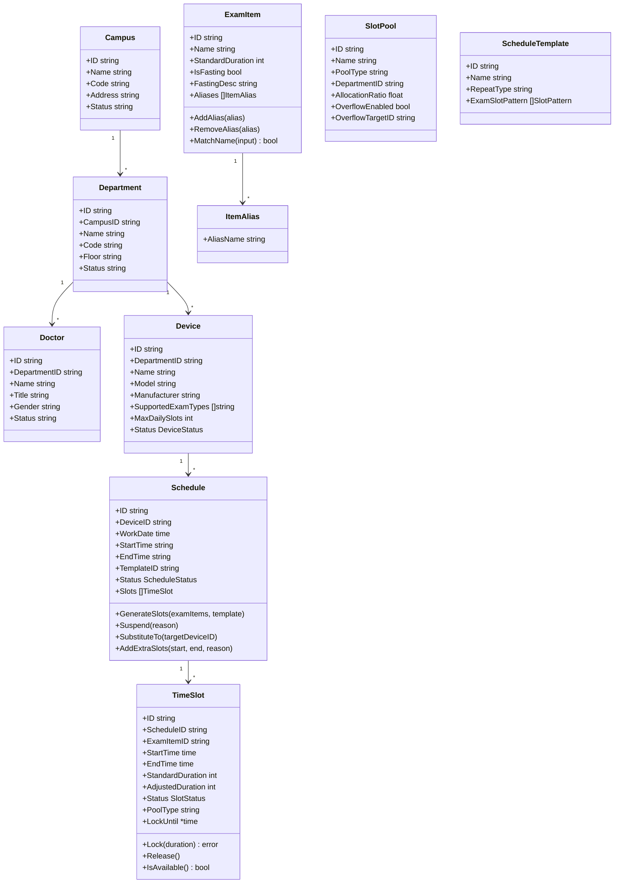

# 基础信息与资源管理子系统详细设计

| 项目 | 内容 |
|------|------|
| 模块编号 | MOD-02 |
| 对应规格书 | 4.2 基础信息与资源管理子系统 |
| 对应限界上下文 | resource |
| 上游依赖 | HIS系统（外部） |
| 下游消费者 | 预约服务子系统、规则引擎子系统、分诊子系统、效能优化子系统 |

---

## 1 模块定位

资源管理子系统是预约平台的**数据基座**，负责与 HIS 系统对接同步基础数据，维护设备排班和号源池，提供可用号源查询与锁定/释放能力。本模块为预约服务提供全部资源调度数据。

---

## 2 领域模型

### 2.1 聚合根与实体



### 2.2 值对象

```go
// DeviceStatus 设备状态
type DeviceStatus string
const (
    DeviceStatusOnline      DeviceStatus = "online"      // 在线
    DeviceStatusOffline     DeviceStatus = "offline"      // 离线
    DeviceStatusMaintenance DeviceStatus = "maintenance"  // 维护中
)

// ScheduleStatus 排班状态
type ScheduleStatus string
const (
    ScheduleStatusNormal    ScheduleStatus = "normal"    // 正常
    ScheduleStatusSuspended ScheduleStatus = "suspended" // 已停诊
)

// SlotStatus 号源状态
type SlotStatus string
const (
    SlotStatusAvailable SlotStatus = "available" // 可预约
    SlotStatusLocked    SlotStatus = "locked"    // 已锁定（待确认）
    SlotStatusBooked    SlotStatus = "booked"    // 已预约
    SlotStatusExpired   SlotStatus = "expired"   // 已过期
    SlotStatusSuspended SlotStatus = "suspended" // 已停诊释放
)

// AgeFactor 年龄耗时折算系数
type AgeFactor struct {
    ChildMaxAge    int     // 儿童年龄上限（默认14）
    ChildFactor    float64 // 儿童折算系数（默认1.10）
    ElderlyMinAge  int     // 老年年龄下限（默认70）
    ElderlyFactor  float64 // 老年折算系数（默认1.15）
}

// SlotPattern 号源排程模式
type SlotPattern struct {
    ExamItemID string
    Count      int    // 连续生成数量
}
```

### 2.3 聚合边界与不变量

| 聚合根 | 不变量 |
|--------|--------|
| `Device` | 设备ID唯一；归属科室必须存在；SupportedExamTypes不为空 |
| `Schedule` | 同一设备同一日期不重叠排班；StartTime < EndTime |
| `TimeSlot` | 时段不超出排班工作时段；锁定有倒计时（5分钟） |
| `ExamItem` | 名称唯一；别名不可与其他标准名称冲突；最多10个别名 |
| `SlotPool` | 各池配额之和 ≤ 100% |

---

## 3 领域服务

### 3.1 SlotGenerationService（号源生成服务）

```go
type SlotGenerationService interface {
    // GenerateSlots 按设备排班动态生成号源
    GenerateSlots(ctx context.Context, input SlotGenerationInput) ([]TimeSlot, error)
}

type SlotGenerationInput struct {
    DeviceID       string
    WorkDate       time.Time
    StartTime      string         // HH:mm
    EndTime        string         // HH:mm
    ExamItems      []ExamItemInfo // 可执行检查项目及标准耗时
    SlotPattern    []SlotPattern  // 排程模式（如6个平扫+2个增强循环）
    MaxDailySlots  int            // 设备单日上限
}
```

**逻辑**：按模板循环切分时段，剩余时间不足一个号源则不再生成；总数不超过设备日上限。

### 3.2 ScheduleService（排班管理服务）

```go
type ScheduleService interface {
    // BatchGenerate 批量生成排班计划
    BatchGenerate(ctx context.Context, input BatchGenerateInput) (int, error)

    // Suspend 临时停诊（释放号源 + 通知患者）
    Suspend(ctx context.Context, input SuspendInput) (*SuspendResult, error)

    // Substitute 替班（迁移号源至同类设备）
    Substitute(ctx context.Context, input SubstituteInput) error

    // AddExtraSlots 追加号源
    AddExtraSlots(ctx context.Context, input AddExtraSlotsInput) error
}

type SuspendResult struct {
    ReleasedSlotCount   int
    AffectedPatientIDs  []string
    NotificationStatus  map[string]string // patientID -> success/failed
    SuggestedAlternatives []AlternativeSlot
}
```

### 3.3 SlotPoolService（号源池服务）

```go
type SlotPoolService interface {
    // QueryAvailable 查询可用号源（带患者属性过滤）
    QueryAvailable(ctx context.Context, input QuerySlotInput) ([]AvailableSlot, error)

    // LockSlot 锁定号源（分布式锁，5分钟倒计时）
    LockSlot(ctx context.Context, slotID string, patientID string) error

    // ReleaseSlot 释放号源（回流公共池）
    ReleaseSlot(ctx context.Context, slotID string) error

    // AdjustDuration 按患者年龄动态调整号源耗时
    AdjustDuration(ctx context.Context, slotID string, patientAge int) (int, error)
}
```

### 3.4 HIS 数据同步服务

```go
type HISSyncService interface {
    // IncrementalSync 增量同步（每5分钟）
    IncrementalSync(ctx context.Context) (*SyncReport, error)

    // FullSync 全量同步（每日凌晨02:00）
    FullSync(ctx context.Context) (*SyncReport, error)
}

type SyncReport struct {
    SyncType     string    // incremental / full
    StartedAt    time.Time
    CompletedAt  time.Time
    CampusCount  int
    DeptCount    int
    DeviceCount  int
    DoctorCount  int
    ExamItemCount int
    ErrorCount   int
    Errors       []SyncError
}
```

---

## 4 接口设计

### 4.1 基础信息查询

| 方法 | 路径 | 说明 |
|------|------|------|
| GET | `/api/v1/resources/campuses` | 院区列表 |
| GET | `/api/v1/resources/departments` | 科室列表（支持?campus_id筛选） |
| GET | `/api/v1/resources/devices` | 设备列表（支持?dept_id筛选） |
| GET | `/api/v1/resources/exam-items` | 检查项目列表 |

### 4.2 项目别名管理

| 方法 | 路径 | 说明 |
|------|------|------|
| GET | `/api/v1/resources/exam-items/:id/aliases` | 查询项目别名 |
| POST | `/api/v1/resources/exam-items/:id/aliases` | 添加别名 |
| DELETE | `/api/v1/resources/exam-items/:id/aliases/:aliasId` | 删除别名 |

### 4.3 排班管理

| 方法 | 路径 | 说明 | 权限 |
|------|------|------|------|
| GET | `/api/v1/resources/schedules` | 查询排班日历（?device_id&start_date&end_date） | 管理员 |
| POST | `/api/v1/resources/schedules/generate` | 批量生成排班 | 管理员 |
| POST | `/api/v1/resources/schedules/suspend` | 临时停诊 | 管理员 |
| POST | `/api/v1/resources/schedules/substitute` | 替班 | 管理员 |
| POST | `/api/v1/resources/schedules/add-slots` | 追加号源 | 管理员 |

**批量生成排班** `POST /api/v1/resources/schedules/generate`

```json
// Request
{
    "device_id": "DEV_MRI_VIDA",
    "start_date": "2025-04-01",
    "end_date": "2025-04-30",
    "template_id": "TPL_MRI_WEEKDAY",
    "work_start": "08:00",
    "work_end": "12:00",
    "repeat_type": "weekly",
    "skip_weekends": true
}
// Response
{ "code": 0, "data": { "generated_count": 22, "total_slots": 220 } }
```

**临时停诊** `POST /api/v1/resources/schedules/suspend`

```json
// Request
{
    "device_id": "DEV_CT_FORCE",
    "date": "2025-03-20",
    "start_time": "09:00",
    "end_time": "13:00",
    "reason": "设备故障维修"
}
// Response
{
    "code": 0,
    "data": {
        "released_slots": 8,
        "affected_patients": 6,
        "notifications": { "success": 5, "failed": 1 },
        "alternatives": [
            { "device": "CT-GE Revolution", "date": "2025-03-20", "available_slots": 3 }
        ]
    }
}
```

### 4.4 号源查询与操作

| 方法 | 路径 | 说明 |
|------|------|------|
| GET | `/api/v1/resources/slots` | 查询可用号源 |
| POST | `/api/v1/resources/slots/:id/lock` | 锁定号源 |
| POST | `/api/v1/resources/slots/:id/release` | 释放号源 |

**查询可用号源** `GET /api/v1/resources/slots`

```
?exam_item_id=EXAM001&date=2025-03-20&pool_type=outpatient&patient_age=72
```

```json
// Response
{
    "code": 0,
    "data": [
        {
            "slot_id": "SLOT001",
            "device_id": "DEV_MRI_VIDA",
            "device_name": "MRI-西门子Vida",
            "room_location": "门诊楼B1放射科MRI室",
            "start_time": "2025-03-20T08:00:00+08:00",
            "end_time": "2025-03-20T08:23:00+08:00",
            "standard_duration": 20,
            "adjusted_duration": 23,
            "status": "available"
        }
    ]
}
```

---

## 5 数据库设计

### 5.1 核心表结构

```sql
CREATE TABLE campuses (
    id       VARCHAR(36) PRIMARY KEY,
    name     VARCHAR(50) NOT NULL,
    code     VARCHAR(20) NOT NULL UNIQUE,
    address  VARCHAR(200),
    status   VARCHAR(10) NOT NULL DEFAULT 'active',
    synced_at TIMESTAMP
);

CREATE TABLE departments (
    id        VARCHAR(36) PRIMARY KEY,
    campus_id VARCHAR(36) NOT NULL REFERENCES campuses(id),
    name      VARCHAR(50) NOT NULL,
    code      VARCHAR(20) NOT NULL UNIQUE,
    floor     VARCHAR(20),
    status    VARCHAR(10) NOT NULL DEFAULT 'active',
    synced_at TIMESTAMP
);

CREATE TABLE devices (
    id               VARCHAR(36)  PRIMARY KEY,
    department_id    VARCHAR(36)  NOT NULL REFERENCES departments(id),
    name             VARCHAR(50)  NOT NULL,
    model            VARCHAR(50),
    manufacturer     VARCHAR(50),
    supported_exam_types JSONB    NOT NULL DEFAULT '[]',
    max_daily_slots  INT          NOT NULL DEFAULT 50,
    status           VARCHAR(15)  NOT NULL DEFAULT 'online',
    synced_at        TIMESTAMP
);

CREATE TABLE doctors (
    id            VARCHAR(36)  PRIMARY KEY,
    department_id VARCHAR(36)  NOT NULL REFERENCES departments(id),
    name          VARCHAR(30)  NOT NULL,
    title         VARCHAR(20),
    gender        VARCHAR(10)  NOT NULL DEFAULT 'unknown',
    status        VARCHAR(10)  NOT NULL DEFAULT 'active',
    synced_at     TIMESTAMP
);

CREATE TABLE exam_items (
    id                VARCHAR(36) PRIMARY KEY,
    name              VARCHAR(50) NOT NULL UNIQUE,
    standard_duration INT         NOT NULL,         -- 标准耗时（分钟）
    is_fasting        BOOLEAN     NOT NULL DEFAULT FALSE,
    fasting_desc      VARCHAR(200),
    status            VARCHAR(10) NOT NULL DEFAULT 'active',
    synced_at         TIMESTAMP
);

CREATE TABLE item_aliases (
    id           VARCHAR(36) PRIMARY KEY,
    exam_item_id VARCHAR(36) NOT NULL REFERENCES exam_items(id) ON DELETE CASCADE,
    alias_name   VARCHAR(50) NOT NULL,
    UNIQUE(alias_name)  -- 别名全局唯一
);

CREATE TABLE schedule_templates (
    id              VARCHAR(36)  PRIMARY KEY,
    name            VARCHAR(50)  NOT NULL,
    repeat_type     VARCHAR(20)  NOT NULL,         -- weekly / custom
    slot_pattern    JSONB        NOT NULL,          -- 排程模式
    created_at      TIMESTAMP    NOT NULL DEFAULT NOW()
);

CREATE TABLE schedules (
    id          VARCHAR(36)   PRIMARY KEY,
    device_id   VARCHAR(36)   NOT NULL REFERENCES devices(id),
    work_date   DATE          NOT NULL,
    start_time  TIME          NOT NULL,
    end_time    TIME          NOT NULL,
    template_id VARCHAR(36)   REFERENCES schedule_templates(id),
    status      VARCHAR(15)   NOT NULL DEFAULT 'normal',
    suspend_reason VARCHAR(200),
    created_at  TIMESTAMP     NOT NULL DEFAULT NOW(),
    updated_at  TIMESTAMP     NOT NULL DEFAULT NOW(),
    UNIQUE(device_id, work_date)
);

CREATE INDEX idx_schedules_device_date ON schedules(device_id, work_date);

CREATE TABLE time_slots (
    id                VARCHAR(36)  PRIMARY KEY,
    schedule_id       VARCHAR(36)  NOT NULL REFERENCES schedules(id) ON DELETE CASCADE,
    exam_item_id      VARCHAR(36)  NOT NULL REFERENCES exam_items(id),
    start_time        TIMESTAMP    NOT NULL,
    end_time          TIMESTAMP    NOT NULL,
    standard_duration INT          NOT NULL,
    adjusted_duration INT,
    pool_type         VARCHAR(15)  NOT NULL DEFAULT 'public',  -- public / department / doctor
    status            VARCHAR(15)  NOT NULL DEFAULT 'available',
    locked_by         VARCHAR(36),
    lock_until        TIMESTAMP,
    booked_patient_id VARCHAR(36),
    created_at        TIMESTAMP    NOT NULL DEFAULT NOW(),
    updated_at        TIMESTAMP    NOT NULL DEFAULT NOW()
);

CREATE INDEX idx_slots_schedule ON time_slots(schedule_id);
CREATE INDEX idx_slots_exam_date ON time_slots(exam_item_id, start_time);
CREATE INDEX idx_slots_status ON time_slots(status);
CREATE INDEX idx_slots_pool ON time_slots(pool_type, status);

CREATE TABLE slot_pools (
    id                    VARCHAR(36) PRIMARY KEY,
    name                  VARCHAR(30) NOT NULL,
    pool_type             VARCHAR(15) NOT NULL,
    department_id         VARCHAR(36) REFERENCES departments(id),
    allocation_ratio      DECIMAL(5,2) NOT NULL DEFAULT 0,
    overflow_enabled      BOOLEAN NOT NULL DEFAULT FALSE,
    overflow_target_id    VARCHAR(36) REFERENCES slot_pools(id),
    created_at            TIMESTAMP NOT NULL DEFAULT NOW(),
    updated_at            TIMESTAMP NOT NULL DEFAULT NOW()
);
```

---

## 6 cmd/sync-worker 设计

`sync-worker` 独立进程负责 HIS 数据同步：

| 任务 | 频率 | 数据范围 |
|------|------|----------|
| 增量同步 | 每5分钟 | 变更的院区/科室/设备/医生/项目 |
| 全量同步 | 每日02:00 | 全部基础数据 |

**同步流程**：
1. 调用 HIS HL7 接口拉取数据
2. 格式校验（必填非空、枚举合法）+ 逻辑校验（设备归属科室存在）
3. 按 ID 做 upsert（存在则更新，不存在则插入）
4. 失败自动重试 3 次（间隔 1 分钟）
5. 生成同步报告，异常条目通知管理员

---

## 7 前端页面设计

| 页面 | 路由 | 核心交互 |
|------|------|----------|
| 设备管理 | `/resource/device` | 表格列表 + 设备状态标签 + 支持检查类型Tag |
| 排班日历 | `/resource/schedule` | 日历视图（设备×日期）+ 拖拽调整 + 停诊/替班/追加弹窗 |
| 号源池管理 | `/resource/slot-pool` | 号源使用情况饼图 + 配额比例配置 |
| 项目别名映射 | `/resource/alias` | 标准项目列表 + 别名Tag编辑 |

**排班日历**是本模块最核心的交互页面：
- 横轴：日期（可按周/月切换）
- 纵轴：设备列表
- 每个单元格显示排班状态（正常=绿色、停诊=红色、无排班=灰色）
- 点击单元格展开号源明细
- 右键菜单：停诊 / 替班 / 追加号源

---

## 8 错误码定义

| 错误码 | 说明 |
|--------|------|
| `RES_001` | 设备不存在或已离线 |
| `RES_002` | 排班日期冲突（同设备同日已有排班） |
| `RES_003` | 号源锁定失败（已被他人锁定） |
| `RES_004` | 号源释放失败（状态不允许） |
| `RES_005` | 替班目标设备不支持源设备的检查类型 |
| `RES_006` | 追加号源时段与已有排班重叠 |
| `RES_007` | 别名与其他标准项目名称冲突 |
| `RES_008` | 别名数量超过上限（10个） |
| `RES_009` | HIS同步失败（重试耗尽） |
| `RES_010` | 号源生成超出设备单日上限 |
