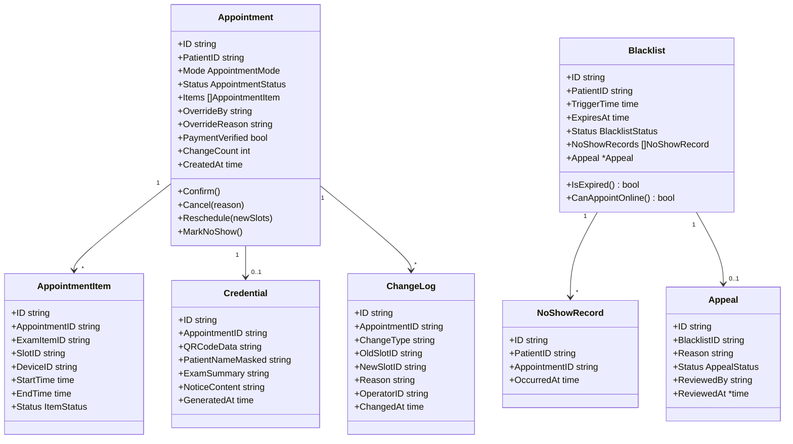
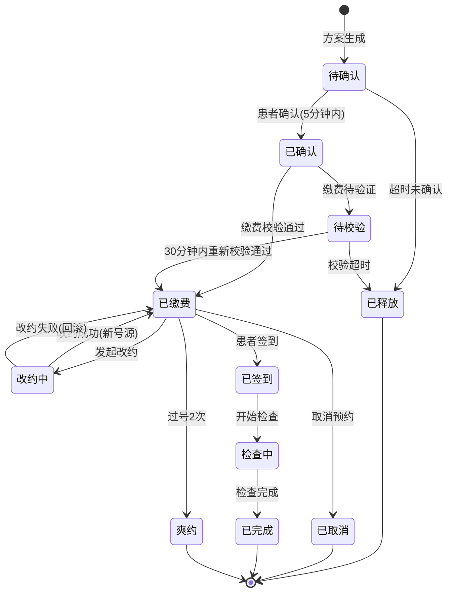

# 预约服务子系统详细设计

| 项目 | 内容 |
|------|------|
| 模块编号 | MOD-03 |
| 对应规格书 | 4.3 预约服务子系统 |
| 对应限界上下文 | appointment |
| 上游依赖 | 规则引擎子系统（规则校验）、资源管理子系统（号源查询/锁定） |
| 下游消费者 | 分诊签到子系统、统计分析子系统、效能优化子系统 |

---

## 1 模块定位

预约服务子系统是平台的**核心业务模块**，覆盖从预约发起到完成的全流程闭环管控。提供一键自动预约、组合预约、人工干预三种模式，并管理缴费校验、改约取消、黑名单、检前通知等闭环流程。

---

## 2 领域模型

### 2.1 聚合根与实体



### 2.2 核心状态机



### 2.3 值对象

```go
// AppointmentMode 预约模式
type AppointmentMode string
const (
    ModeAuto   AppointmentMode = "auto"    // 一键自动预约
    ModeCombo  AppointmentMode = "combo"   // 组合预约
    ModeManual AppointmentMode = "manual"  // 人工干预
)

// AppointmentStatus 预约状态
type AppointmentStatus string
const (
    StatusPending       AppointmentStatus = "pending"        // 待确认
    StatusConfirmed     AppointmentStatus = "confirmed"      // 已确认
    StatusPayVerifying  AppointmentStatus = "pay_verifying"  // 缴费待校验
    StatusPaid          AppointmentStatus = "paid"           // 已缴费
    StatusRescheduling  AppointmentStatus = "rescheduling"   // 改约中
    StatusCancelled     AppointmentStatus = "cancelled"      // 已取消
    StatusCheckedIn     AppointmentStatus = "checked_in"     // 已签到
    StatusExamining     AppointmentStatus = "examining"      // 检查中
    StatusCompleted     AppointmentStatus = "completed"      // 已完成
    StatusNoShow        AppointmentStatus = "no_show"        // 爽约
    StatusReleased      AppointmentStatus = "released"       // 已释放
)

// BlacklistStatus 黑名单状态
type BlacklistStatus string
const (
    BlacklistActive   BlacklistStatus = "active"    // 生效中
    BlacklistReleased BlacklistStatus = "released"  // 已解除
    BlacklistExpired  BlacklistStatus = "expired"   // 已过期
)
```

### 2.4 聚合不变量

| 聚合根 | 不变量 |
|--------|--------|
| `Appointment` | 改约次数 ≤ 3；检查前2小时内仅可取消不可改约；人工干预需管理员角色 |
| `Blacklist` | 90天滑动窗口内爽约 ≥ 3次触发；有效期默认180天；预置爽约记录不可删除 |
| `Credential` | 患者姓名脱敏显示（张*明） |

---

## 3 领域服务

### 3.1 AutoAppointmentService（一键自动预约）

```go
type AutoAppointmentService interface {
    // Execute 患者缴费后自动触发
    // 1. 读取待预约项目 → 2. 调用规则引擎 → 3. 查询号源 → 4. 时间窗口计算 → 5. 返回方案
    Execute(ctx context.Context, patientID string) (*AutoAppointmentResult, error)
}

type AutoAppointmentResult struct {
    Plans          []AppointmentPlan // 最多3套方案
    FailedItems    []FailedItem      // 无法安排的项目
    RuleWarnings   []string          // 规则警告
}
```

### 3.2 ComboAppointmentService（组合预约）

```go
type ComboAppointmentService interface {
    // Calculate 批量导入项目后计算方案
    Calculate(ctx context.Context, input ComboInput) (*ComboResult, error)

    // Confirm 确认选定方案，批量锁定号源
    Confirm(ctx context.Context, appointmentID string, planID string) error
}

type ComboInput struct {
    PatientID     string
    ExamItemIDs   []string    // 最多10个
    DateRange     DateRange   // 期望日期范围（当日~90天内）
    PreferPeriod  string      // morning / afternoon / any
}
```

### 3.3 ManualOverrideService（人工干预）

```go
type ManualOverrideService interface {
    // Override 强制指定号源（需管理员权限）
    Override(ctx context.Context, input OverrideInput) (*Appointment, error)
}

type OverrideInput struct {
    PatientID    string
    ExamItemID   string
    SlotID       string
    OperatorID   string   // 必须为预约管理员
    Reason       string   // 必填，最长200字符
    AckConflict  bool     // 已知悉冲突风险
}
```

### 3.4 RescheduleService（改约服务）

```go
type RescheduleService interface {
    // Reschedule 改约（释放原号源 + 锁定新号源，事务保证）
    Reschedule(ctx context.Context, appointmentID string, newSlotID string) error

    // Cancel 取消预约
    Cancel(ctx context.Context, appointmentID string, reason string) error
}
```

**事务保证**：释放原号源成功但锁定新号源失败时，自动回滚恢复原预约。

### 3.5 BlacklistService（黑名单服务）

```go
type BlacklistService interface {
    // RecordNoShow 记录爽约（由分诊子系统调用）
    RecordNoShow(ctx context.Context, appointmentID string) error

    // CheckBlacklist 检查患者是否在黑名单中
    CheckBlacklist(ctx context.Context, patientID string) (*BlacklistCheckResult, error)

    // SubmitAppeal 提交申诉
    SubmitAppeal(ctx context.Context, blacklistID string, reason string) error

    // ReviewAppeal 审核申诉（管理员）
    ReviewAppeal(ctx context.Context, appealID string, approved bool) error

    // AutoCleanup 自动清理过期黑名单（定时任务调用）
    AutoCleanup(ctx context.Context) (int, error)

    // CalibrateNoShowCount 校准爽约计数（每日凌晨）
    CalibrateNoShowCount(ctx context.Context) error
}
```

### 3.6 PaymentVerificationService（缴费校验服务）

```go
type PaymentVerificationService interface {
    // Verify 调用HIS收费接口校验缴费状态
    Verify(ctx context.Context, patientID string, examItemIDs []string) (*PaymentResult, error)
}

type PaymentResult struct {
    AllPaid   bool
    Items     []PaymentItemResult
    Timeout   bool     // HIS接口是否超时
}
```

### 3.7 NotificationService（检前通知服务）

```go
type NotificationService interface {
    // SendConfirmation 预约确认后即时推送
    SendConfirmation(ctx context.Context, appointmentID string) error

    // SendReminder 检查前一日18:00提醒
    SendReminder(ctx context.Context, appointmentID string) error
}
```

---

## 4 接口设计

### 4.1 预约操作

| 方法 | 路径 | 说明 | 权限 |
|------|------|------|------|
| POST | `/api/v1/appointments/auto` | 一键自动预约 | 操作员+ |
| POST | `/api/v1/appointments/combo` | 组合预约计算 | 操作员+ |
| POST | `/api/v1/appointments/combo/confirm` | 确认组合预约方案 | 操作员+ |
| POST | `/api/v1/appointments/manual` | 人工干预预约 | 预约管理员 |
| PUT | `/api/v1/appointments/:id/confirm` | 确认预约 | 操作员+ |
| PUT | `/api/v1/appointments/:id/reschedule` | 改约 | 操作员+ |
| PUT | `/api/v1/appointments/:id/cancel` | 取消 | 操作员+ |
| GET | `/api/v1/appointments/:id` | 预约详情 | 操作员+ |
| GET | `/api/v1/appointments` | 预约列表 | 操作员+ |
| GET | `/api/v1/appointments/:id/credential` | 预约凭证（含二维码） | 操作员+ |

**一键自动预约** `POST /api/v1/appointments/auto`

```json
// Request
{ "patient_id": "P20250001" }

// Response
{
    "code": 0,
    "data": {
        "appointment_id": "APT001",
        "plans": [
            {
                "plan_id": "PLAN_A",
                "plan_type": "shortest_time",
                "items": [
                    { "exam_item": "腹部彩超", "device": "EPIQ7", "room": "超声科3号", "start": "08:30", "end": "08:45", "is_fasting": true },
                    { "exam_item": "腹部CT平扫", "device": "CT-Force", "room": "放射科CT室", "start": "09:15", "end": "09:30" }
                ],
                "total_minutes": 60,
                "wait_minutes": 15,
                "trip_count": 1
            }
        ],
        "warnings": ["腹部彩超为空腹项目，请空腹前来"]
    }
}
```

### 4.2 黑名单管理

| 方法 | 路径 | 说明 | 权限 |
|------|------|------|------|
| GET | `/api/v1/appointments/blacklist` | 黑名单列表 | 管理员 |
| GET | `/api/v1/appointments/blacklist/:id` | 黑名单详情 | 管理员 |
| POST | `/api/v1/appointments/blacklist/:id/appeal` | 提交申诉 | 操作员 |
| PUT | `/api/v1/appointments/blacklist/appeals/:id/review` | 审核申诉 | 管理员 |

---

## 5 数据库设计

```sql
CREATE TABLE appointments (
    id                VARCHAR(36) PRIMARY KEY,
    patient_id        VARCHAR(36) NOT NULL,
    mode              VARCHAR(10) NOT NULL,           -- auto/combo/manual
    status            VARCHAR(15) NOT NULL DEFAULT 'pending',
    override_by       VARCHAR(36),
    override_reason   VARCHAR(200),
    payment_verified  BOOLEAN NOT NULL DEFAULT FALSE,
    change_count      INT     NOT NULL DEFAULT 0,
    created_at        TIMESTAMP NOT NULL DEFAULT NOW(),
    updated_at        TIMESTAMP NOT NULL DEFAULT NOW(),
    confirmed_at      TIMESTAMP,
    cancelled_at      TIMESTAMP,
    cancel_reason     VARCHAR(200)
);
CREATE INDEX idx_appointments_patient ON appointments(patient_id);
CREATE INDEX idx_appointments_status ON appointments(status);

CREATE TABLE appointment_items (
    id              VARCHAR(36) PRIMARY KEY,
    appointment_id  VARCHAR(36) NOT NULL REFERENCES appointments(id),
    exam_item_id    VARCHAR(36) NOT NULL,
    slot_id         VARCHAR(36) NOT NULL,
    device_id       VARCHAR(36) NOT NULL,
    start_time      TIMESTAMP NOT NULL,
    end_time        TIMESTAMP NOT NULL,
    status          VARCHAR(15) NOT NULL DEFAULT 'pending'
);
CREATE INDEX idx_appt_items_appt ON appointment_items(appointment_id);

CREATE TABLE appointment_credentials (
    id              VARCHAR(36) PRIMARY KEY,
    appointment_id  VARCHAR(36) NOT NULL UNIQUE REFERENCES appointments(id),
    qr_code_data    TEXT NOT NULL,
    patient_name_masked VARCHAR(30),
    exam_summary    TEXT,
    notice_content  TEXT,
    generated_at    TIMESTAMP NOT NULL DEFAULT NOW()
);

CREATE TABLE appointment_change_logs (
    id              VARCHAR(36) PRIMARY KEY,
    appointment_id  VARCHAR(36) NOT NULL REFERENCES appointments(id),
    change_type     VARCHAR(15) NOT NULL,         -- reschedule / cancel
    old_slot_id     VARCHAR(36),
    new_slot_id     VARCHAR(36),
    reason          VARCHAR(200),
    operator_id     VARCHAR(36) NOT NULL,
    changed_at      TIMESTAMP NOT NULL DEFAULT NOW()
);

CREATE TABLE blacklists (
    id          VARCHAR(36) PRIMARY KEY,
    patient_id  VARCHAR(36) NOT NULL,
    trigger_time TIMESTAMP NOT NULL,
    expires_at  TIMESTAMP NOT NULL,
    status      VARCHAR(10) NOT NULL DEFAULT 'active',
    released_at TIMESTAMP,
    release_reason VARCHAR(200)
);
CREATE INDEX idx_blacklist_patient ON blacklists(patient_id);
CREATE INDEX idx_blacklist_status_expires ON blacklists(status, expires_at);

CREATE TABLE no_show_records (
    id             VARCHAR(36) PRIMARY KEY,
    patient_id     VARCHAR(36) NOT NULL,
    appointment_id VARCHAR(36) NOT NULL REFERENCES appointments(id),
    occurred_at    TIMESTAMP NOT NULL DEFAULT NOW()
);
CREATE INDEX idx_noshow_patient ON no_show_records(patient_id, occurred_at);

CREATE TABLE appeals (
    id           VARCHAR(36) PRIMARY KEY,
    blacklist_id VARCHAR(36) NOT NULL REFERENCES blacklists(id),
    reason       VARCHAR(500) NOT NULL,
    status       VARCHAR(10) NOT NULL DEFAULT 'pending', -- pending/approved/rejected
    reviewed_by  VARCHAR(36),
    reviewed_at  TIMESTAMP,
    created_at   TIMESTAMP NOT NULL DEFAULT NOW()
);
```

---

## 6 前端页面设计

| 页面 | 路由 | 核心交互 |
|------|------|----------|
| 一键预约 | `/appointment/auto` | 患者搜索 → 方案卡片 → 确认/选择 |
| 组合预约 | `/appointment/combo` | 左侧项目选择 + 右侧方案对比表格 + 确认 |
| 人工干预 | `/appointment/manual` | 号源手动选择 + 原因表单 + 冲突风险确认弹窗 |
| 预约列表 | `/appointment/list` | 搜索+筛选表格 + 改约/取消操作 + 凭证查看 |
| 黑名单管理 | `/appointment/blacklist` | 黑名单列表 + 爽约明细 + 申诉审核 |

---

## 7 错误码定义

| 错误码 | 说明 |
|--------|------|
| `APPT_001` | 缴费未完成，不允许预约 |
| `APPT_002` | 存在禁止级冲突，不允许预约 |
| `APPT_003` | 强制前置依赖未满足 |
| `APPT_004` | 号源已被他人抢占 |
| `APPT_005` | 确认超时，号源已释放 |
| `APPT_006` | 改约次数已达上限（3次） |
| `APPT_007` | 距检查不足2小时，仅支持取消 |
| `APPT_008` | 患者处于黑名单限制期 |
| `APPT_009` | 人工干预需预约管理员权限 |
| `APPT_010` | 组合预约项目数量超过上限（10个） |
| `APPT_011` | HIS缴费接口超时（降级处理） |
