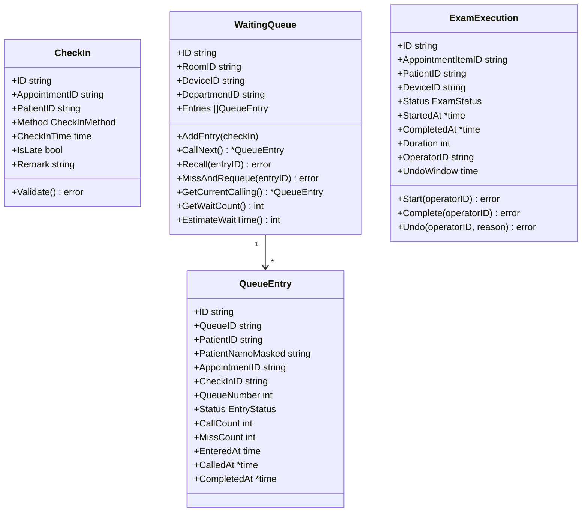

# 分诊签到与执行管理子系统详细设计

| 项目 | 内容 |
|------|------|
| 模块编号 | MOD-04 |
| 对应规格书 | 4.4 分诊签到与执行管理子系统 |
| 对应限界上下文 | triage |
| 上游依赖 | 预约服务子系统（预约记录） |
| 下游消费者 | 统计分析子系统、效能优化子系统 |

---

## 1 模块定位

分诊签到与执行管理子系统覆盖患者到院后的**签到→候诊→呼叫→检查执行**全流程，是预约闭环的"最后一公里"。核心提供多终端签到、排队管理、护士呼叫、状态流转、分诊大屏推送等能力。

---

## 2 领域模型

### 2.1 聚合根与实体



### 2.2 状态枚举

```go
// CheckInMethod 签到方式
type CheckInMethod string
const (
    CheckInKiosk   CheckInMethod = "kiosk"   // 自助机扫码
    CheckInNurse   CheckInMethod = "nurse"   // 护士站手动
    CheckInNFC     CheckInMethod = "nfc"     // NFC读卡
)

// EntryStatus 队列条目状态
type EntryStatus string
const (
    EntryWaiting   EntryStatus = "waiting"    // 候诊中
    EntryCalling   EntryStatus = "calling"    // 呼叫中
    EntryExamining EntryStatus = "examining"  // 检查中
    EntryCompleted EntryStatus = "completed"  // 已完成
    EntryMissed    EntryStatus = "missed"     // 已过号
    EntryNoShow    EntryStatus = "no_show"    // 爽约
)

// ExamStatus 检查状态
type ExamStatus string
const (
    ExamCheckedIn  ExamStatus = "checked_in"  // 已签到
    ExamWaiting    ExamStatus = "waiting"     // 候诊中
    ExamOngoing    ExamStatus = "ongoing"     // 检查中
    ExamDone       ExamStatus = "done"        // 检查完成
)
```

### 2.3 聚合不变量

| 聚合根 | 不变量 |
|--------|--------|
| `CheckIn` | 签到窗口：预约前30分钟~预约后15分钟；同一预约不可重复签到 |
| `WaitingQueue` | 呼叫严格按签到时间排序；重叫最多3次；过号2次标记爽约 |
| `ExamExecution` | 状态必须按顺序流转（不可跳过）；误操作撤销窗口5分钟 |

---

## 3 领域服务

### 3.1 CheckInService（签到服务）

```go
type CheckInService interface {
    // KioskCheckIn 自助机扫码签到
    KioskCheckIn(ctx context.Context, qrCodeData string) (*CheckInResult, error)

    // NurseCheckIn 护士站手动签到
    NurseCheckIn(ctx context.Context, input NurseCheckInInput) (*CheckInResult, error)

    // NFCCheckIn NFC读卡签到
    NFCCheckIn(ctx context.Context, cardID string) (*CheckInResult, error)
}

type CheckInResult struct {
    CheckInID      string
    QueueNumber    int
    EstimatedWait  int      // 预计等待分钟
    RoomLocation   string   // 诊室位置
    IsLate         bool     // 是否迟到
}
```

**签到校验逻辑**：
1. 验证预约存在且为当日
2. 检查签到时间窗口（预约前30分钟~后15分钟）
3. 超时标记迟到，仅护士站可处理
4. 签到成功后加入候诊队列，打印排队号票

### 3.2 QueueManagementService（队列管理服务）

```go
type QueueManagementService interface {
    // CallNext 呼叫下一位
    CallNext(ctx context.Context, roomID string) (*CallResult, error)

    // Recall 重叫当前患者（最多3次）
    Recall(ctx context.Context, roomID string) (*CallResult, error)

    // MissAndRequeue 过号重排
    MissAndRequeue(ctx context.Context, roomID string) (*MissResult, error)

    // GetQueueStatus 获取候诊队列状态（供大屏展示）
    GetQueueStatus(ctx context.Context, roomID string) (*QueueStatus, error)
}

type CallResult struct {
    EntryID          string
    PatientNameMasked string
    QueueNumber      int
    RoomName         string
    CallCount        int     // 第几次呼叫
}

type MissResult struct {
    PatientID      string
    MissCount      int      // 累计过号次数
    IsNoShow       bool     // 是否已标记爽约
    RequeuedPosition int    // 重排后的位置
}

type QueueStatus struct {
    RoomID          string
    RoomName        string
    CurrentCalling  *CallResult
    WaitingCount    int
    AverageWait     int  // 平均等待分钟
    Entries         []QueueEntryBrief
}
```

### 3.3 ExamStatusService（检查状态服务）

```go
type ExamStatusService interface {
    // StartExam 开始检查
    StartExam(ctx context.Context, appointmentItemID string, operatorID string) error

    // CompleteExam 结束检查
    CompleteExam(ctx context.Context, appointmentItemID string, operatorID string) error

    // UndoStatus 撤销误操作（5分钟内）
    UndoStatus(ctx context.Context, appointmentItemID string, operatorID string, reason string) error
}
```

---

## 4 接口设计

### 4.1 签到接口

| 方法 | 路径 | 说明 | 权限 |
|------|------|------|------|
| POST | `/api/v1/triage/checkin/kiosk` | 自助机扫码签到 | 公开 |
| POST | `/api/v1/triage/checkin/nurse` | 护士站手动签到 | 护士+ |
| POST | `/api/v1/triage/checkin/nfc` | NFC读卡签到 | 公开 |

### 4.2 队列与呼叫

| 方法 | 路径 | 说明 | 权限 |
|------|------|------|------|
| GET | `/api/v1/triage/queue/:roomId` | 获取候诊队列 | 护士+ |
| POST | `/api/v1/triage/call/:roomId/next` | 呼叫下一位 | 护士+ |
| POST | `/api/v1/triage/call/:roomId/recall` | 重叫 | 护士+ |
| POST | `/api/v1/triage/call/:roomId/miss` | 过号重排 | 护士+ |

### 4.3 检查状态

| 方法 | 路径 | 说明 | 权限 |
|------|------|------|------|
| POST | `/api/v1/triage/exam/:id/start` | 开始检查 | 护士+ |
| POST | `/api/v1/triage/exam/:id/complete` | 检查完成 | 护士+ |
| POST | `/api/v1/triage/exam/:id/undo` | 撤销误操作 | 护士(5分钟内)/管理员 |

### 4.4 WebSocket 推送

| 路径 | 说明 | 推送频率 |
|------|------|----------|
| `/ws/v1/screen/:roomId` | 分诊大屏推送（呼叫信息 + 队列状态） | 事件触发即时推送 |

**推送消息格式**：
```json
{
    "type": "call",
    "data": {
        "patient_name": "张*明",
        "room": "超声科3号诊室",
        "queue_number": 15,
        "message": "请 张*明 到超声科3号诊室"
    }
}
```

---

## 5 数据库设计

```sql
CREATE TABLE check_ins (
    id              VARCHAR(36) PRIMARY KEY,
    appointment_id  VARCHAR(36) NOT NULL,
    patient_id      VARCHAR(36) NOT NULL,
    method          VARCHAR(10) NOT NULL,      -- kiosk/nurse/nfc
    check_in_time   TIMESTAMP  NOT NULL DEFAULT NOW(),
    is_late         BOOLEAN    NOT NULL DEFAULT FALSE,
    remark          VARCHAR(100),
    UNIQUE(appointment_id)
);
CREATE INDEX idx_checkin_patient_date ON check_ins(patient_id, check_in_time);

CREATE TABLE waiting_queues (
    id              VARCHAR(36) PRIMARY KEY,
    room_id         VARCHAR(36) NOT NULL,
    device_id       VARCHAR(36) NOT NULL,
    department_id   VARCHAR(36) NOT NULL,
    status          VARCHAR(10) NOT NULL DEFAULT 'active'
);

CREATE TABLE queue_entries (
    id                   VARCHAR(36) PRIMARY KEY,
    queue_id             VARCHAR(36) NOT NULL REFERENCES waiting_queues(id),
    patient_id           VARCHAR(36) NOT NULL,
    patient_name_masked  VARCHAR(30),
    appointment_id       VARCHAR(36) NOT NULL,
    check_in_id          VARCHAR(36) NOT NULL REFERENCES check_ins(id),
    queue_number         INT NOT NULL,
    status               VARCHAR(15) NOT NULL DEFAULT 'waiting',
    call_count           INT NOT NULL DEFAULT 0,
    miss_count           INT NOT NULL DEFAULT 0,
    entered_at           TIMESTAMP NOT NULL DEFAULT NOW(),
    called_at            TIMESTAMP,
    completed_at         TIMESTAMP
);
CREATE INDEX idx_queue_entries_queue ON queue_entries(queue_id, status);

CREATE TABLE exam_executions (
    id                    VARCHAR(36) PRIMARY KEY,
    appointment_item_id   VARCHAR(36) NOT NULL,
    patient_id            VARCHAR(36) NOT NULL,
    device_id             VARCHAR(36) NOT NULL,
    status                VARCHAR(15) NOT NULL DEFAULT 'checked_in',
    started_at            TIMESTAMP,
    completed_at          TIMESTAMP,
    duration              INT,            -- 实际耗时（分钟）
    operator_id           VARCHAR(36),
    undo_deadline         TIMESTAMP,      -- 撤销截止时间
    created_at            TIMESTAMP NOT NULL DEFAULT NOW(),
    updated_at            TIMESTAMP NOT NULL DEFAULT NOW()
);
CREATE INDEX idx_exec_device ON exam_executions(device_id, status);
```

---

## 6 前端页面设计

| 页面 | 路由 | 核心交互 |
|------|------|----------|
| 签到工作站 | `/triage/checkin` | 患者搜索 + 当日预约列表 + 一键签到 + 备注输入 |
| 候诊队列 | `/triage/queue` | 实时队列列表 + 等待时长统计 |
| 呼叫面板 | `/triage/call` | 呼叫/重叫/过号按钮 + 当前呼叫患者卡片 + 队列列表 |
| 分诊大屏 | `/triage/screen` | 全屏展示：当前呼叫（大字）+ 候诊列表 + 诊室信息 |

**分诊大屏**关键要求：
- 独立路由，支持全屏模式
- 患者姓名脱敏（张*明）
- WebSocket实时更新，断线显示"重连中"
- 语音播报（如设备支持）
- 支持多屏拼接

---

## 7 错误码定义

| 错误码 | 说明 |
|--------|------|
| `TRIAGE_001` | 预约不存在或非当日预约 |
| `TRIAGE_002` | 签到时间窗口外（需至护士站处理） |
| `TRIAGE_003` | 已签到，不可重复签到 |
| `TRIAGE_004` | 候诊队列为空 |
| `TRIAGE_005` | 重叫次数超限（最多3次） |
| `TRIAGE_006` | 状态流转异常（跳过中间状态） |
| `TRIAGE_007` | 超过撤销时限（5分钟），需管理员权限 |
| `TRIAGE_008` | 二维码无效 |
