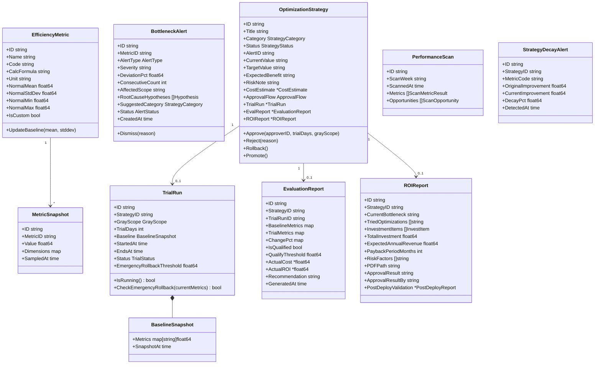

# 智能效能优化子系统详细设计

| 项目 | 内容 |
|------|------|
| 模块编号 | MOD-06 |
| 对应规格书 | 4.5 智能效能优化子系统 |
| 对应限界上下文 | optimization |
| 上游依赖 | 统计分析子系统（运营数据）、资源管理/规则引擎（配置读写） |
| 下游消费者 | 规则引擎子系统（A类策略下发）、资源管理子系统（B类策略下发） |
| 运行入口 | cmd/analyzer-worker（独立进程） |

---

## 1 模块定位

智能效能优化子系统是平台的**"智慧大脑"**，基于全量运营数据实现"数据采集→瓶颈发现→建议生成→试运行→效果评估→策略转正→下一轮检测"的**持续优化闭环**。策略按可执行性分为A类（软策略）、B类（弹性资源）、C类（硬资源）三条路径。

---

## 2 领域模型

### 2.1 聚合根与实体



### 2.2 核心枚举与值对象

```go
// StrategyCategory 策略分类
type StrategyCategory string
const (
    CategoryA StrategyCategory = "A" // A类·软策略（纯配置调整）
    CategoryB StrategyCategory = "B" // B类·弹性资源策略（现有资源重新调配）
    CategoryC StrategyCategory = "C" // C类·硬资源策略（新增物理资源）
)

// StrategyStatus 策略状态
type StrategyStatus string
const (
    StatusPendingReview   StrategyStatus = "pending_review"     // 待审核
    StatusRejected        StrategyStatus = "rejected"           // 已驳回
    StatusTrialRunning    StrategyStatus = "trial_running"      // 试运行中(A类)
    StatusTrialRunningB   StrategyStatus = "trial_running_b"    // 试行中(B类)
    StatusSubmittedApproval StrategyStatus = "submitted_approval" // 已提交院级审批(C类)
    StatusPendingEval     StrategyStatus = "pending_eval"       // 待评估
    StatusPromoted        StrategyStatus = "promoted"           // 已转正(A类)
    StatusNormalized      StrategyStatus = "normalized"         // 已常态化(B类)
    StatusRolledBack      StrategyStatus = "rolled_back"        // 已回滚
    StatusArchived        StrategyStatus = "archived"           // 已归档
    StatusPostValidation  StrategyStatus = "post_validation"    // 待投产验证(C类)
    StatusTracking        StrategyStatus = "tracking"           // 长期追踪
    StatusDecayed         StrategyStatus = "decayed"            // 策略衰减
)

// AlertType 告警类型
type AlertType string
const (
    AlertConsecutiveDeviation AlertType = "consecutive_deviation" // 连续偏离
    AlertSuddenChange         AlertType = "sudden_change"         // 环比突变
    AlertTrendDegradation     AlertType = "trend_degradation"     // 趋势恶化
)

// GrayScope 灰度范围
type GrayScope struct {
    DepartmentIDs []string
    DeviceIDs     []string
    TimePeriods   []string // 如 "08:00-12:00"
}

// ApprovalFlow 审批流
type ApprovalFlow struct {
    Type        string          // single(A类) / joint(B类) / external(C类)
    Approvers   []ApprovalNode
    Status      string
}

type ApprovalNode struct {
    ApproverID   string
    ApproverRole string
    Status       string    // pending/approved/rejected
    Timestamp    *time.Time
    Comment      string
}

// CostEstimate B类成本评估
type CostEstimate struct {
    LaborCost    float64 // 人力成本
    MaterialCost float64 // 耗材成本
    EnergyCost   float64 // 能耗成本
    TotalCost    float64
    ROI          float64 // 预估投入产出比
}
```

---

## 3 领域服务

### 3.1 AnomalyDetectionService（异常检测引擎）

```go
type AnomalyDetectionService interface {
    // RunFullScan 全指标异常检测扫描（每小时执行）
    RunFullScan(ctx context.Context) ([]BottleneckAlert, error)
}
```

**检测算法**：
1. 加载各指标近90天历史数据，计算均值μ和标准差σ
2. 正常区间 = [μ-2σ, μ+2σ]
3. 连续3个采样周期偏离正常区间 → 触发连续偏离告警
4. 单日环比变化 > 20% → 触发环比突变告警
5. 连续7日持续下降 → 触发趋势恶化告警

### 3.2 BottleneckAttributionService（瓶颈归因服务）

```go
type BottleneckAttributionService interface {
    // Analyze 对告警进行归因分析
    Analyze(ctx context.Context, alertID string) (*AttributionReport, error)
}

type AttributionReport struct {
    AlertID           string
    Hypotheses        []Hypothesis
    SuggestedCategory StrategyCategory
    SupportingData    map[string]interface{}
}

type Hypothesis struct {
    RootCause   string   // 根因描述
    Confidence  float64  // 置信度 0-1
    Evidence    []string // 支撑数据
}
```

**归因逻辑**（按类型分流）：
- 设备利用率过高 → 排班不足 or 分流不均 → 建议B类
- 等待时长过长 → 号源超配 or 签到高峰错位 → 建议A类
- 冲突触发过高 → 规则过严 → 建议A类
- 爽约率偏高 → 通知不畅 or 时段不合理 → 建议A类
- A/B类穷尽后仍无改善 → 建议C类

### 3.3 StrategyGenerationService（策略生成服务）

```go
type StrategyGenerationService interface {
    // GenerateFromAlert 根据告警和归因生成优化策略
    GenerateFromAlert(ctx context.Context, alertID string) (*OptimizationStrategy, error)

    // GenerateFromScan 根据周期扫描发现的机会生成策略
    GenerateFromScan(ctx context.Context, opportunity ScanOpportunity) (*OptimizationStrategy, error)
}
```

### 3.4 TrialExecutionService（试运行执行服务）

```go
type TrialExecutionService interface {
    // StartTrial 策略批准后启动试运行（A类灰度 / B类有限试行）
    StartTrial(ctx context.Context, strategyID string, trialDays int, scope GrayScope) (*TrialRun, error)

    // RollbackTrial 回滚试运行
    RollbackTrial(ctx context.Context, strategyID string) error

    // EmergencyRollback 紧急回滚（指标恶化超15%自动触发）
    EmergencyRollback(ctx context.Context, strategyID string, reason string) error

    // CheckTrialStatus 检查试运行是否到期
    CheckTrialStatus(ctx context.Context) ([]TrialRun, error)
}
```

### 3.5 EvaluationService（效果评估服务）

```go
type EvaluationService interface {
    // GenerateReport 试运行到期后生成评估报告
    GenerateReport(ctx context.Context, strategyID string) (*EvaluationReport, error)

    // PromoteStrategy 策略转正/常态化
    PromoteStrategy(ctx context.Context, strategyID string) error
}
```

### 3.6 DecayTrackingService（策略衰减追踪）

```go
type DecayTrackingService interface {
    // CheckDecay 检测已转正策略的效果是否衰减
    CheckDecay(ctx context.Context) ([]StrategyDecayAlert, error)

    // GenerateLongTermReport 生成长期追踪报告（第30/90/180天）
    GenerateLongTermReport(ctx context.Context, strategyID string) (*EvaluationReport, error)
}
```

### 3.7 PerformanceScanService（周期效能扫描）

```go
type PerformanceScanService interface {
    // WeeklyScan 周度全量扫描
    WeeklyScan(ctx context.Context) (*PerformanceScan, error)
}
```

---

## 4 接口设计

### 4.1 指标查询

| 方法 | 路径 | 说明 |
|------|------|------|
| GET | `/api/v1/optimization/metrics` | 效率指标列表及当前值 |
| GET | `/api/v1/optimization/metrics/:code/trend` | 指标趋势（7日/30日/90日） |

### 4.2 瓶颈告警

| 方法 | 路径 | 说明 |
|------|------|------|
| GET | `/api/v1/optimization/alerts` | 告警列表 |
| GET | `/api/v1/optimization/alerts/:id` | 告警详情（含归因） |
| PUT | `/api/v1/optimization/alerts/:id/dismiss` | 标记误报 |

### 4.3 策略管理

| 方法 | 路径 | 说明 | 权限 |
|------|------|------|------|
| GET | `/api/v1/optimization/strategies` | 策略列表（支持分类/状态筛选） | 管理员 |
| GET | `/api/v1/optimization/strategies/:id` | 策略详情 | 管理员 |
| POST | `/api/v1/optimization/strategies/:id/approve` | 审批策略 | 管理员(A类)/管理员+科室(B类) |
| POST | `/api/v1/optimization/strategies/:id/reject` | 驳回策略 | 管理员 |
| POST | `/api/v1/optimization/strategies/:id/rollback` | 手动回滚 | 管理员 |
| POST | `/api/v1/optimization/strategies/:id/promote` | 转正/常态化 | 管理员 |

**审批请求** `POST /api/v1/optimization/strategies/:id/approve`

```json
// Request
{
    "trial_days": 14,
    "gray_scope": {
        "department_ids": ["DEPT_US"],
        "device_ids": [],
        "time_periods": []
    },
    "comment": "同意试运行，限超声科范围"
}
```

### 4.4 试运行与评估

| 方法 | 路径 | 说明 |
|------|------|------|
| GET | `/api/v1/optimization/trials/:id/monitor` | 试运行监控数据 |
| GET | `/api/v1/optimization/evaluations/:id` | 评估报告 |

### 4.5 ROI报告与扫描

| 方法 | 路径 | 说明 |
|------|------|------|
| GET | `/api/v1/optimization/roi-reports/:id` | ROI论证报告 |
| GET | `/api/v1/optimization/roi-reports/:id/export` | 导出PDF |
| POST | `/api/v1/optimization/roi-reports/:id/result` | 回填院级审批结果 |
| GET | `/api/v1/optimization/scans` | 周期扫描报告列表 |
| GET | `/api/v1/optimization/scans/:id` | 扫描报告详情 |

---

## 5 数据库设计

```sql
CREATE TABLE efficiency_metrics (
    id            VARCHAR(36) PRIMARY KEY,
    name          VARCHAR(50) NOT NULL,
    code          VARCHAR(30) NOT NULL UNIQUE,         -- slot_usage_rate 等
    calc_formula  TEXT,
    unit          VARCHAR(10),                         -- % / min / count
    normal_mean   DOUBLE PRECISION,
    normal_stddev DOUBLE PRECISION,
    normal_min    DOUBLE PRECISION,
    normal_max    DOUBLE PRECISION,
    is_custom     BOOLEAN NOT NULL DEFAULT FALSE,
    created_at    TIMESTAMP NOT NULL DEFAULT NOW(),
    updated_at    TIMESTAMP NOT NULL DEFAULT NOW()
);

CREATE TABLE metric_snapshots (
    id          VARCHAR(36)  PRIMARY KEY,
    metric_id   VARCHAR(36)  NOT NULL REFERENCES efficiency_metrics(id),
    value       DOUBLE PRECISION NOT NULL,
    dimensions  JSONB,                                  -- { campus_id, dept_id, device_id }
    sampled_at  TIMESTAMP    NOT NULL
);
CREATE INDEX idx_metric_snap_metric_time ON metric_snapshots(metric_id, sampled_at);

CREATE TABLE bottleneck_alerts (
    id                    VARCHAR(36) PRIMARY KEY,
    metric_id             VARCHAR(36) NOT NULL REFERENCES efficiency_metrics(id),
    alert_type            VARCHAR(30) NOT NULL,
    severity              VARCHAR(10) NOT NULL DEFAULT 'warning',
    deviation_pct         DOUBLE PRECISION NOT NULL,
    consecutive_count     INT,
    affected_scope        JSONB,
    root_cause_hypotheses JSONB,
    suggested_category    VARCHAR(1),                    -- A/B/C
    status                VARCHAR(15) NOT NULL DEFAULT 'active', -- active/dismissed/resolved
    dismiss_reason        VARCHAR(500),
    created_at            TIMESTAMP NOT NULL DEFAULT NOW()
);

CREATE TABLE optimization_strategies (
    id               VARCHAR(36) PRIMARY KEY,
    title            VARCHAR(100) NOT NULL,
    category         VARCHAR(1)  NOT NULL,               -- A/B/C
    status           VARCHAR(25) NOT NULL DEFAULT 'pending_review',
    alert_id         VARCHAR(36) REFERENCES bottleneck_alerts(id),
    current_value    TEXT,
    target_value     TEXT,
    expected_benefit TEXT,
    risk_note        TEXT,
    cost_estimate    JSONB,                               -- B类成本评估
    approval_flow    JSONB,                               -- 审批流
    reject_reason    VARCHAR(500),
    cooldown_until   TIMESTAMP,                           -- 驳回后冷却期
    promoted_at      TIMESTAMP,
    created_at       TIMESTAMP NOT NULL DEFAULT NOW(),
    updated_at       TIMESTAMP NOT NULL DEFAULT NOW()
);
CREATE INDEX idx_strategy_status ON optimization_strategies(status);
CREATE INDEX idx_strategy_category ON optimization_strategies(category);

CREATE TABLE trial_runs (
    id                    VARCHAR(36) PRIMARY KEY,
    strategy_id           VARCHAR(36) NOT NULL REFERENCES optimization_strategies(id),
    gray_scope            JSONB NOT NULL,
    trial_days            INT NOT NULL,
    baseline_snapshot     JSONB NOT NULL,
    config_backup         JSONB,                          -- 原配置备份(A类)
    emergency_threshold   DOUBLE PRECISION DEFAULT 0.15,
    started_at            TIMESTAMP NOT NULL,
    ends_at               TIMESTAMP NOT NULL,
    status                VARCHAR(15) NOT NULL DEFAULT 'running',
    rolled_back_at        TIMESTAMP,
    rollback_reason       VARCHAR(500)
);

CREATE TABLE baseline_snapshots (
    id            VARCHAR(36) PRIMARY KEY,
    trial_run_id  VARCHAR(36) NOT NULL REFERENCES trial_runs(id),
    metrics       JSONB NOT NULL,
    snapshot_at   TIMESTAMP NOT NULL DEFAULT NOW()
);

CREATE TABLE evaluation_reports (
    id                 VARCHAR(36) PRIMARY KEY,
    strategy_id        VARCHAR(36) NOT NULL REFERENCES optimization_strategies(id),
    trial_run_id       VARCHAR(36) REFERENCES trial_runs(id),
    report_type        VARCHAR(20) NOT NULL DEFAULT 'trial', -- trial/long_term_30/long_term_90/long_term_180/post_deploy
    baseline_metrics   JSONB NOT NULL,
    trial_metrics      JSONB NOT NULL,
    change_pct         JSONB NOT NULL,
    is_qualified       BOOLEAN,
    qualify_threshold   DOUBLE PRECISION,
    actual_cost        DOUBLE PRECISION,
    actual_roi         DOUBLE PRECISION,
    recommendation     VARCHAR(20),                       -- promote/normalize/retry/abandon
    generated_at       TIMESTAMP NOT NULL DEFAULT NOW()
);

CREATE TABLE roi_reports (
    id                   VARCHAR(36) PRIMARY KEY,
    strategy_id          VARCHAR(36) NOT NULL REFERENCES optimization_strategies(id),
    current_bottleneck   TEXT NOT NULL,
    tried_optimizations  JSONB,
    investment_items     JSONB NOT NULL,
    total_investment     DOUBLE PRECISION NOT NULL,
    expected_annual_rev  DOUBLE PRECISION,
    payback_months       INT,
    risk_factors         JSONB,
    pdf_path             VARCHAR(500),
    approval_result      VARCHAR(15),                    -- approved/rejected/pending
    approval_result_by   VARCHAR(36),
    deploy_date          DATE,
    post_deploy_report_id VARCHAR(36),
    created_at           TIMESTAMP NOT NULL DEFAULT NOW()
);

CREATE TABLE resource_action_lists (
    id            VARCHAR(36) PRIMARY KEY,
    strategy_id   VARCHAR(36) NOT NULL REFERENCES optimization_strategies(id),
    list_type     VARCHAR(10) NOT NULL,                 -- deploy / revert
    created_at    TIMESTAMP NOT NULL DEFAULT NOW()
);

CREATE TABLE resource_action_items (
    id              VARCHAR(36) PRIMARY KEY,
    list_id         VARCHAR(36) NOT NULL REFERENCES resource_action_lists(id),
    step_order      INT NOT NULL,
    description     TEXT NOT NULL,
    status          VARCHAR(15) NOT NULL DEFAULT 'pending', -- pending/done/blocked
    completed_by    VARCHAR(36),
    completed_at    TIMESTAMP,
    block_reason    VARCHAR(500)
);

CREATE TABLE performance_scans (
    id          VARCHAR(36) PRIMARY KEY,
    scan_week   VARCHAR(10) NOT NULL,                  -- 2025-W12
    metrics     JSONB NOT NULL,
    opportunities JSONB,
    scanned_at  TIMESTAMP NOT NULL DEFAULT NOW()
);

CREATE TABLE strategy_decay_alerts (
    id                    VARCHAR(36) PRIMARY KEY,
    strategy_id           VARCHAR(36) NOT NULL REFERENCES optimization_strategies(id),
    metric_code           VARCHAR(30) NOT NULL,
    original_improvement  DOUBLE PRECISION NOT NULL,
    current_improvement   DOUBLE PRECISION NOT NULL,
    decay_pct             DOUBLE PRECISION NOT NULL,
    detected_at           TIMESTAMP NOT NULL DEFAULT NOW()
);
```

---

## 6 cmd/analyzer-worker 设计

`analyzer-worker` 是独立进程，负责所有效能分析相关的周期性任务：

| 任务 | 频率 | 说明 |
|------|------|------|
| 异常检测扫描 | 每小时 | 全指标μ±2σ检测，≤5分钟/轮 |
| 试运行监控 | 每分钟 | 对比试运行指标与基线，紧急回滚检测 |
| 日报推送 | 每日09:00 | 向审批人推送试运行日报 |
| 周度效能扫描 | 每周一04:00 | 全量扫描，≤1小时 |
| 策略衰减检测 | 每日 | 检测转正后第30/90/180天节点 |
| 评估报告生成 | 事件触发 | 试运行到期后24小时内 |

---

## 7 前端页面设计

| 页面 | 路由 | 核心交互 |
|------|------|----------|
| 效率指标看板 | `/optimization/metrics` | 指标卡片 + 趋势折线图 + 正常区间阴影 |
| 瓶颈告警列表 | `/optimization/alerts` | 告警卡片 + 严重程度标签 + 归因展开 + 误报标记 |
| 策略管理 | `/optimization/strategies` | Tab分类(A/B/C) + 状态筛选 + 列表 |
| 策略详情 | `/optimization/strategies/:id` | 策略信息 + 审批流 + 操作按钮(批准/驳回/回滚/转正) |
| 试运行监控 | `/optimization/trial` | 基线vs当前实时对比折线图 + 紧急回滚阈值线 + 日报 |
| 评估报告 | `/optimization/evaluation` | 指标对比表 + 达标判定 + 建议操作 |
| ROI论证报告 | `/optimization/roi` | 投资明细 + 收益预估 + PDF导出 + 审批回填 |
| 周期扫描报告 | `/optimization/scan` | 周报列表 + 优化机会卡片(A/B/C标签) |

---

## 8 错误码定义

| 错误码 | 说明 |
|--------|------|
| `OPT_001` | 待审核策略数量已达上限（10条） |
| `OPT_002` | 驳回原因为必填项 |
| `OPT_003` | 策略当前状态不允许此操作 |
| `OPT_004` | 联合审批未全部通过 |
| `OPT_005` | 试运行期间不可生成同类新建议 |
| `OPT_006` | 驳回后30天冷却期内不可自动重新生成 |
| `OPT_007` | 紧急回滚已触发 |
| `OPT_008` | 评估报告生成失败（重试中） |
| `OPT_009` | C类策略仅生成报告，不可直接执行 |
| `OPT_010` | 成本超出预估30%（B类告警） |
