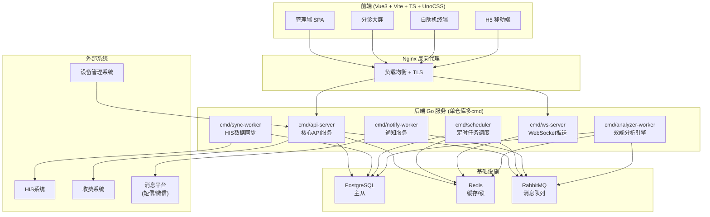
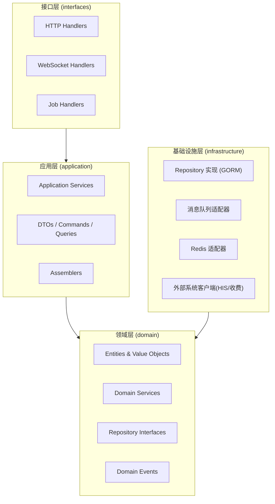
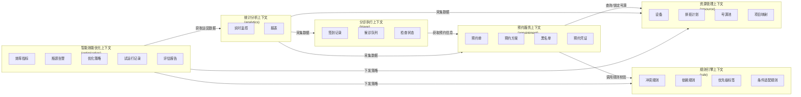
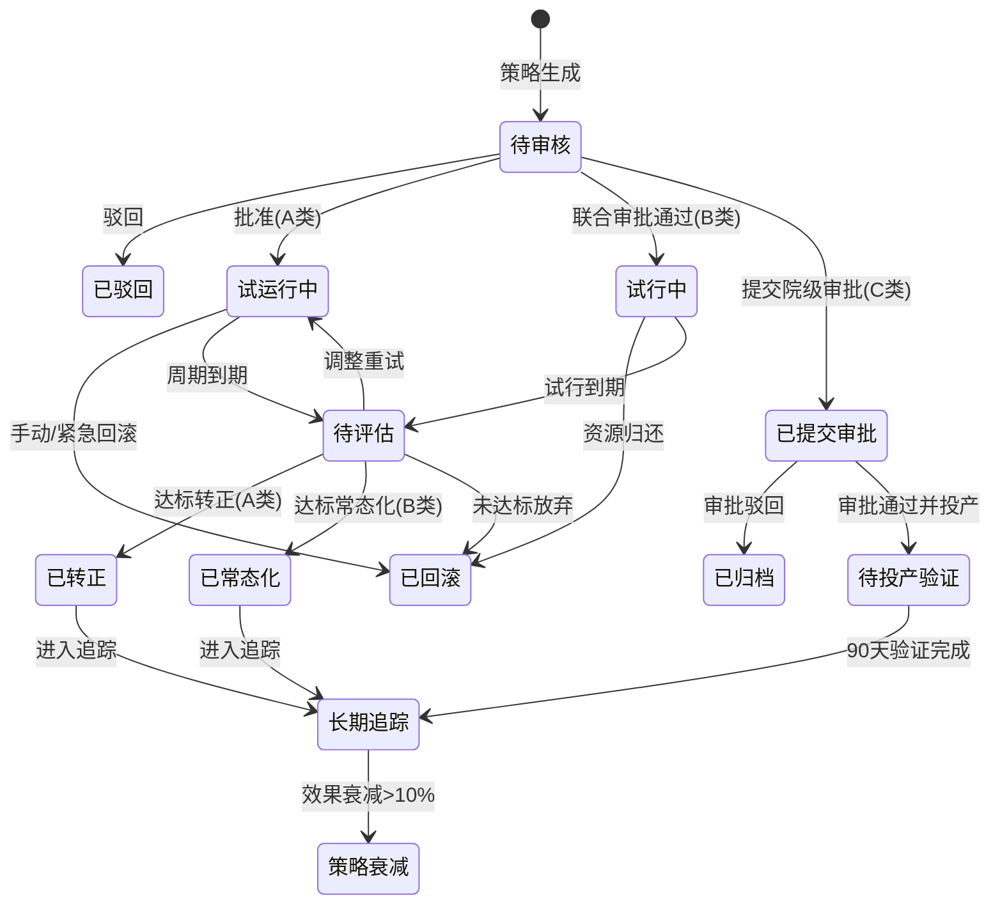
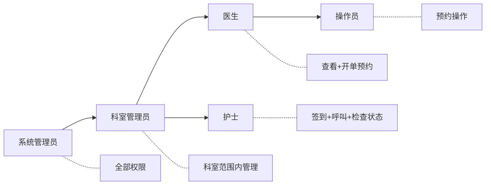
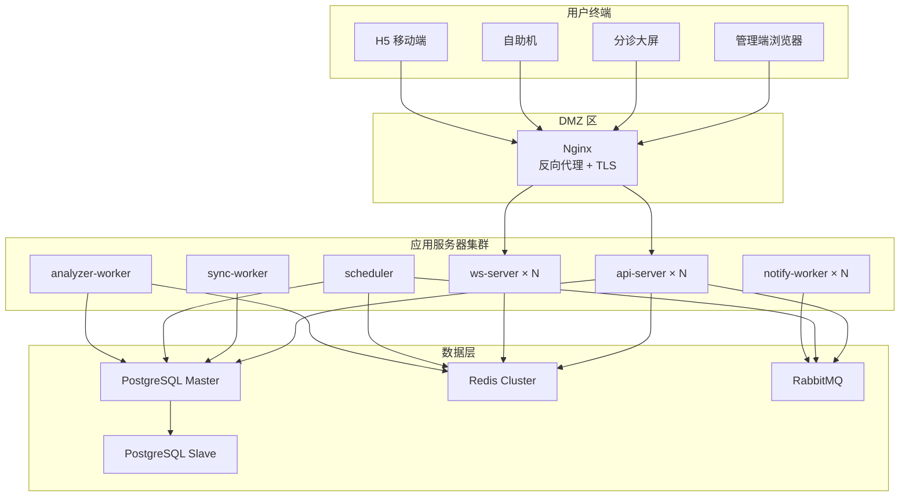

# 一站式全医技预约平台（MTAP）总体设计方案

| 项目 | 内容 |
|------|------|
| 文件状态 | 草稿 |
| 文件编号 | MTAP-ODD-2025-001 |
| 当前版本 | V1.0 |
| 完成日期 | 2025年 |

---

## 1 设计概述

### 1.1 设计目标

基于《一站式全医技预约平台软件产品规格书》（MTA-SRS-2025-001），本文档对系统进行总体架构设计。设计遵循以下核心原则：

- **后端**：采用 Golang，基于 DDD（领域驱动设计）分层架构，单项目多 `cmd` 入口
- **前端**：采用 Vue 3 + Vite + TypeScript + @antfu/eslint-config + UnoCSS
- **通信**：前后端通过 RESTful API + WebSocket 交互
- **部署**：容器化部署（Docker），支持主从数据库、Redis 缓存、消息队列

### 1.2 技术选型

| 层级 | 技术栈 | 说明 |
|------|--------|------|
| 后端语言 | Go 1.22+ | 高并发、高性能 |
| Web框架 | Gin / Hertz | 路由+中间件 |
| ORM | GORM | 数据库操作 |
| 数据库 | PostgreSQL 13+ / MySQL 8.0+ | 主从复制 |
| 缓存 | Redis 6.0+ | 号源锁定、会话管理 |
| 消息队列 | RabbitMQ / Kafka | 异步通知、事件驱动 |
| 前端框架 | Vue 3 + Vite 5 + TypeScript | SPA 管理端 |
| CSS方案 | UnoCSS (Attributify + Icons) | 原子化CSS |
| 代码规范 | @antfu/eslint-config | 统一前端规范 |
| API文档 | Swagger / OpenAPI 3.0 | 接口文档自动生成 |
| 容器化 | Docker + Docker Compose | 部署编排 |
| WebSocket | gorilla/websocket | 大屏实时推送 |

### 1.3 参考文档

- [Specification.md](file:///home/lgt/euler/plans/Specification.md) — 软件产品规格书

---

## 2 系统总体架构

### 2.1 架构全景



### 2.2 单项目多 cmd 设计

项目采用 **单仓库（mono-repo）多入口** 模式，所有服务共享领域层代码，通过不同的 `cmd/` 入口独立编译部署：

| cmd 入口 | 职责 | 启动方式 |
|----------|------|----------|
| `cmd/api-server` | 核心 HTTP API 服务，对外提供 RESTful 接口 | 长驻进程 |
| `cmd/sync-worker` | HIS 数据同步工作器（增量同步 + 全量同步） | 长驻进程 |
| `cmd/scheduler` | 定时任务调度器（号源释放、黑名单清理等） | 长驻进程 |
| `cmd/ws-server` | WebSocket 推送服务（分诊大屏、实时监控） | 长驻进程 |
| `cmd/notify-worker` | 消息通知消费者（短信/微信推送） | 长驻进程 |
| `cmd/analyzer-worker` | 效能分析引擎（异常检测、瓶颈归因、周期扫描、策略衰减追踪） | 长驻进程 |
| `cmd/migrate` | 数据库迁移工具 | 一次性运行 |

---

## 3 DDD 分层架构设计

### 3.1 分层模型



### 3.2 各层职责

| 层级 | 职责 | 核心原则 |
|------|------|----------|
| **接口层** (interfaces) | HTTP/WS路由、请求解析、参数校验、响应封装 | 不含业务逻辑 |
| **应用层** (application) | 编排领域服务、事务管理、DTO转换、权限校验 | 协调者角色 |
| **领域层** (domain) | 核心业务规则、实体、值对象、领域事件、仓储接口 | 无外部依赖 |
| **基础设施层** (infrastructure) | 数据库实现、外部API调用、缓存、消息队列 | 实现领域层接口 |

---

## 4 领域模型设计

### 4.1 限界上下文划分

根据规格书中的子系统划分，定义六个限界上下文（Bounded Context）：



### 4.2 聚合根与实体清单

#### 4.2.1 规则引擎上下文 (rule)

| 聚合根 / 实体 | 类型 | 说明 |
|----------------|------|------|
| `ConflictRule` | 聚合根 | 冲突规则（项目对 + 间隔 + 级别） |
| `ConflictPackage` | 聚合根 | 冲突包（包含多个项目的互斥分组） |
| `DependencyRule` | 聚合根 | 依赖规则（前置项目 + 后续项目 + 类型） |
| `PriorityTag` | 聚合根 | 优先级标签（名称 + 权重） |
| `SortingStrategy` | 聚合根 | 排序策略（类型 + 范围 + 时段） |
| `PatientAdaptRule` | 聚合根 | 患者属性适配规则 |
| `SourceControl` | 聚合根 | 开单来源控制规则 |
| `FastingItem` | 值对象 | 空腹项目标记 |

#### 4.2.2 资源管理上下文 (resource)

| 聚合根 / 实体 | 类型 | 说明 |
|----------------|------|------|
| `Device` | 聚合根 | 设备（归属科室/院区、支持检查类型） |
| `Schedule` | 聚合根 | 排班计划（设备 + 日期 + 时段） |
| `TimeSlot` | 实体 | 号源时段（属于 Schedule） |
| `SlotPool` | 聚合根 | 号源池（公共池/科室池/医生专池） |
| `ExamItem` | 聚合根 | 检查项目 |
| `ItemAlias` | 值对象 | 项目别名映射 |
| `Campus` / `Department` / `Doctor` | 实体 | 院区 / 科室 / 医生 |

#### 4.2.3 预约服务上下文 (appointment)

| 聚合根 / 实体 | 类型 | 说明 |
|----------------|------|------|
| `Appointment` | 聚合根 | 预约单（核心聚合，包含状态机） |
| `AppointmentPlan` | 值对象 | 预约方案（时间 + 设备 + 地点组合） |
| `Credential` | 实体 | 预约凭证（二维码 + 注意事项） |
| `Blacklist` | 聚合根 | 黑名单记录 |
| `NoShowRecord` | 实体 | 爽约记录 |
| `ChangeLog` | 值对象 | 改约/取消变更记录 |

#### 4.2.4 分诊执行上下文 (triage)

| 聚合根 / 实体 | 类型 | 说明 |
|----------------|------|------|
| `CheckIn` | 聚合根 | 签到记录 |
| `WaitingQueue` | 聚合根 | 候诊队列（按诊室维度） |
| `QueueEntry` | 实体 | 队列条目（属于 WaitingQueue） |
| `ExamExecution` | 聚合根 | 检查执行（状态流转链路） |

#### 4.2.5 统计分析上下文 (analytics)

| 聚合根 / 实体 | 类型 | 说明 |
|----------------|------|------|
| `DashboardSnapshot` | 聚合根 | 大屏快照数据 |
| `Report` | 聚合根 | 报表（按维度+日期范围） |

#### 4.2.6 智能效能优化上下文 (optimization)

| 聚合根 / 实体 | 类型 | 说明 |
|----------------|------|------|
| `EfficiencyMetric` | 聚合根 | 效率指标（指标名称+计算口径+阈值） |
| `MetricSnapshot` | 实体 | 指标快照（属于 EfficiencyMetric，按采样周期存储） |
| `BottleneckAlert` | 聚合根 | 瓶颈告警（异常指标+偏离程度+归因报告） |
| `OptimizationStrategy` | 聚合根 | 优化策略（核心聚合，含A/B/C分类+状态机） |
| `StrategyCategory` | 值对象 | 策略分类（A类软策略/B类弹性资源/C类硬资源） |
| `TrialRun` | 实体 | 试运行记录（灰度范围+周期+基线快照，属于 Strategy） |
| `BaselineSnapshot` | 值对象 | 基线快照（试运行前各指标数值） |
| `EvaluationReport` | 实体 | 评估报告（基线vs试运行对比+达标判定） |
| `ROIReport` | 实体 | ROI论证报告（C类专用，投资测算+收益预估） |
| `ResourceActionList` | 值对象 | 资源调配执行清单/归还清单（B类专用） |
| `PerformanceScan` | 聚合根 | 周期性效能扫描结果 |
| `StrategyDecayAlert` | 实体 | 策略衰减告警 |

**OptimizationStrategy 状态机：**



### 4.3 核心领域事件

| 事件 | 触发时机 | 消费方 |
|------|----------|--------|
| `AppointmentConfirmed` | 预约确认锁定号源 | 通知服务、统计 |
| `AppointmentCancelled` | 取消预约 | 号源释放、通知 |
| `SlotReleased` | 号源释放回池 | 排队等候者通知 |
| `PatientCheckedIn` | 患者签到 | 候诊队列、大屏 |
| `PatientCalled` | 护士呼叫 | 大屏更新 |
| `ExamStarted` / `ExamCompleted` | 检查开始/完成 | 设备利用率统计 |
| `NoShowTriggered` | 爽约发生 | 黑名单计数 |
| `BlacklistTriggered` | 累计爽约达阈值 | 限制预约权限 |
| `ScheduleChanged` | 排班变更（停诊/替班） | 患者通知、号源调整 |
| `HISDataSynced` | HIS 数据同步完成 | 资源刷新 |
| `BottleneckDetected` | 异常检测发现瓶颈 | 优化策略生成 |
| `StrategyApproved` | 管理员批准策略 | 试运行执行 |
| `TrialStarted` | 策略试运行开始 | 基线快照、监控启动 |
| `TrialEmergencyRollback` | 关键指标恶化超阈值 | 紧急回滚、告警 |
| `TrialCompleted` | 试运行周期到期 | 评估报告生成 |
| `StrategyPromoted` | 策略转正/常态化 | 写入规则引擎/资源管理 |
| `StrategyDecayed` | 已转正策略效果衰减 | 新一轮优化分析 |
| `PerformanceScanCompleted` | 周期效能扫描完成 | 优化机会推送 |

---

## 5 后端项目目录结构

```
euler/
├── cmd/                              # 多入口
│   ├── api-server/
│   │   └── main.go                   # 核心 API 服务入口
│   ├── sync-worker/
│   │   └── main.go                   # HIS 同步工作器入口
│   ├── scheduler/
│   │   └── main.go                   # 定时任务入口
│   ├── ws-server/
│   │   └── main.go                   # WebSocket 服务入口
│   ├── notify-worker/
│   │   └── main.go                   # 通知消费者入口
│   ├── analyzer-worker/
│   │   └── main.go                   # 效能分析引擎入口
│   └── migrate/
│       └── main.go                   # 数据库迁移工具
│
├── internal/                         # 内部包（不对外暴露）
│   ├── domain/                       # 领域层
│   │   ├── rule/                     # 规则引擎上下文
│   │   │   ├── entity.go             # ConflictRule, DependencyRule 等实体
│   │   │   ├── value_object.go       # FastingItem 等值对象
│   │   │   ├── repository.go         # 仓储接口定义
│   │   │   ├── service.go            # 领域服务（冲突检测、时间窗口计算）
│   │   │   └── event.go              # 领域事件
│   │   ├── resource/                 # 资源管理上下文
│   │   │   ├── entity.go
│   │   │   ├── value_object.go
│   │   │   ├── repository.go
│   │   │   ├── service.go            # 号源生成、排班管理
│   │   │   └── event.go
│   │   ├── appointment/              # 预约服务上下文
│   │   │   ├── entity.go
│   │   │   ├── value_object.go
│   │   │   ├── repository.go
│   │   │   ├── service.go            # 预约编排、方案计算
│   │   │   └── event.go
│   │   ├── triage/                   # 分诊执行上下文
│   │   │   ├── entity.go
│   │   │   ├── value_object.go
│   │   │   ├── repository.go
│   │   │   ├── service.go            # 队列管理、状态流转
│   │   │   └── event.go
│   │   ├── analytics/                # 统计分析上下文
│   │   │   ├── entity.go
│   │   │   ├── repository.go
│   │   │   └── service.go
│   │   └── optimization/             # 智能效能优化上下文
│   │       ├── entity.go             # Strategy, TrialRun, BottleneckAlert 等
│   │       ├── value_object.go       # StrategyCategory, BaselineSnapshot 等
│   │       ├── repository.go
│   │       ├── service.go            # 异常检测、归因分析、策略生成
│   │       └── event.go
│   │
│   ├── application/                  # 应用层
│   │   ├── rule/
│   │   │   ├── service.go            # 规则应用服务
│   │   │   ├── dto.go                # 请求/响应 DTO
│   │   │   └── assembler.go          # 实体<->DTO 转换
│   │   ├── resource/
│   │   │   ├── service.go
│   │   │   ├── dto.go
│   │   │   └── assembler.go
│   │   ├── appointment/
│   │   │   ├── service.go
│   │   │   ├── dto.go
│   │   │   └── assembler.go
│   │   ├── triage/
│   │   │   ├── service.go
│   │   │   ├── dto.go
│   │   │   └── assembler.go
│   │   ├── analytics/
│   │   │   ├── service.go
│   │   │   └── dto.go
│   │   └── optimization/
│   │       ├── service.go            # 策略审批、试运行、评估应用服务
│   │       ├── dto.go
│   │       └── assembler.go
│   │
│   ├── interfaces/                   # 接口层
│   │   ├── http/                     # HTTP 路由 & Handler
│   │   │   ├── router.go             # 路由注册总入口
│   │   │   ├── middleware/            # 中间件（认证、日志、限流...）
│   │   │   │   ├── auth.go
│   │   │   │   ├── ratelimit.go
│   │   │   │   └── logger.go
│   │   │   ├── rule/
│   │   │   │   └── handler.go
│   │   │   ├── resource/
│   │   │   │   └── handler.go
│   │   │   ├── appointment/
│   │   │   │   └── handler.go
│   │   │   ├── triage/
│   │   │   │   └── handler.go
│   │   │   ├── analytics/
│   │   │   │   └── handler.go
│   │   │   └── optimization/
│   │   │       └── handler.go
│   │   ├── ws/                       # WebSocket Handler
│   │   │   ├── hub.go                # 连接管理
│   │   │   └── handler.go
│   │   └── job/                      # 定时任务 Handler
│   │       ├── sync_job.go
│   │       ├── slot_release_job.go
│   │       ├── blacklist_cleanup_job.go
│   │       ├── anomaly_detection_job.go    # 每小时异常检测
│   │       ├── performance_scan_job.go     # 周度效能扫描
│   │       ├── trial_monitor_job.go        # 试运行监控
│   │       └── strategy_decay_job.go       # 策略衰减检测
│   │
│   └── infrastructure/              # 基础设施层
│       ├── persistence/              # 数据库持久化
│       │   ├── po/                   # Persistent Objects (数据库模型)
│       │   │   ├── rule.go
│       │   │   ├── resource.go
│       │   │   ├── appointment.go
│       │   │   ├── triage.go
│       │   │   ├── analytics.go
│       │   │   └── optimization.go
│       │   ├── rule/
│       │   │   └── repository.go     # 规则仓储实现
│       │   ├── resource/
│       │   │   └── repository.go
│       │   ├── appointment/
│       │   │   └── repository.go
│       │   ├── triage/
│       │   │   └── repository.go
│       │   ├── analytics/
│       │   │   └── repository.go
│       │   └── optimization/
│       │       └── repository.go     # 策略/试运行/评估仓储实现
│       ├── cache/                    # Redis 缓存
│       │   └── redis.go
│       ├── mq/                       # 消息队列
│       │   ├── publisher.go
│       │   └── consumer.go
│       ├── external/                 # 外部系统适配器
│       │   ├── his_client.go         # HIS 接口客户端
│       │   ├── payment_client.go     # 收费系统客户端
│       │   └── message_client.go     # 消息平台客户端
│       └── config/                   # 配置加载
│           └── config.go
│
├── pkg/                              # 公共工具包（可对外暴露）
│   ├── errors/                       # 统一错误码
│   ├── response/                     # 统一响应格式
│   ├── auth/                         # Token 工具
│   ├── encrypt/                      # 加解密工具（AES-256）
│   ├── qrcode/                       # 二维码生成
│   └── logger/                       # 日志工具
│
├── migrations/                       # 数据库迁移文件
├── configs/                          # 配置文件
│   ├── config.yaml
│   └── config.prod.yaml
├── deployments/                      # 部署文件
│   ├── Dockerfile
│   └── docker-compose.yaml
├── docs/                             # API 文档
│   └── swagger.yaml
├── web/                              # 前端项目（子目录）
│   └── (见第6节)
├── plans/                            # 设计文档
│   ├── Specification.md
│   └── overall-design.md
├── go.mod
├── go.sum
├── Makefile
└── README.md
```

---

## 6 前端项目设计

### 6.1 技术栈明细

| 技术 | 版本 | 用途 |
|------|------|------|
| Vue 3 | 3.4+ | 核心框架（Composition API + `<script setup>`） |
| Vite | 5.x | 构建工具 |
| TypeScript | 5.x | 类型安全 |
| Vue Router | 4.x | 路由管理 |
| Pinia | 2.x | 状态管理 |
| UnoCSS | 0.58+ | 原子化 CSS（Attributify + Icons + Presets） |
| @antfu/eslint-config | latest | 统一代码规范 |
| Ant Design Vue / Naive UI | latest | UI 组件库 |
| VueUse | latest | Composition 工具集 |
| Axios | latest | HTTP 请求 |
| ECharts | 5.x | 图表（大屏监控） |

### 6.2 前端目录结构

```
web/
├── index.html
├── vite.config.ts
├── tsconfig.json
├── eslint.config.ts                  # @antfu/eslint-config
├── uno.config.ts                     # UnoCSS 配置
├── package.json
├── src/
│   ├── main.ts                       # 应用入口
│   ├── App.vue
│   ├── router/                       # 路由
│   │   └── index.ts
│   ├── stores/                       # Pinia 状态管理
│   │   ├── user.ts
│   │   ├── rule.ts
│   │   ├── resource.ts
│   │   ├── appointment.ts
│   │   ├── triage.ts
│   │   └── optimization.ts
│   ├── api/                          # API 请求层
│   │   ├── request.ts                # Axios 实例封装
│   │   ├── rule.ts
│   │   ├── resource.ts
│   │   ├── appointment.ts
│   │   ├── triage.ts
│   │   ├── analytics.ts
│   │   └── optimization.ts
│   ├── views/                        # 页面视图
│   │   ├── login/
│   │   ├── rule/                     # 规则引擎管理
│   │   │   ├── ConflictRuleList.vue
│   │   │   ├── ConflictPackageList.vue
│   │   │   ├── DependencyRuleList.vue
│   │   │   ├── PriorityTagList.vue
│   │   │   └── SortingStrategyForm.vue
│   │   ├── resource/                 # 资源管理
│   │   │   ├── DeviceList.vue
│   │   │   ├── ScheduleCalendar.vue
│   │   │   ├── SlotPoolView.vue
│   │   │   └── ItemAliasManager.vue
│   │   ├── appointment/              # 预约管理
│   │   │   ├── AutoAppointment.vue
│   │   │   ├── ComboAppointment.vue
│   │   │   ├── ManualOverride.vue
│   │   │   ├── AppointmentList.vue
│   │   │   └── BlacklistManager.vue
│   │   ├── triage/                   # 分诊管理
│   │   │   ├── CheckInStation.vue
│   │   │   ├── WaitingQueueView.vue
│   │   │   ├── NurseCallPanel.vue
│   │   │   └── TriageScreen.vue      # 分诊大屏（独立路由）
│   │   ├── analytics/                # 统计分析
│   │   │   ├── Dashboard.vue         # 实时大屏
│   │   │   └── ReportExport.vue
│   │   └── optimization/             # 智能效能优化
│   │       ├── MetricsDashboard.vue   # 效率指标看板
│   │       ├── BottleneckAlerts.vue   # 瓶颈告警列表
│   │       ├── StrategyList.vue       # 优化策略管理
│   │       ├── StrategyDetail.vue     # 策略详情（含审批）
│   │       ├── TrialMonitor.vue       # 试运行监控面板
│   │       ├── EvaluationReport.vue   # 评估报告
│   │       ├── ROIReport.vue          # ROI论证报告(C类)
│   │       └── PerformanceScan.vue    # 周期扫描报告
│   ├── components/                   # 通用组件
│   │   ├── layout/
│   │   │   ├── AppLayout.vue
│   │   │   ├── Sidebar.vue
│   │   │   └── Header.vue
│   │   ├── common/
│   │   │   ├── DataTable.vue
│   │   │   ├── SearchForm.vue
│   │   │   └── ConfirmDialog.vue
│   │   └── business/
│   │       ├── PatientCard.vue
│   │       ├── SlotPicker.vue
│   │       └── PlanCompare.vue       # 方案对比组件
│   ├── composables/                  # 组合式函数
│   │   ├── useWebSocket.ts
│   │   ├── useAuth.ts
│   │   └── usePagination.ts
│   ├── types/                        # TypeScript 类型定义
│   │   ├── rule.ts
│   │   ├── resource.ts
│   │   ├── appointment.ts
│   │   ├── triage.ts
│   │   └── optimization.ts
│   ├── utils/                        # 工具函数
│   │   ├── format.ts
│   │   ├── desensitize.ts            # 脱敏工具
│   │   └── qrcode.ts
│   └── styles/
│       └── global.css
└── public/
    └── favicon.ico
```

### 6.3 前端页面与功能矩阵

| 页面模块 | 路由 | 对应规格书章节 | 权限 |
|----------|------|----------------|------|
| 冲突规则管理 | `/rule/conflict` | 4.1.2.1 | 管理员 |
| 冲突包管理 | `/rule/conflict-package` | 4.1.2.2 | 管理员 |
| 依赖关系管理 | `/rule/dependency` | 4.1.2.3 | 管理员 |
| 优先级标签 | `/rule/priority` | 4.1.1.2 | 管理员 |
| 排序策略配置 | `/rule/sorting` | 4.1.1.1 | 管理员 |
| 患者属性适配 | `/rule/patient-adapt` | 4.1.3.1 | 管理员 |
| 开单来源控制 | `/rule/source-control` | 4.1.3.2 | 管理员 |
| 设备管理 | `/resource/device` | 4.2.1 | 管理员 |
| 排班日历 | `/resource/schedule` | 4.2.2.2 | 管理员 |
| 号源池管理 | `/resource/slot-pool` | 4.2.2.1 | 管理员 |
| 项目别名映射 | `/resource/alias` | 4.2.1.2 | 管理员 |
| 一键预约 | `/appointment/auto` | 4.3.1.1 | 操作员+ |
| 组合预约 | `/appointment/combo` | 4.3.1.2 | 操作员+ |
| 人工干预 | `/appointment/manual` | 4.3.1.3 | 预约管理员 |
| 预约列表 | `/appointment/list` | 4.3.2 | 操作员+ |
| 黑名单管理 | `/appointment/blacklist` | 4.3.2.3 | 管理员 |
| 签到工作站 | `/triage/checkin` | 4.4.1 | 护士+ |
| 呼叫面板 | `/triage/call` | 4.4.2.1 | 护士+ |
| 分诊大屏 | `/triage/screen` | 4.4.2 | 公开 |
| 实时监控大屏 | `/analytics/dashboard` | 4.4.3.1 | 管理员 |
| 报表导出 | `/analytics/report` | 4.4.3.2 | 管理员 |
| 效率指标看板 | `/optimization/metrics` | 4.5.1 | 管理员 |
| 瓶颈告警 | `/optimization/alerts` | 4.5.2 | 管理员 |
| 优化策略管理 | `/optimization/strategies` | 4.5.3 | 管理员 |
| 试运行监控 | `/optimization/trial` | 4.5.4 | 管理员 |
| 评估报告 | `/optimization/evaluation` | 4.5.5 | 管理员 |
| ROI论证报告 | `/optimization/roi` | 4.5.3.3 | 管理员 |
| 周期扫描报告 | `/optimization/scan` | 4.5.6.1 | 管理员 |

---

## 7 核心 API 设计

### 7.1 API 模块划分

| 模块 | 前缀 | 说明 |
|------|------|------|
| 认证 | `/api/v1/auth` | 登录、Token刷新 |
| 规则管理 | `/api/v1/rules` | 冲突/依赖/优先级/排序/条件规则 CRUD |
| 资源管理 | `/api/v1/resources` | 设备/排班/号源/项目 CRUD |
| 预约服务 | `/api/v1/appointments` | 预约/改约/取消/黑名单 |
| 分诊管理 | `/api/v1/triage` | 签到/队列/呼叫/状态流转 |
| 统计分析 | `/api/v1/analytics` | 大屏数据/报表导出 |
| 效能优化 | `/api/v1/optimization` | 指标/告警/策略/试运行/评估/扫描 |
| WebSocket | `/ws/v1/screen` | 分诊大屏实时推送 |
| WebSocket | `/ws/v1/dashboard` | 监控大屏实时推送 |

### 7.2 关键接口示例

```
# 规则引擎
POST   /api/v1/rules/conflicts              # 创建冲突规则
GET    /api/v1/rules/conflicts               # 查询冲突规则列表
POST   /api/v1/rules/conflict-packages       # 创建冲突包
POST   /api/v1/rules/dependencies            # 创建依赖规则
POST   /api/v1/rules/check                   # 执行规则校验（冲突+依赖）

# 资源管理
POST   /api/v1/resources/schedules/generate  # 批量生成排班
POST   /api/v1/resources/schedules/suspend   # 临时停诊
POST   /api/v1/resources/schedules/substitute # 替班
GET    /api/v1/resources/slots               # 查询可用号源

# 预约服务
POST   /api/v1/appointments/auto             # 一键自动预约
POST   /api/v1/appointments/combo            # 组合预约
POST   /api/v1/appointments/manual           # 人工干预预约
PUT    /api/v1/appointments/:id/reschedule   # 改约
PUT    /api/v1/appointments/:id/cancel       # 取消
GET    /api/v1/appointments/:id/credential   # 获取预约凭证

# 分诊管理
POST   /api/v1/triage/checkin                # 签到
GET    /api/v1/triage/queue/:roomId          # 获取候诊队列
POST   /api/v1/triage/call/:roomId/next      # 呼叫下一位
POST   /api/v1/triage/call/:roomId/recall    # 重叫
POST   /api/v1/triage/exam/:id/start         # 开始检查
POST   /api/v1/triage/exam/:id/complete      # 检查完成

# 效能优化
GET    /api/v1/optimization/metrics           # 效率指标列表及趋势
GET    /api/v1/optimization/alerts            # 瓶颈告警列表
PUT    /api/v1/optimization/alerts/:id/dismiss # 标记告警误报
GET    /api/v1/optimization/strategies        # 优化策略列表
GET    /api/v1/optimization/strategies/:id    # 策略详情
POST   /api/v1/optimization/strategies/:id/approve   # 审批(A类单人/B类会签)
POST   /api/v1/optimization/strategies/:id/reject    # 驳回
POST   /api/v1/optimization/strategies/:id/rollback  # 手动回滚
GET    /api/v1/optimization/trials/:id/monitor        # 试运行监控数据
GET    /api/v1/optimization/evaluations/:id           # 评估报告
POST   /api/v1/optimization/strategies/:id/promote   # 转正/常态化
GET    /api/v1/optimization/roi-reports/:id           # ROI论证报告
POST   /api/v1/optimization/roi-reports/:id/result   # 回填审批结果(C类)
GET    /api/v1/optimization/scans                     # 周期扫描报告列表
GET    /api/v1/optimization/scans/:id                 # 扫描报告详情
```

---

## 8 数据库设计概要

### 8.1 核心表清单

| 模块 | 表名 | 说明 |
|------|------|------|
| 规则 | `conflict_rules` | 冲突规则 |
| 规则 | `conflict_packages` | 冲突包 |
| 规则 | `conflict_package_items` | 冲突包-项目关联 |
| 规则 | `dependency_rules` | 依赖规则 |
| 规则 | `priority_tags` | 优先级标签 |
| 规则 | `sorting_strategies` | 排序策略 |
| 规则 | `patient_adapt_rules` | 患者属性适配规则 |
| 规则 | `source_controls` | 开单来源控制 |
| 资源 | `campuses` | 院区 |
| 资源 | `departments` | 科室 |
| 资源 | `devices` | 设备 |
| 资源 | `doctors` | 医生 |
| 资源 | `exam_items` | 检查项目 |
| 资源 | `item_aliases` | 项目别名 |
| 资源 | `schedules` | 排班计划 |
| 资源 | `time_slots` | 号源时段 |
| 预约 | `appointments` | 预约单 |
| 预约 | `appointment_items` | 预约项目明细 |
| 预约 | `appointment_credentials` | 预约凭证 |
| 预约 | `appointment_change_logs` | 改约/取消日志 |
| 预约 | `blacklists` | 黑名单 |
| 预约 | `no_show_records` | 爽约记录 |
| 分诊 | `check_ins` | 签到记录 |
| 分诊 | `waiting_queues` | 候诊队列 |
| 分诊 | `queue_entries` | 队列条目 |
| 分诊 | `exam_executions` | 检查执行记录 |
| 效能优化 | `efficiency_metrics` | 效率指标定义 |
| 效能优化 | `metric_snapshots` | 指标快照（按采样周期） |
| 效能优化 | `bottleneck_alerts` | 瓶颈告警 |
| 效能优化 | `optimization_strategies` | 优化策略（含A/B/C分类+状态） |
| 效能优化 | `trial_runs` | 试运行记录 |
| 效能优化 | `baseline_snapshots` | 基线快照 |
| 效能优化 | `evaluation_reports` | 评估报告 |
| 效能优化 | `roi_reports` | ROI论证报告(C类) |
| 效能优化 | `resource_action_lists` | 资源调配/归还清单(B类) |
| 效能优化 | `resource_action_items` | 清单明细步骤 |
| 效能优化 | `performance_scans` | 周期性效能扫描结果 |
| 效能优化 | `strategy_decay_alerts` | 策略衰减告警 |
| 通用 | `users` | 用户（操作员/管理员/医生/护士） |
| 通用 | `roles` | 角色 |
| 通用 | `audit_logs` | 审计日志 |
| 通用 | `operation_logs` | 操作日志 |

---

## 9 安全与权限设计

### 9.1 RBAC 权限模型



### 9.2 安全措施

| 措施 | 实现方式 |
|------|----------|
| 传输加密 | TLS 1.2+，Nginx 终止 SSL |
| 存储加密 | 敏感字段 AES-256 加密（`pkg/encrypt`） |
| 认证 | JWT Token，有效期 2 小时，支持 Refresh Token |
| 接口限流 | 令牌桶算法，60次/分钟/用户 |
| 数据脱敏 | 患者姓名中间字符替换为 `*` |
| 审计日志 | 所有敏感操作不可篡改记录 |

---

## 10 部署架构



### 10.1 容器编排

```yaml
# docker-compose.yaml 结构概要
services:
  api-server:      # 核心API，可多副本
  ws-server:       # WebSocket推送
  sync-worker:     # HIS同步
  scheduler:       # 定时任务（单实例）
  notify-worker:   # 通知消费者
  analyzer-worker: # 效能分析引擎（单实例）
  postgres:        # 数据库
  redis:           # 缓存
  rabbitmq:        # 消息队列
  nginx:           # 反向代理
```

---

## 11 开发规范与构建

### 11.1 后端开发规范

- 遵循 Go 官方 Code Review 规范
- 使用 `golangci-lint` 进行静态检查
- 单元测试覆盖率不低于 70%
- 接口版本化路径：`/api/v1/...`
- 统一错误码体系（`pkg/errors`）
- 统一响应格式：`{ code, message, data }`

### 11.2 前端开发规范

- 使用 `@antfu/eslint-config` 统一代码风格
- 组件命名：PascalCase
- 路由命名：kebab-case
- API 层与视图层分离
- TypeScript 严格模式
- UnoCSS Attributify 模式

### 11.3 Makefile 命令

```makefile
build-api:       # 编译 api-server
build-sync:      # 编译 sync-worker
build-scheduler: # 编译 scheduler
build-ws:        # 编译 ws-server
build-notify:    # 编译 notify-worker
build-analyzer:  # 编译 analyzer-worker
build-all:       # 编译全部
migrate-up:      # 执行数据库迁移
migrate-down:    # 回滚数据库迁移
lint:            # 代码检查
test:            # 运行测试
docker-up:       # Docker Compose 启动
docker-down:     # Docker Compose 停止
```

---

## 12 实施计划建议

| 阶段 | 内容 | 预计周期 |
|------|------|----------|
| P0 - 基础搭建 | 项目骨架、DDD分层、数据库迁移、认证鉴权、前端框架搭建 | 2 周 |
| P1 - 核心规则 | 规则引擎（冲突/依赖/优先级）、基础字典同步 | 3 周 |
| P2 - 资源排班 | 号源生成、排班管理、排班干预 | 3 周 |
| P3 - 预约服务 | 一键预约、组合预约、人工干预、缴费校验、改约取消 | 4 周 |
| P4 - 分诊执行 | 签到、队列、呼叫、状态流转、大屏推送 | 3 周 |
| P5 - 闭环机制 | 黑名单、检前通知、报表统计 | 2 周 |
| P6 - 智能效能优化 | 数据采集、异常检测、瓶颈归因、A/B/C策略生成、试运行管理、评估报告、持续闭环 | 4 周 |
| P7 - 集成测试 | 端到端测试、性能调优、安全审计 | 2 周 |

---

> **备注**：本设计方案为总体设计，后续将根据各模块分别出具详细设计文档，包括完整的数据库 ER 图、接口参数定义、状态机详图等。
