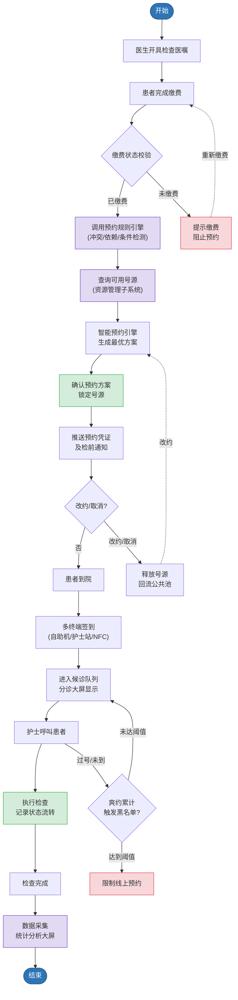
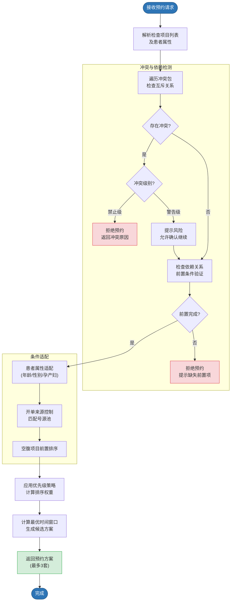
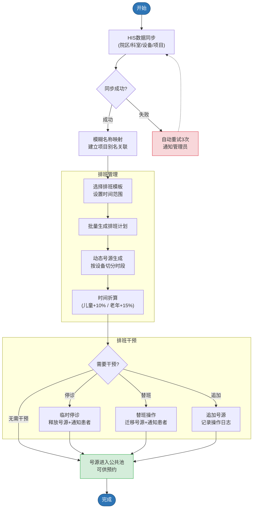
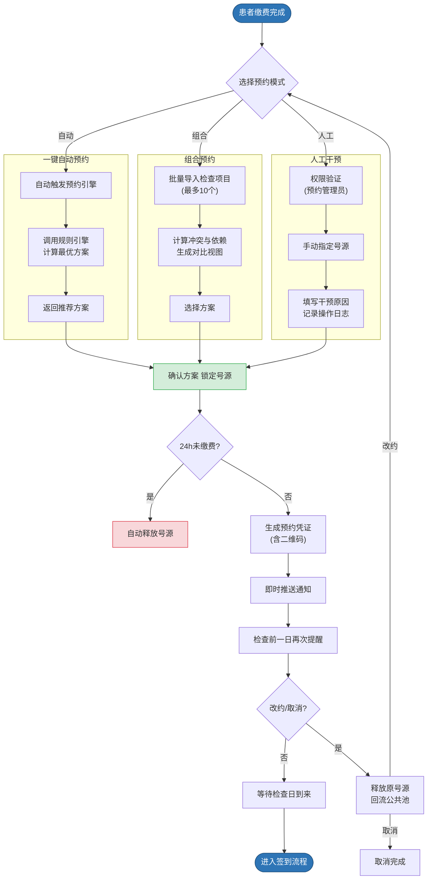
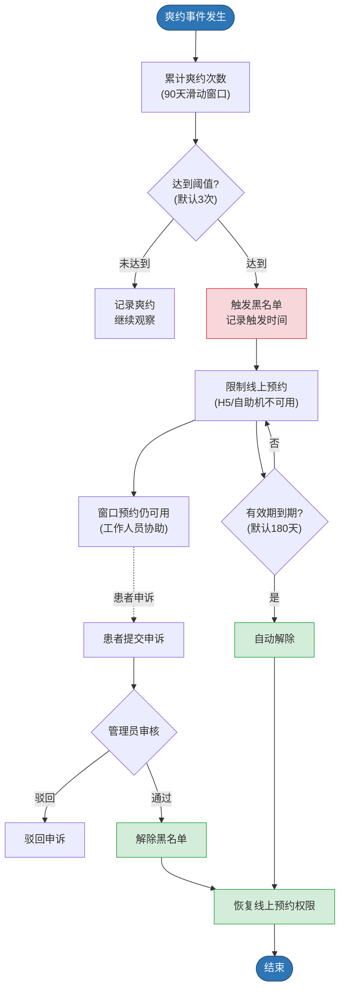
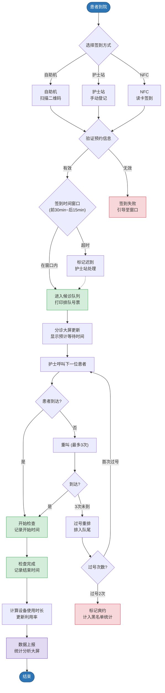
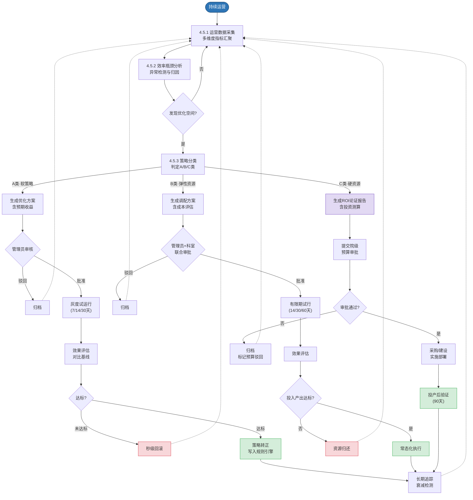

# 一站式全医技预约平台 软件产品规格书

| 项目 | 内容 |
|------|------|
| 文件状态 | 草稿 |
| 文件编号 | MTA-SRS-2025-001 |
| 当前版本 | V1.0 |
| 作者 | 产品经理 |
| 完成日期 | 2025年XX月XX日 |

编制：________________　　日期：________________

审核：________________　　日期：________________

批准：________________　　日期：________________

---

## 版本历史

| 版本/状态 | 作者 | 参与者 | 完成日期 | 变更详情 |
|-----------|------|--------|----------|----------|
| V1.0 | 产品经理 | 开发团队 | 2025年XX月XX日 | 初版发布 |

> *备注：版本历史中仅记录评审通过后发布版本的变更记录。*

---

## 目录

- [1 概述](#1-概述)
  - [1.1 编写目的](#11-编写目的)
  - [1.2 文档范围](#12-文档范围)
  - [1.3 术语/缩略词定义](#13-术语缩略词定义)
- [2 系统说明](#2-系统说明)
  - [2.1 背景介绍](#21-背景介绍)
  - [2.2 软件产品名称](#22-软件产品名称)
  - [2.3 产品功能](#23-产品功能)
  - [2.4 运行环境](#24-运行环境)
  - [2.5 条件和限制](#25-条件和限制)
- [3 系统组成](#3-系统组成)
- [4 功能规格](#4-功能规格)
  - [4.1 预约规则引擎子系统](#41-预约规则引擎子系统)
  - [4.2 基础信息与资源管理子系统](#42-基础信息与资源管理子系统)
  - [4.3 预约服务子系统](#43-预约服务子系统)
  - [4.4 分诊签到与执行管理子系统](#44-分诊签到与执行管理子系统)
  - [4.5 智能效能优化子系统](#45-智能效能优化子系统)
- [5 其他规格](#5-其他规格)
- [附录](#附录)

---

# 1 概述

## 1.1 编写目的

本文档是一站式全医技预约平台软件产品规格书，对该软件产品的应用背景、总体规格、各项功能的具体含义及功能和性能需求、度量和遵循基准等进行了详细阐述。本文档作为开发、测试及验收的依据，确保各方对系统功能范围、技术约束、性能指标达成一致理解。

## 1.2 文档范围

本文档作为一站式全医技预约平台软件产品规格书，使用对象主要包括：

- 项目需求人员：了解系统完整功能规格与业务规则
- 软件开发人员：依据规格定义进行编码实现
- 项目负责人：把控项目范围与交付标准
- 测试人员：编写测试用例与验收标准
- 运维人员：了解系统部署架构与接口依赖

## 1.3 术语/缩略词定义

| 缩略词/术语 | 释义 |
|-------------|------|
| HIS | Hospital Information System，医院信息系统 |
| 号源池 | 可预约时间段的集合，分为公共池、科室池、医生专池 |
| 冲突包 | 一组互斥检查项目的逻辑分组 |
| HL7 | Health Level Seven，医疗信息交换国际标准协议 |
| RESTful | 基于HTTP协议的轻量级Web服务架构风格 |
| WebSocket | 全双工通信协议，支持服务端主动推送数据 |
| NFC | Near Field Communication，近场通信技术 |
| MRI | Magnetic Resonance Imaging，磁共振成像 |
| CT | Computed Tomography，电子计算机断层扫描 |
| 效能闭环 | 数据采集→瓶颈发现→建议生成→试运行→效果评估→策略转正→下一轮检测的持续优化循环 |
| 基线快照 | 策略试运行前系统自动保存的各项效率指标数值，作为效果对比的基准 |
| 策略灰度 | 优化策略在限定范围（科室/设备/时段）内试运行，不影响灰度范围外的正常配置 |
| 策略衰减 | 已转正策略的改善效果随时间推移逐渐回落的现象 |

---

# 2 系统说明

## 2.1 背景介绍

传统医技预约流程依赖人工操作，存在资源利用率低、患者等待时间长、多项目检查协调困难、跨院区资源无法共享等核心痛点。本系统旨在通过智能化、集中化管理，优化医技科室（超声、放射、内镜等）的预约流程，实现检查项目的自动化排班与最优预约组合，减少患者往返次数与等待时间，提升患者就医体验与医院运营效率。

## 2.2 软件产品名称

一站式全医技预约平台（Medical Technology Appointment Platform，简称MTAP）

## 2.3 产品功能

本系统主要包含以下核心功能：

1. 预约规则引擎：包含优先级与时间规则、冲突与依赖管理、精细化条件限制
2. 基础信息与资源排班管理：包含基础字典映射、动态号源生成、排班干预工具
3. 全渠道预约与闭环管控：包含多模式预约操作、缴费校验、改约取消、黑名单机制
4. 分诊签到与执行统计：包含多终端签到、呼叫与状态管理、统计分析大屏
5. 智能效能优化：包含运营数据采集与分析、效率瓶颈识别、优化建议生成、试运行与效果评估、策略转正与持续迭代

## 2.4 运行环境

| 环境类型 | 说明 |
|----------|------|
| 硬件环境 | 服务器：CPU 8核及以上，内存 32GB 及以上，硬盘 500GB SSD 及以上；数据库服务器：CPU 16核及以上，内存 64GB 及以上，支持主从复制；客户端PC：CPU 2.0GHz 双核以上，内存 4GB 以上；自助终端设备：触摸屏，支持二维码扫描与NFC读取；分诊大屏：支持 1920×1080 分辨率以上；千兆网络环境 |
| 软件环境 | 服务器操作系统：CentOS 7.x / Ubuntu 20.04 LTS 及以上；Web服务器：Nginx 1.18+ / Tomcat 9.0+；数据库：MySQL 8.0+ / PostgreSQL 13+；消息队列：RabbitMQ 3.8+ 或 Kafka 2.8+；缓存：Redis 6.0+；客户端浏览器：Chrome 90+、Edge 90+；移动端：H5页面兼容 iOS 13+、Android 9.0+ |

## 2.5 条件和限制

- 前置条件：系统需先与HIS系统完成对接，成功获取患者信息、检查项目与缴费状态后方可正常运行
- 前置条件：号源生成依赖设备排班数据，排班数据需由管理员提前配置或从HIS同步
- 硬件限制：分诊大屏推送依赖WebSocket连接，需确保网络环境稳定且支持长连接
- 软件功能限制：冲突检测依赖预约规则引擎中的规则完整性，规则缺失可能导致漏检
- 安全限制：患者隐私数据必须加密传输与存储，系统必须符合《个人信息保护法》要求
- 其他：系统目前仅支持医院内网部署，外网访问需通过VPN或安全网关

---

# 3 系统组成

一站式全医技预约平台由以下子系统组成：

**(1) 预约规则引擎子系统：** 负责管理预约的核心业务规则，包括优先级调度策略、多项目时间窗口计算、检查间冲突与依赖关系检测、特殊人群适配规则等。作为系统的决策中枢，为预约调度提供规则支撑。

**(2) 基础信息与资源管理子系统：** 负责与HIS系统对接，同步院区、科室、设备、医生等基础信息，管理号源生成、设备排班、排班干预等资源调度功能。

**(3) 预约服务子系统：** 提供一键自动预约、组合预约、人工干预等多种预约模式，实现缴费校验、改约取消、黑名单管理、检前通知等闭环流程管控功能。

**(4) 分诊签到与执行管理子系统：** 覆盖患者到院后的签到、排队、呼叫、检查执行全流程，支持自助机、护士站、移动端等多终端签到方式，并与分诊大屏实时同步队列状态。

**(5) 统计分析与监控子系统：** 提供实时数据监控大屏及报表导出功能，辅助管理层进行资源调配决策。

**(6) 智能效能优化子系统：** 基于全量运营数据进行多维度效率分析，自动识别预约流程中的瓶颈与优化空间，生成可执行的优化建议（如排班调整、号源配比优化、冲突规则优化等），经管理员确认后进入试运行周期，系统自动对比试运行前后的效率指标并生成评估报告，决定策略是否转正。形成"数据采集→瓶颈发现→建议生成→试运行→效果评估→策略转正→下一轮检测"的持续优化闭环。

各子系统之间的约束关系：预约服务子系统在执行预约操作前，必须调用预约规则引擎进行规则校验；资源管理子系统为预约服务子系统提供可用号源数据；分诊签到子系统从预约服务子系统获取预约记录信息；统计分析子系统从各子系统采集运行数据；智能效能优化子系统从统计分析子系统获取全量运营数据，生成的优化策略经确认后下发至预约规则引擎和资源管理子系统执行。

系统总业务流程如下图所示，覆盖从医生开具医嘱到检查完成的全生命周期：

*图3-1 总业务流程图*

---

# 4 功能规格

## 4.1 预约规则引擎子系统

本子系统是预约平台的决策中枢，负责管理和执行所有业务规则，为预约调度提供冲突检测、优先级排序、时间窗口计算等核心能力。其处理流程如下图所示：

*图4-1 预约规则引擎处理流程*

### 4.1.1 优先级与时间规则管理

本模块负责配置和管理预约号源的排序策略、优先级标签、多项目时间窗口计算及空腹项目的前置规则。

#### 4.1.1.1 默认排序规则配置

支持配置单项目预约的默认排序策略，系统内置"等待时间最短"原则，自动匹配最早可用号源。

> **【用户界面】** 管理员通过规则配置页面，选择排序策略（等待时间最短/距离最近/指定优先级），配置生效范围（全局/科室/设备），设置生效时间段。
>
> **【数据输入】** 排序策略类型（枚举值）；生效范围（院区/科室/设备ID）；生效时间段（起止日期）。
>
> **【操作结果】** 保存成功后，新策略即时生效于目标范围内的所有预约请求。
>
> **【异常处理】** 规则保存失败（如数据库写入超时）时，界面提示"保存失败，请重试"，原策略继续生效不受影响。配置的生效范围包含无效ID时，系统保存前校验并提示具体无效项。规则引擎加载新策略异常时，自动回退至上一版本策略并记录异常日志。
>
> **【验证标准】** 配置完成后，在目标范围内发起预约请求，返回的号源排序应符合已配置策略。

| 约束类型 | 约束说明 |
|----------|----------|
| 字段约束 | 排序策略类型为必选枚举值，不可为空；生效范围至少选择一个院区/科室/设备 |
| 功能约束 | 同一范围内同一时段仅允许一条有效排序策略，新策略自动覆盖旧策略 |
| 数据约束 | 生效时间段的结束日期必须晚于起始日期；生效范围中的科室/设备ID必须在基础字典中存在 |

#### 4.1.1.2 优先级标签管理

支持创建、编辑、删除优先级标签（如急诊、VIP、普通），并为每个标签配置排序权重值。标签创建后可在预约时关联患者或检查项目，系统自动按权重调整排序。

> **【数据输入】** 标签名称（字符串，最长20字符）；权重值（整数，范围1–100，数值越大优先级越高）；标签颜色（十六进制色值）。
>
> **【默认值】** 系统预置"急诊"（权重90）、"VIP"（权重80）、"普通"（权重50）三个标签，不可删除但可修改权重。
>
> **【异常处理】** 创建标签时名称已存在，系统拒绝保存并提示。修改预置标签权重后出现多个标签权重相同，系统允许保存但提示同权重下按创建时间排序。尝试删除预置标签时，系统拒绝操作。

| 约束类型 | 约束说明 |
|----------|----------|
| 字段约束 | 标签名称：必填，最长20字符，不可重复；权重值：必填整数，范围1–100 |
| 字段约束 | 标签颜色：必填，合法十六进制色值（如#FF5733） |
| 功能约束 | 系统预置标签（急诊/VIP/普通）不可删除；删除自定义标签时，已关联的历史预约记录保持原标签不变 |

#### 4.1.1.3 多项目时间窗口计算

当患者有多个检查项目时，基于"时间相邻"原则，自动计算最优时间组合窗口，尽量将检查安排在同一时段。系统遍历所有可用号源，以总等待时间最短为优化目标，生成最多3套候选方案供选择。

> **【场景示例】** 患者张明华（男，45岁，门诊）同时需要完成3项检查：腹部CT平扫（15分钟）、腹部彩超（15分钟，空腹）、血常规（5分钟）。系统处理过程如下：
>
> ① 规则检测：腹部彩超标记为空腹项目，需前置安排在早晨；血常规无特殊约束；腹部CT平扫与腹部彩超无冲突关系。
>
> ② 号源扫描：查询当日可用号源——超声科EPIQ7设备08:15有空位（15分钟），检验科08:30有空位（5分钟），放射科CT-Force设备09:00有空位（15分钟）；另一方案——超声科EPIQ7设备10:00有空位，但违反空腹前置原则被排除。
>
> ③ 生成方案：
> - **方案A（总耗时最短）**：08:15腹部彩超(超声科2楼) → 08:35血常规(检验科1楼) → 09:00腹部CT平扫(放射科B1楼)，总耗时60分钟，等待间隙15分钟
> - **方案B（往返最少）**：08:15腹部彩超(超声科2楼) → 09:00腹部CT平扫(放射科B1楼) → 09:30血常规(检验科1楼)，总耗时80分钟，但楼层切换仅2次
> - **方案C（最早可约）**：08:00血常规 → 08:15腹部彩超 → 08:45腹部CT平扫，总耗时50分钟（但08:00血常规号源紧张，锁定成功率较低）
>
> ④ 系统默认推荐方案A，用户可选择其他方案。

> **【输入数据】** 患者的检查项目列表、各项目预计耗时、项目间最小间隔要求、项目间依赖关系。
>
> **【输出结果】** 预约方案列表，每套方案包含各项目的预约时间、设备、地点及总耗时预估。
>
> **【异常处理】** 计算超过3秒未返回结果时，中止计算并提示减少项目数量或扩大日期范围。所有号源均无法满足全部项目时，返回部分可行方案并提示无法安排的项目及原因。计算过程中号源被其他用户抢占，系统自动重新计算一次，仍失败则提示刷新重试。

| 约束类型 | 约束说明 |
|----------|----------|
| 性能约束 | 多项目组合计算处理时间不超过3秒（5个项目以内） |
| 功能约束 | 同一时段同一患者不可被安排在两个不同检查室 |
| 数量约束 | 单次计算最多返回3套候选方案 |

#### 4.1.1.4 空腹项目前置规则

支持标记特定检查项目为"空腹项目"（如超声胆囊、血糖检测），系统在组合预约时自动将空腹项目排在当日最早时段。若无法安排在早晨时段，系统给出提示并建议拆分至不同日期。

> **【场景示例】** 患者李秀英需同时完成：心脏彩超（非空腹）、腹部彩超（空腹，要求禁食8小时）、胸部DR（非空腹）。操作人员选择3月20日预约。系统处理：腹部彩超为空腹项目，自动排在当日最早时段08:00；心脏彩超排在08:20；胸部DR排在08:45。若08:00-09:00超声号源已满，系统提示"空腹项目无法安排在3月20日早晨，建议：①改为3月21日（08:00有号源）②仅预约心脏彩超和胸部DR在3月20日，腹部彩超单独改日"。

> **【数据输入】** 项目ID；空腹标记（布尔值）；空腹要求说明文本（最长200字符）。
>
> **【异常处理】** 当日早晨时段号源全部售罄时，提示建议选择其他日期或单独预约。多个空腹项目且早晨时段不足时，按项目优先级排序，优先安排高优先级空腹项目。
>
> **【验证标准】** 包含空腹项目的组合方案中，空腹项目的预约时间必须早于同日非空腹项目。

| 约束类型 | 约束说明 |
|----------|----------|
| 字段约束 | 空腹要求说明文本：最长200字符，支持中英文 |
| 功能约束 | 空腹项目在组合预约中必须自动前置排序，不可手动调整至非空腹项目之后 |

---

### 4.1.2 冲突与依赖管理

本模块负责管理检查项目间的互斥关系和依赖顺序，确保预约安全性。

#### 4.1.2.1 冲突检测引擎

自动识别检查项目间的互斥关系，在预约前进行冲突校验，阻止冲突项目在限制时间内被同时安排。管理员在规则配置页面创建冲突规则，选择冲突项目对或冲突包，设置最小间隔时间。

> **【数据输入】** 项目A的ID；项目B的ID；最小间隔时间（单位：小时，范围0–720）；冲突级别（禁止/警告）。
>
> **【操作结果】** 预约时若触发"禁止"级冲突，系统拒绝预约并提示冲突原因；若触发"警告"级，提示风险但允许操作人员确认后继续。
>
> **【示例规则】** MRI检查与金属植入物患者为绝对禁忌（禁止级）；CT增强与CT增强间隔至少24小时（禁止级）；CT增强与MRI增强间隔建议48小时（警告级）。
>
> **【异常处理】** 冲突规则数据不完整或被误删时，按"警告"级处理并提示联系管理员核实，允许确认后继续。同一项目对存在矛盾规则时，采用最严格规则并记录冲突日志。冲突检测服务不可用时，降级为跳过检测但标记"待人工复核"并通知科室负责人。

| 约束类型 | 约束说明 |
|----------|----------|
| 字段约束 | 最小间隔时间：必填整数，范围0–720小时；冲突级别：必选枚举值（禁止/警告） |
| 功能约束 | 禁止级冲突不可被普通操作员跳过，仅人工干预通道（需管理员权限）可豁免 |
| 数据约束 | 项目A与项目B不可为同一项目ID |

#### 4.1.2.2 冲突包管理

支持将一组互斥检查项目打包为"冲突包"，实现批量冲突规则设置。冲突包内任意两个项目之间自动生效相同的冲突规则，无需逐一配置。

> **【数据输入】** 冲突包名称（字符串，最长30字符）；包含项目列表（至少2个项目ID）；统一最小间隔时间。
>
> **【异常处理】** 包内引用的检查项目在HIS中被停用时，自动从包中移除并通知管理员。移除后包内项目少于2个，自动标记为"失效"状态。批量导入时格式错误，逐条校验并跳过错误记录，返回导入报告。

| 约束类型 | 约束说明 |
|----------|----------|
| 字段约束 | 冲突包名称：必填，最长30字符，不可重复；包含项目列表：至少2个有效项目ID |
| 功能约束 | 一个检查项目可同时属于多个冲突包；删除冲突包时，包内项目间的冲突规则同步解除 |
| 数据约束 | 冲突包内项目数低于2个时自动失效，不再参与冲突检测 |

#### 4.1.2.3 依赖关系处理

支持配置检查项目间的强制依赖顺序（如内镜检查前必须完成血常规），系统自动锁定前置条件。强制依赖下，若前置项目未完成或结果已过时效，系统拒绝预约后续项目；推荐依赖下，系统提示建议但不阻止预约。

> **【场景示例】** 患者孙志强需预约胃镜检查，系统配置了"血常规→胃镜"的强制依赖（时效72小时）。
>
> **情况A（正常通过）：** 孙志强3月18日10:00完成了血常规，3月19日预约胃镜——系统查询HIS确认血常规已出结果且在72小时时效内，依赖校验通过，允许预约。
>
> **情况B（前置未完成）：** 孙志强未做血常规直接预约胃镜——系统检测到强制前置项"血常规"未完成，拒绝预约，界面提示"胃镜检查需先完成血常规，请先预约血常规检查"。
>
> **情况C（结果过期）：** 孙志强1月10日做过血常规，3月19日预约胃镜——已超过72小时时效，系统提示"血常规结果已过期（超过72小时），请重新检查后再预约胃镜"。
>
> **情况D（紧急放行）：** 孙志强血常规结果刚过期1小时，已到达内镜中心候诊。护士确认患者状态良好，通过"紧急放行"功能跳过前置验证，系统记录操作日志"护士张XX于09:15紧急放行，原因：血常规结果过期1小时，患者已到场且状态良好"。

> **【数据输入】** 前置项目ID；后续项目ID；依赖类型（强制/推荐）；前置项目完成时效要求（如血常规结果须在72小时内有效）。
>
> **【异常处理】** 查询前置项目完成状态时HIS接口超时，按"前置状态未知"处理，允许预约但标记"待前置验证"，每30分钟自动重试，连续3次失败通知管理员。前置项目存在循环依赖，保存时检测并拒绝。前置项目结果已过时效但患者已到现场，护士可通过"紧急放行"跳过（需记录日志）。

| 约束类型 | 约束说明 |
|----------|----------|
| 字段约束 | 依赖类型：必选枚举值（强制/推荐）；时效要求：正整数，单位小时 |
| 功能约束 | 强制依赖在前置项目未完成时阻止后续预约；不允许配置循环依赖关系 |
| 功能约束 | "紧急放行"仅护士及以上角色可操作，须记录操作日志与放行原因 |

---

### 4.1.3 精细化条件限制

本模块根据患者属性和开单来源进行号源的精细化分配与过滤。

#### 4.1.3.1 患者属性适配

根据患者属性（年龄、性别、特殊状态如孕产妇）自动匹配适配的时段与设备。管理员配置属性匹配规则，如孕产妇限定使用低辐射设备、儿童匹配儿科专用时段、性别隔离检查自动分配对应性别医生诊室。

> **【场景示例】**
>
> **场景A — 孕产妇适配：** 患者李秀英（女，32岁，孕产妇标记）预约腹部彩超。系统自动过滤掉CT、DR等辐射类设备，仅返回超声设备的可用号源，并优先分配至产科专用超声诊室。
>
> **场景B — 儿童适配：** 患者赵小燕（女，8岁）预约腹部彩超。系统检测到年龄<14岁，自动匹配儿科专用时段（上午09:00-11:00），号源耗时从标准15分钟调整为16.5分钟（+10%儿童折算），同时过滤掉仅面向成人的诊室。
>
> **场景C — 性别隔离：** 患者刘美丽（女，28岁）预约妇科超声。系统自动分配女医生诊室，过滤掉男医生排班的诊室号源。若当日无女医生排班，提示"当日无适配诊室，建议选择X月X日（有女医生排班）"。
>
> **场景D — 多规则叠加：** 患者李秀英（女，32岁，孕产妇）预约妇科超声——同时触发孕产妇规则（低辐射设备）和性别隔离规则（女医生诊室），系统取交集，仅返回同时满足两个条件的号源。

> **【数据来源】** 患者属性从HIS系统实时同步获取，包括年龄、性别、孕产妇标记等。
>
> **【操作结果】** 预约引擎在分配号源时自动过滤不符合患者属性的设备与时段，仅返回适配结果。
>
> **【异常处理】** HIS未返回患者关键属性时，按"普通成人"默认属性匹配，预约记录标注"患者属性不完整"并提醒确认。孕产妇标记与年龄/性别逻辑矛盾时，忽略矛盾标记并记录数据异常日志。适配规则错误导致所有设备被过滤时，提示"无匹配设备，可能为规则配置异常"并通知管理员。

| 约束类型 | 约束说明 |
|----------|----------|
| 功能约束 | 若适配设备/时段已满，系统提示"当前无可用号源"并建议改日或跨院区预约 |
| 数据约束 | 患者年龄由出生日期自动计算，不可手动输入；性别字段仅支持"男/女/未知"三种枚举 |

#### 4.1.3.2 开单来源控制

根据患者来源（门诊/住院/转诊）区分号源池，确保不同来源患者使用对应的预约资源。门诊患者仅可预约门诊号源池；住院患者优先使用住院专属池，住院池满后可自动溢出至公共池；转诊患者使用目标院区的公共池。

> **【数据输入】** 开单来源类型（门诊/住院/院区间转诊）；关联号源池ID。
>
> **【异常处理】** 患者开单来源标识缺失或不合法时，默认按"门诊"来源处理并提示确认。指定号源池已耗尽且未配置溢出规则时，提示联系管理员开启溢出或调整配额。溢出目标池也已满时，建议改日或跨院区预约。

| 约束类型 | 约束说明 |
|----------|----------|
| 字段约束 | 开单来源类型：必选枚举值（门诊/住院/转诊） |
| 功能约束 | 号源池分配比例由管理员配置（如门诊60%、住院30%、公共10%），各池可设置溢出规则 |
| 功能约束 | 转诊预约需提供转诊单编号，系统校验转诊单有效性 |

---

## 4.2 基础信息与资源管理子系统

本子系统负责维护预约平台运行所需的基础数据与资源调度信息，是预约服务的数据基座。其业务流程如下图所示：

*图4-2 号源管理与排班流程*

### 4.2.1 基础字典映射

本模块负责对接HIS系统同步基础数据，并维护检查项目的别名映射关系。

#### 4.2.1.1 HIS数据同步

对接HIS系统，实时同步院区、科室、设备、医生、检查项目等基础信息，建立统一资源视图。通过HL7标准接口拉取数据，支持增量同步与全量同步两种模式。

> **【同步频率】** 增量同步每5分钟执行一次；全量同步每日凌晨02:00自动执行。
>
> **【数据校验】** 同步数据需通过格式校验（必填字段非空、枚举值合法）与逻辑校验（设备归属科室存在、医生归属院区存在）。
>
> **【异常处理】** 同步失败时系统自动重试3次（间隔1分钟），仍失败则记录异常日志并通知管理员。
>
> **【验证标准】** HIS中新增一台设备后，系统在5分钟内可查询到该设备信息。

| 约束类型 | 约束说明 |
|----------|----------|
| 性能约束 | 增量同步间隔：5分钟；全量同步窗口：凌晨02:00–03:00 |
| 功能约束 | 同步失败自动重试3次，间隔1分钟；超过重试次数后记录日志并通知管理员 |
| 数据约束 | 同步数据中的设备ID、科室ID、院区ID必须唯一，重复数据按最新一条覆盖 |

#### 4.2.1.2 模糊名称映射

支持检查项目的别名/模糊名称映射，确保不同叫法的同一检查能正确关联号源。例如"腹部彩超"="肝胆胰脾超声"="上腹部B超"均指向同一号源类型。

> **【数据输入】** 标准项目名称；别名列表（每个项目支持最多10个别名），映射关系由管理员维护。
>
> **【异常处理】** 医生开单使用的项目名称在标准名称和别名表中均未匹配时，提示"未识别的检查项目名称"并记录日志供管理员补充映射。别名与其他标准名称冲突时保存被拒绝。HIS同步的项目名称变更导致映射失效时，在同步报告中标注。

| 约束类型 | 约束说明 |
|----------|----------|
| 字段约束 | 标准项目名称：必填，不可为空；别名列表：每个项目最多10个别名，每个别名最长50字符 |
| 数据约束 | 别名不可与其他标准项目名称重复，系统保存时自动校验唯一性 |

---

### 4.2.2 精细化资源管理

本模块负责号源的动态生成与排班计划的维护和干预。

#### 4.2.2.1 动态号源生成

按设备独立排班，根据设备属性与检查类型自动生成号源时段，支持多项目混合排程。系统根据标准耗时按顺序切分工作时段为号源单元（如MRI平扫15分钟/号、MRI增强30分钟/号），并根据患者年龄自动调整号源消耗（儿童+10%、老年患者>70岁+15%）。

> **【场景示例】** MRI-西门子3.0T Vida设备，工作日排班08:00-12:00（240分钟），可执行MRI平扫（标准20分钟/号）和MRI增强（标准35分钟/号）。管理员配置混合排程模板为"6个平扫+2个增强"循环。
>
> 号源生成过程：
> - 08:00-08:20 MRI平扫#1
> - 08:20-08:40 MRI平扫#2
> - 08:40-09:00 MRI平扫#3
> - 09:00-09:20 MRI平扫#4
> - 09:20-09:40 MRI平扫#5
> - 09:40-10:00 MRI平扫#6
> - 10:00-10:35 MRI增强#1
> - 10:35-11:10 MRI增强#2
> - 11:10-11:30 MRI平扫#7
> - 11:30-11:50 MRI平扫#8
> - 剩余10分钟不足一个号源，不再生成
>
> 共生成10个号源。当72岁患者王建国预约MRI平扫时，系统自动将其号源耗时从20分钟调整为23分钟（+15%老年折算），即该号源占用23分钟，后续号源起始时间顺延。当8岁患者赵小燕预约时，耗时调整为22分钟（+10%儿童折算）。

> **【数据输入】** 设备ID；工作日期；工作时段（起止时间）；可执行检查项目列表及各项目标准耗时。
>
> **【输出结果】** 号源包含时段起止时间、关联设备、关联检查类型、剩余可预约数量。
>
> **【异常处理】** 设备排班数据缺失时，跳过该设备号源生成并记录告警日志通知管理员。动态折算后号源数量超出设备单日上限时，按上限截断并提示。号源生成过程中数据库写入失败，自动回滚该批次并重试一次。

| 约束类型 | 约束说明 |
|----------|----------|
| 字段约束 | 工作时段起止时间：必填，格式HH:mm；标准耗时：正整数，单位分钟 |
| 功能约束 | 单台设备单日号源总数不得超过管理员设定的上限值；号源时段不得超出设备工作时段范围 |
| 功能约束 | 动态时间折算规则：儿童（<14岁）+10%，老年（>70岁）+15%，可由管理员调整折算系数 |

#### 4.2.2.2 排班干预工具

支持管理员批量生成年度/月度排班计划，并进行临时停诊、替班、追加号源等干预操作。排班日历视图展示设备维度的每日排班状态，支持拖拽调整与批量操作。

> **【场景示例 — 临时停诊完整流程】** 3月20日09:00，CT-西门子Force设备突发故障需维修，预计修复时间4小时。管理员操作步骤：
>
> ① 在排班日历中选择CT-Force设备，点击3月20日09:00-13:00时段，选择"临时停诊"。
>
> ② 系统检测到该时段有8个已预约号源（涉及6名患者），弹出确认："将释放8个号源并通知6名患者，是否确认？"管理员确认。
>
> ③ 系统自动执行：8个号源状态变为"已释放"回流公共池；6名患者收到短信/微信通知"您在CT-Force的检查因设备维护已取消，请改约"；系统自动为6名患者匹配CT-GE Revolution的同日可用号源并推送改约建议。
>
> ④ 其中2名患者通过H5页面自助完成改约；3名患者通过窗口改约；1名患者短信通知失败（手机号关机），护士站界面标注红色"通知未送达"标识，工作人员人工电话联系。

> **【批量生成】** 选择设备、时间范围、排班模板后一键生成排班计划，模板支持每周重复/自定义周期。
>
> **【临时停诊】** 选择设备与时段后标记停诊，系统自动释放该时段已预约号源并通知相关患者。
>
> **【追加号源】** 在已有排班基础上追加额外号源（如加班时段），需填写追加原因并记录操作日志。
>
> **【替班操作】** 将一台设备的排班整体迁移至另一台同类设备，已预约患者号源自动迁移并通知。
>
> **【异常处理】** 停诊时通知患者失败，加入重试队列（每10分钟重试，最多6次），同时在护士站标注"通知未送达"供人工电话通知。替班目标设备不支持源设备某些检查类型时拒绝替班并提示。批量生成时模板数据异常，逐条校验并跳过异常条目。追加号源与已有时段重叠时拒绝追加。

| 约束类型 | 约束说明 |
|----------|----------|
| 权限约束 | 停诊操作需管理员权限；追加号源需填写原因（必填，最长200字符） |
| 功能约束 | 替班目标设备必须支持源设备的全部检查类型；追加号源时段不可与已有排班重叠 |
| 功能约束 | 停诊操作执行后，该时段号源状态变为不可预约，已预约患者收到改约通知 |

---

## 4.3 预约服务子系统

本子系统是面向预约操作的核心业务模块，覆盖从预约发起到完成的全流程闭环管控。其整体流程如下图所示：

*图4-3 全渠道预约与闭环管控流程*

### 4.3.1 多模式预约操作

本模块提供三种预约模式，满足不同场景下的预约需求。

#### 4.3.1.1 一键自动预约

患者完成缴费后，系统自动触发智能预约引擎。引擎自动读取患者待预约检查项目列表，调用预约规则引擎进行冲突检测与时间窗口计算，返回最优时间、地点组合方案。患者/操作人员确认后自动锁定号源。

> **【端到端场景示例】** 患者张明华（男，45岁，门诊）就诊后，医生开具"腹部CT平扫+腹部彩超"两项检查医嘱。完整流程：
>
> ① **缴费触发**：张明华在窗口完成两项检查的缴费（共450元），HIS回调通知预约平台。
>
> ② **规则引擎校验**：系统自动读取两项检查 → 冲突检测（CT平扫与腹部彩超无互斥关系，通过）→ 依赖检测（无强制前置条件，通过）→ 患者属性适配（男性，45岁，普通成人，无特殊限制）→ 空腹检测（腹部彩超为空腹项目，自动前置）。
>
> ③ **号源匹配**：系统查询当日可用号源，腹部彩超安排在08:30（超声科2楼，EPIQ7设备），腹部CT平扫安排在09:15（放射科B1楼，CT-Force），两项检查间隔30分钟（步行+候诊），同一上午完成。
>
> ④ **推送确认**：张明华手机收到微信推送："您的检查已自动安排——①08:30腹部彩超(门诊楼2楼超声科3号诊室) ②09:15腹部CT平扫(门诊楼B1放射科CT室)。请空腹前来，禁带金属物品。[查看预约凭证]"
>
> ⑤ **号源锁定**：张明华点击确认后，两个号源进入"已确认"状态。若5分钟内未确认，号源自动释放。

> **【合并策略】** 若患者有多个可合并项目（如超声+抽血），系统优先将其安排在相邻时段与同一楼层。
>
> **【异常处理】** 若无可用号源，提示最近可预约日期；若部分项目无法安排，返回已安排项目方案并提示未安排项目原因。

| 约束类型 | 约束说明 |
|----------|----------|
| 性能约束 | 单次自动预约响应时间不超过2秒 |
| 功能约束 | 缴费完成是触发自动预约的前置条件，未缴费不触发 |
| 功能约束 | 自动锁定号源后，号源进入5分钟确认倒计时，超时未确认则自动释放 |

#### 4.3.1.2 组合预约

支持操作人员手动选择多个检查项目批量导入，系统自动计算时间冲突与依赖关系，生成多套预约方案对比视图。

> **【场景示例】** 患者王建国（男，72岁，住院）需完成5项检查：头颅MRI平扫、头颅MRI增强、血常规、胸部DR、心脏彩超。操作人员在组合预约界面操作：
>
> ① 从HIS医嘱一键导入5个项目，选择期望日期3月20日-3月22日，偏好时段"上午"。
>
> ② 系统自动检测：MRI平扫与MRI增强可合并安排（同设备连续做）；MRI增强前推荐先做血常规（推荐依赖）；患者72岁，号源耗时+15%老年折算。
>
> ③ 生成3套方案对比视图：
>
> | 方案 | 3月20日 | 3月21日 | 总耗时 | 往返次数 |
> |------|---------|---------|--------|----------|
> | A·总耗时最短 | 08:00血常规→08:15胸部DR→09:00头颅MRI平扫+增强(连做) | 08:30心脏彩超 | 2天，检查总时长105分钟 | 2次 |
> | B·一天完成 | 08:00血常规→08:15胸部DR→09:00心脏彩超→10:00头颅MRI平扫+增强 | — | 1天，检查总时长120分钟，等待间隙较长 | 1次 |
> | C·最早可约 | 08:00血常规→08:30头颅MRI平扫+增强 | 08:00胸部DR→08:15心脏彩超 | 2天，但MRI安排在最早时段 | 2次 |
>
> ④ 操作人员与患者沟通后选择方案B（住院患者优先减少往返），点击确认，系统批量锁定4个号源。

> **【用户界面】** 左侧为项目选择面板（支持搜索与筛选），右侧为方案对比区域，展示各方案的总耗时、往返次数、冲突提示。
>
> **【数据输入】** 检查项目列表（支持从HIS医嘱直接导入或手动添加）；期望预约日期范围；偏好时段（上午/下午/不限）。
>
> **【输出结果】** 最多生成3套候选方案，按"总耗时最短""往返次数最少""最早可约"分别排序。
>
> **【异常处理】** 确认方案时部分号源已被抢占，提示具体项目并自动重新计算替代方案。从HIS导入项目时接口超时，提示重试或手动添加。

| 约束类型 | 约束说明 |
|----------|----------|
| 数量约束 | 单次组合预约项目数量上限为10个，超出时提示分批预约 |
| 字段约束 | 期望预约日期范围：起始日期不得早于当日，结束日期不得超过起始日期后90天 |

#### 4.3.1.3 人工干预通道

具备特定权限的工作人员可跳过自动排班逻辑，强制指定号源进行预约。在预约界面点击"人工指定"按钮进入手动号源选择模式。每次操作需填写干预原因，系统记录操作人、操作时间、干预原因、涉及号源。

> **【异常处理】** 权限不足时按钮不可见，接口绕过前端调用则后端拒绝并记录安全日志。指定号源已被占用时提示选择其他时段。强制预约触发禁止级冲突时，弹出二次确认要求输入原因并勾选"已知悉冲突风险"。

| 约束类型 | 约束说明 |
|----------|----------|
| 权限约束 | 仅"预约管理员"及以上角色可使用，普通操作员不可见 |
| 字段约束 | 干预原因：必填，最长200字符 |
| 功能约束 | 人工干预预约不计入智能排班的号源利用率统计，单独统计干预预约占比 |
| 审计约束 | 所有人工干预操作记录不可修改和删除，保留完整审计链 |

---

### 4.3.2 闭环流程管理

本模块覆盖预约后的缴费校验、改约取消、黑名单管理、检前通知等闭环流程。

#### 4.3.2.1 缴费校验

预约前对接HIS收费系统，验证患者是否已完成检查项目的缴费。通过RESTful接口调用HIS扣费状态查询接口，传入患者ID与检查项目ID。缴费已完成则允许继续，未完成则阻止预约。

> **【号源释放】** 未缴费的预约订单在24小时后自动释放号源，释放的号源实时回流至公共号源池。
>
> **【异常处理】** HIS接口调用超时（超过5秒），按"缴费未确认"处理，允许临时预约但标记为"待校验"状态，30分钟内重新校验。

| 约束类型 | 约束说明 |
|----------|----------|
| 性能约束 | HIS缴费接口调用超时阈值：5秒 |
| 功能约束 | 未缴费订单24小时后自动释放号源；"待校验"状态预约30分钟内必须完成重新校验 |

#### 4.3.2.2 改约与取消

支持患者或操作人员通过线上（H5页面）或线下（窗口）渠道进行改约或取消预约。改约时原号源立即释放并回流至公共池，新号源按正常流程锁定。取消后号源实时释放，若该时段有排队等候的患者，自动通知排队首位。

> **【场景示例 — 改约完整交互】** 患者周丽华已预约3月20日09:00腹部CT增强（改约次数0/3）。
>
> **第1次改约**：周丽华通过H5页面发起改约，选择3月21日10:00 → 系统释放3月20日09:00号源（回流公共池），锁定3月21日10:00号源，推送改约确认通知。预约记录标注"已改约1次"。
>
> **第2次改约**：周丽华再次改约至3月22日08:30 → 操作成功，标注"已改约2次"。
>
> **第3次改约**：周丽华第三次改约至3月23日09:00 → 操作成功，标注"已改约3次"。H5页面"改约"按钮变为灰色不可点击，旁边提示"已达改约上限(3次)，如需更换时间请取消后重新预约"。
>
> **检查前2小时内尝试改约**：3月23日07:15，周丽华尝试改约08:30的检查 → 系统拒绝，提示"距检查不足2小时，仅支持取消操作"。
>
> **取消后号源自动通知**：周丽华取消后，该号源释放回公共池。系统检测到另一名患者刘美丽此前预约失败（无可用号源），自动向刘美丽推送"3月23日09:00腹部CT增强有新号源，是否预约？"。

> **【异常处理】** 改约时释放原号源成功但锁定新号源失败，自动回滚恢复原预约不变并提示重试。取消时数据库事务异常，标记"取消中"由后台5分钟内异步完成。2小时内尝试改约时拒绝并仅支持取消。改约达3次上限时按钮置灰并提示取消后重新预约。

| 约束类型 | 约束说明 |
|----------|----------|
| 功能约束 | 改约须在检查开始前2小时以上操作，否则仅支持取消 |
| 数量约束 | 同一预约最多允许改约3次，超出后仅可取消重新预约 |
| 数据约束 | 改约/取消操作生成变更记录，包含操作时间、操作人、变更原因、原号源与新号源信息 |

#### 4.3.2.3 黑名单机制

累计爽约达到阈值的患者自动进入黑名单，限制其线上预约权限。黑名单患者不可使用线上自助预约（H5/自助机），但可通过窗口由工作人员协助预约。患者可向窗口提交申诉，经管理员审核通过后解除；黑名单有效期默认180天，到期自动解除。

> **【完整生命周期场景】** 患者陈大力的黑名单触发与解除全过程：
>
> **1月15日** — 陈大力预约腹部CT未到（爽约第1次），系统记录爽约，爽约计数1/3。
>
> **2月1日** — 陈大力预约心脏彩超未到（爽约第2次），爽约计数2/3。系统推送提醒"您近期已爽约2次，再次爽约将被限制线上预约权限"。
>
> **2月18日** — 陈大力预约胸部DR未到（爽约第3次），爽约计数达到阈值3次（90天窗口内）。系统自动触发黑名单：状态变为"生效中"，有效期至8月20日（180天后）；陈大力收到通知"您已累计爽约3次，线上预约权限已暂停，请至窗口办理预约"。
>
> **3月5日** — 陈大力尝试通过H5页面预约 → 系统拦截，提示"您当前处于预约限制期，请至窗口由工作人员协助预约"。陈大力到窗口后，工作人员可正常为其预约（系统记录"黑名单患者窗口预约"标签）。
>
> **4月10日** — 陈大力到窗口提交申诉，填写申诉理由"前三次因突发加班无法到院，后续已调整工作时间，保证按时就诊"。管理员审核后点击"通过"→ 黑名单解除，陈大力恢复线上预约权限，爽约计数清零。
>
> **或者，若未申诉** — 8月20日黑名单到期，系统自动解除，陈大力恢复线上预约权限。

> **【异常处理】** 爽约计数服务异常时，以预约记录和签到记录为准进行校准，每日凌晨自动执行校准任务。黑名单触发时通知失败，加入重试队列。管理员审核申诉时操作失败，保留申诉记录标记"待处理"。

| 约束类型 | 约束说明 |
|----------|----------|
| 功能约束 | 触发条件：90天滑动窗口内累计爽约3次（默认阈值，管理员可配置，范围1–10次） |
| 功能约束 | 黑名单有效期默认180天（管理员可配置，范围30–365天），到期自动解除 |
| 数据约束 | 黑名单记录包含触发时间、爽约明细、解除时间、解除原因，不可删除 |

#### 4.3.2.4 检前通知

预约成功后自动生成带二维码的预约凭证并推送检前注意事项。凭证包含患者姓名、检查项目、预约日期时段、检查地点及预约二维码。注意事项根据检查项目自动匹配模板，通过短信/微信/APP消息渠道推送。

> **【推送时机】** 预约成功时立即推送一次；检查前一日18:00再次提醒。
>
> **【异常处理】** 短信网关失败时自动切换至备用通道补发，所有通道均失败则在护士站标注由工作人员电话通知。模板未关联当前检查类型时发送通用模板并记录日志。二维码生成失败时生成文字凭证并提示到院后至窗口报到。检查前一日提醒时发现预约已取消则自动跳过。

| 约束类型 | 约束说明 |
|----------|----------|
| 字段约束 | 注意事项模板：由管理员维护，关联检查项目类型，内容支持富文本，最长500字符 |
| 功能约束 | 推送渠道依赖患者联系方式完整性，缺失手机号时仅生成凭证不推送短信 |
| 功能约束 | 患者姓名在凭证中脱敏显示（如张*明） |

黑名单管理的详细处理流程如下图所示：

*图4-5 黑名单管理流程*

---

## 4.4 分诊签到与执行管理子系统

本子系统覆盖患者到院后的签到、候诊、呼叫、检查执行全流程，是预约闭环的"最后一公里"。其业务流程如下图所示：

*图4-4 分诊签到与执行流程*

### 4.4.1 多终端签到

本模块支持患者通过多种终端完成签到，进入候诊队列。

#### 4.4.1.1 自助机扫码签到

患者到院后在自助终端机上扫描预约二维码完成签到。签到成功后显示排队序号、预计等待时间、检查诊室位置，并自动打印排队号票。

> **【签到窗口】** 预约时间前30分钟至预约时间后15分钟可签到，超时视为迟到由护士站处理。
>
> **【异常处理】** 二维码无效或预约不存在时显示"签到失败，请至窗口确认"。非当日预约显示"未到预约日期"。

| 约束类型 | 约束说明 |
|----------|----------|
| 时间约束 | 签到时间窗口：预约时间前30分钟至预约时间后15分钟 |
| 功能约束 | 超时未签到视为迟到，仅可通过护士站手动处理 |
| 硬件约束 | 自助机需配备二维码扫描模块与热敏打印模块 |

#### 4.4.1.2 护士站手动签到

护士通过工作站系统手动为患者完成签到登记。支持按患者姓名/就诊卡号/预约号搜索，展示该患者全部当日预约记录。选择对应记录后点击"签到"按钮，可选填备注信息（如"轮椅患者""需翻译"）。

> **【异常处理】** 搜索无结果时提示"未找到匹配的预约记录"。签到后大屏同步失败时本地队列正常更新，系统自动重连并恢复后全量同步，护士站显示"大屏同步中断"警告。重复签到时拒绝并提示。

| 约束类型 | 约束说明 |
|----------|----------|
| 字段约束 | 备注信息：选填，最长100字符 |
| 功能约束 | 同一检查项目不可重复签到；签到完成后队列即时更新至护士站与分诊大屏 |

#### 4.4.1.3 移动端NFC签到

患者使用支持NFC功能的手机或就诊卡在NFC读卡器上完成签到。系统自动识别患者身份并匹配当日预约，签到成功后显示排队信息。

> **【异常处理】** NFC读取失败时提示重试或使用二维码签到。识别到身份但无当日预约时提示至窗口确认。NFC读卡器硬件故障时自动切换为二维码扫描模式。

| 约束类型 | 约束说明 |
|----------|----------|
| 硬件约束 | 终端设备须具备NFC读取能力；患者手机需开启NFC功能 |
| 功能约束 | NFC签到结果与自助机扫码签到一致，统一进入同一候诊队列 |

---

### 4.4.2 呼叫与状态管理

本模块管理护士端的候诊呼叫操作与患者检查状态的全链路流转。

#### 4.4.2.1 呼叫终端操作

护士端支持对候诊队列进行"呼叫下一个""重叫""过号重排"操作。呼叫时按签到顺序自动呼叫队列中下一位患者，分诊大屏同步显示呼叫信息（患者姓名脱敏+诊室号）。

> **【完整操作链场景】** 超声科3号诊室，当前候诊队列：①李秀英 ②王建国 ③刘美丽。
>
> **09:10** — 护士点击"呼叫下一个"→ 系统呼叫李秀英，大屏显示"请 李*英 到超声科3号诊室"，语音播报同步播放。李秀英到达诊室，护士点击"开始检查"。
>
> **09:30** — 李秀英检查完成，护士点击"结束检查"→"呼叫下一个"→ 系统呼叫王建国，大屏显示"请 王*国 到超声科3号诊室"。
>
> **09:31** — 王建国未到，护士点击"重叫"（第1次重叫），大屏再次显示呼叫信息。
>
> **09:33** — 仍未到，护士点击"重叫"（第2次重叫）。
>
> **09:35** — 第3次重叫仍未到，护士点击"过号重排"→ 王建国排入队尾（过号第1次），队列变为：③刘美丽 ②王建国。系统自动呼叫刘美丽。
>
> **09:50** — 刘美丽检查完成后，系统再次呼叫王建国。王建国又未到，再次3次重叫后过号（过号第2次）→ 系统自动标记王建国为"爽约"，该预约状态变为"爽约"，王建国的爽约计数+1。护士站显示红色提醒"患者王建国已过号2次，已标记爽约"。

> **【重叫】** 对当前已呼叫但未到诊室的患者再次呼叫，最多重叫3次。
>
> **【过号重排】** 患者3次呼叫未到后标记为"过号"，排入队列末尾；过号2次自动标记为"爽约"。
>
> **【异常处理】** 分诊大屏通信断开时护士站本地队列正常更新，系统每5秒重连，恢复后全量同步。队列为空时提示"当前无候诊患者"。护士站断电重启后自动加载最近队列快照。语音播报设备故障时仅大屏文字显示。

| 约束类型 | 约束说明 |
|----------|----------|
| 功能约束 | 呼叫顺序严格按签到时间排序；重叫最多3次；过号2次自动标记爽约 |
| 功能约束 | 患者姓名在分诊大屏上脱敏显示（如张*明） |
| 数据约束 | 每次呼叫操作记录时间戳、操作人、呼叫结果，不可修改 |

#### 4.4.2.2 检查状态流转

系统记录每位患者检查的完整状态链路：已签到 → 候诊中 → 检查中 → 检查完成。"已签到"由签到操作触发；"候诊中"为签到后默认状态；"检查中"由护士点击"开始检查"触发；"检查完成"由护士点击"结束检查"触发。系统自动计算设备单次使用时长用于利用率统计。

> **【异常处理】** 护士误操作时支持5分钟内撤销（需填写原因），超过5分钟需管理员权限修正。检测到状态跳变异常时拒绝并提示先标记上一状态。数据库写入失败时本地缓存防丢失，恢复后自动补写。长时间处于"检查中"（超标准耗时3倍）时向护士站发送提醒。

| 约束类型 | 约束说明 |
|----------|----------|
| 功能约束 | 状态流转必须按顺序执行，不可跳过中间状态 |
| 功能约束 | 误操作撤销窗口：5分钟内可撤销（需填写撤销原因），超时需管理员权限 |
| 数据约束 | 状态变更实时同步至分诊大屏与统计分析子系统；所有状态变更记录不可删除 |

---

### 4.4.3 统计分析大屏

本模块提供实时运营监控和多维度报表分析能力。

#### 4.4.3.1 实时监控大屏

展示各科室/设备的实时运行状态，包括号源占用率饼图（已用/剩余/过期）、各设备当前状态（空闲/使用中/维护）、当日平均等待时长趋势图、异常告警信息（如某设备等待队列超过20人）。支持WebSocket推送至大屏终端，支持多屏拼接显示。

> **【刷新频率】** 数据每10秒自动刷新。
>
> **【交互功能】** 点击设备卡片可展开查看该设备的当日详细排队与使用记录。
>
> **【异常处理】** WebSocket断开时大屏显示"数据连接中断，正在重连"，每5秒重连。连续30秒无心跳包时主动重连。后台数据采集异常时对应区域显示"数据暂不可用"，其他模块不受影响。大屏浏览器崩溃时watchdog脚本60秒内自动重启恢复。

| 约束类型 | 约束说明 |
|----------|----------|
| 性能约束 | 数据刷新间隔：10秒；WebSocket重连间隔：5秒 |
| 功能约束 | 告警阈值：设备等待队列超过20人触发告警（管理员可配置） |
| 硬件约束 | 大屏终端分辨率不低于1920×1080，支持WebSocket长连接 |

#### 4.4.3.2 报表生成与导出

支持按日/周/月维度生成运营分析报表。报表内容涵盖号源利用率统计、设备使用率排名、患者平均等待时长、爽约率分析、高峰时段分布、人工干预占比统计。支持按院区、科室、设备、时间范围进行多维度筛选。

> **【导出格式】** 支持导出为Excel（.xlsx）和PDF格式。
>
> **【异常处理】** 报表查询超时（超过30秒）时自动切换为异步生成并通知下载。异步生成失败时通知缩小筛选范围重试。导出文件超50MB时自动压缩为ZIP。查询时间范围超24个月时自动调整并提示。

| 约束类型 | 约束说明 |
|----------|----------|
| 性能约束 | 报表查询超时阈值：30秒，超时自动切换异步模式 |
| 数据约束 | 报表数据保留周期：最近24个月 |
| 功能约束 | 大数据量导出（超过10万条）采用异步生成+下载通知方式 |
| 功能约束 | 导出文件超过50MB时自动压缩为ZIP格式 |

---

## 4.5 智能效能优化子系统

本子系统是平台的"智慧大脑"，通过持续的数据分析与闭环验证，驱动预约流程从"能用"走向"好用"。

系统识别到的优化机会按**可执行性**分为三类，走不同的决策路径：

| 策略分类 | 定义 | 执行特征 | 典型场景 |
|----------|------|----------|----------|
| **A类·软策略** | 纯配置/算法层面的调整，不涉及物理资源变动 | 秒级生效、秒级回滚、支持灰度试运行 | 号源配比调整、冲突规则参数优化、排班时段迁移、优先级权重调整、检前通知时间优化 |
| **B类·弹性资源策略** | 涉及现有物理资源的重新调配，有一定成本但可逆 | 小时级生效、需人工协调、有限度可回滚 | 启用闲置设备、延长设备工作时段（加班排班）、跨院区设备/人员临时调拨 |
| **C类·硬资源策略** | 涉及新增物理资源的采购或扩建，不可逆、高成本 | 需预算审批、采购周期长、不可试运行 | 新增设备采购、新建检查室、增设科室/院区、扩招人员编制 |

完整闭环流程如下图所示（其中A类走完整的试运行→评估→转正闭环，B类走有限试运行闭环，C类走ROI论证→审批→事后验证路径）：

*图4-6 智能效能优化闭环流程（三类策略分流）*

### 4.5.1 运营数据采集与指标体系

本模块负责从各子系统汇聚全量运营数据，构建多维度效率指标体系，为后续分析提供数据基座。

#### 4.5.1.1 数据采集引擎

系统自动从预约服务、签到分诊、资源管理、规则引擎等子系统采集运营数据，按统一格式存入分析数据仓库。采集维度覆盖预约全生命周期。

> **【采集范围】** 预约记录（创建/确认/改约/取消/完成/爽约）、号源使用记录（生成/锁定/释放/过期）、签到与候诊记录（签到时间/等待时长/呼叫次数）、检查执行记录（开始时间/结束时间/设备耗时）、规则触发记录（冲突命中/依赖拦截/人工干预）。
>
> **【采集频率】** 实时流式采集，事件发生即入库；每日凌晨03:00执行一次全量汇总计算生成日报快照。
>
> **【异常处理】** 采集链路中断时，事件缓存在本地消息队列中，链路恢复后自动补采，确保数据不丢失。数据格式异常时记录到脏数据表并告警，不影响正常数据入库。

| 约束类型 | 约束说明 |
|----------|----------|
| 性能约束 | 实时采集延迟不超过5秒；日报快照生成时间不超过30分钟 |
| 数据约束 | 分析数据仓库保留最近36个月完整数据，超期数据归档至冷存储 |
| 功能约束 | 采集过程不得影响业务系统性能，采集负载控制在业务系统CPU占用的5%以内 |

#### 4.5.1.2 效率指标体系

系统内置多维度效率指标，自动计算并持续追踪，构成效能分析的度量基础。

> **【核心指标】** 号源利用率（已用号源/总号源）、号源空置率（过期未用/总号源）、患者平均等待时长（签到到开始检查的平均时间差）、设备平均空转时长（相邻两次检查之间的设备空闲时间）、爽约率（爽约次数/总预约次数）、人工干预率（人工干预预约数/总预约数）、改约率（改约次数/总预约次数）、首次预约成功率（一次自动预约即成功/总自动预约尝试次数）。
>
> **【分析维度】** 每个指标支持按时间（小时/日/周/月）、院区、科室、设备、检查类型、患者来源进行多维交叉分析。
>
> **【趋势追踪】** 系统自动计算各指标的7日滑动平均值、环比变化率、同比变化率，并在管理端可视化展示趋势图。

| 约束类型 | 约束说明 |
|----------|----------|
| 功能约束 | 核心指标不少于8项，管理员可自定义扩展指标（最多20项） |
| 功能约束 | 趋势数据至少保留12个月，支持任意两个时间段的对比分析 |
| 数据约束 | 指标计算口径由系统预设，管理员不可修改核心指标的计算逻辑，仅可调整阈值 |

---

### 4.5.2 效率瓶颈识别

本模块基于指标数据，自动检测运营中的异常模式和效率瓶颈，并进行根因归类。

#### 4.5.2.1 异常检测引擎

系统运用统计学方法对各项效率指标进行持续监测，当指标偏离正常范围时自动触发异常告警并归因分析。

> **【检测方法】** 基于历史数据计算各指标的均值±2σ（标准差）作为正常区间，指标连续3个采样周期偏离正常区间则判定为异常。同时支持环比突变检测（单日变化超过20%）和趋势恶化检测（连续7日持续下降）。
>
> **【数值示例】** 以"放射科CT设备平均等待时长"为例：过去90天的历史数据均值为18分钟，标准差σ=4分钟，正常区间为10-26分钟（均值±2σ）。
> - 3月15日：等待时长22分钟 → 在正常区间内，不触发。
> - 3月16日：等待时长28分钟 → 超出上限26分钟，标记偏离计数1/3。
> - 3月17日：等待时长31分钟 → 连续偏离计数2/3。
> - 3月18日：等待时长29分钟 → 连续偏离计数3/3，**触发异常告警**。
>
> 同时，3月18日的28分钟相比3月11日（16分钟）环比变化75%，超过20%阈值，也独立触发**环比突变告警**。系统生成告警卡片："放射科CT等待时长异常——当前均值29分钟，偏离正常区间(10-26分钟)持续3天，环比增长75%，影响范围：CT-Force、CT-GE Revolution两台设备，初步归因：疑似号源不足或设备利用率过高"。
>
> **【异常分类】** 资源瓶颈类（某设备利用率持续>95%或空置率>30%）、流程瓶颈类（某科室平均等待时长持续超过30分钟）、规则瓶颈类（某冲突规则触发频率异常高导致大量预约失败）、行为异常类（某时段爽约率异常偏高）。
>
> **【告警输出】** 异常检测结果以告警卡片形式展示在管理端首页，包含异常指标名称、偏离程度、持续时长、影响范围、初步归因。
>
> **【异常处理】** 检测算法误报时，管理员可标记为"误报"并反馈原因，系统据此调整该指标的检测灵敏度。检测引擎自身异常时，降级为仅基于固定阈值的简单监控并通知运维。

| 约束类型 | 约束说明 |
|----------|----------|
| 性能约束 | 异常检测每小时执行一轮全指标扫描，单轮耗时不超过5分钟 |
| 功能约束 | 检测阈值（σ倍数、环比变化率、趋势天数）可由管理员调整，但不可低于系统最低安全阈值 |
| 功能约束 | 误报标记累计达到某指标检测次数的30%时，系统自动建议调整该指标的灵敏度参数 |

#### 4.5.2.2 瓶颈归因分析

对检测到的异常进行深层归因，定位根本原因并关联到具体的可优化对象（设备、科室、规则、时段等）。

> **【归因逻辑】** 设备利用率过高→检查该设备是否排班不足或同类设备分流不均；等待时长过长→检查该时段号源是否超配或签到高峰与号源时段错位；冲突规则触发过高→检查规则是否过于严格或项目间实际不需要如此长的间隔；爽约率偏高→检查是否通知渠道不畅或预约时段不符合患者出行习惯。
>
> **【输出格式】** 每个瓶颈生成一份归因报告，包含：瓶颈描述、影响范围（涉及科室/设备/检查类型）、根因假设（按可能性排序）、关联数据图表、建议优化方向、**建议策略分类（A/B/C类）**。

| 约束类型 | 约束说明 |
|----------|----------|
| 功能约束 | 归因报告中的每个根因假设必须附带支撑数据，不可仅凭规则推断 |
| 功能约束 | 归因报告必须标注建议策略分类（A/B/C类），后续流程据此分流 |
| 数据约束 | 归因分析仅基于系统内数据，不依赖外部数据源 |

---

### 4.5.3 优化建议生成（按策略分类）

本模块根据瓶颈归因结果和策略分类，生成不同形式的优化方案。三类策略的建议内容、审批流程和执行方式各不相同。

#### 4.5.3.1 A类·软策略建议

适用于纯配置/算法层面的调整，不涉及物理资源变动，可灰度、可即时回滚。

> **【策略类型与场景示例】**
>
> **场景1 — 号源配比优化：** 系统检测到总院超声科门诊号源池利用率98%（长期满载），而住院号源池利用率仅52%。系统建议将住院池配额从30%调整为20%，释放10%给门诊池。预期效果：门诊号源利用率降至88%，住院池利用率升至65%，患者平均等待时长减少12分钟。
>
> **场景2 — 冲突规则参数优化：** 系统检测到"CT增强与MRI增强间隔48小时"的警告级规则在过去30天内触发312次，其中286次（91.7%）被操作人员确认跳过。系统建议将间隔从48小时降至24小时。预期效果：预约冲突提示减少约90%，操作人员确认操作量大幅降低。
>
> **场景3 — 排班时段迁移：** 系统检测到MRI-Vida设备上午8:00-10:00号源利用率100%且候诊队列平均12人，而下午14:00-16:00利用率仅45%。系统建议将上午4个MRI平扫号源迁移至下午14:00-15:00时段。预期效果：上午等待时长减少20分钟，下午利用率提升至65%。
>
> **场景4 — 优先级权重调整：** 系统检测到急诊标签患者的平均等待时长为22分钟，与普通患者（25分钟）差距不大，优先级效果不明显。系统建议将急诊权重从90提升至95，同时普通权重从50降至40。预期效果：急诊患者等待时长降至12分钟以内。
>
> **【建议内容】** 每条建议包含：策略标题、分类标签（A类·软策略）、涉及对象、当前值→目标值、预期收益（量化）、风险提示、操作按钮（"批准试运行"/"驳回"）。
>
> **【审核流程】** 仅需系统管理员或科室管理员（限本科室范围）单人审批。批准时选择试运行周期（7/14/30天）和灰度范围（全局/指定科室/指定设备）。
>
> **【异常处理】** 审核操作失败时建议保持"待审核"状态。试运行周期内相同类型的新建议自动排队不立即推送。驳回后需填写原因，同类建议30天冷却期内不再自动生成。

| 约束类型 | 约束说明 |
|----------|----------|
| 功能约束 | 每条建议必须包含预期收益的量化指标和风险提示 |
| 功能约束 | 系统同时待审核的A类建议不超过10条 |
| 字段约束 | 驳回原因：必填，最长500字符；试运行周期：必选枚举值（7/14/30天） |
| 权限约束 | 系统管理员或科室管理员（限本科室范围）可审核 |
| 数据约束 | 收益预估基于最近30天运营数据模拟计算，不足30天时标注"样本不足，预估可能偏差较大" |

#### 4.5.3.2 B类·弹性资源策略建议

适用于现有物理资源的重新调配，有一定成本但可逆，需要多方协调。

> **【策略类型与场景示例】**
>
> **场景1 — 启用闲置设备：** 系统检测到总院CT-GE Revolution设备已维护完成处于"空闲"状态超过14天，而CT-西门子Force利用率持续92%以上。系统建议重新启用GE Revolution设备并分配30%的CT平扫号源。预期效果：西门子Force利用率降至75%，患者CT平扫等待时长减少15分钟。成本评估：需安排1名技师排班（约增加每月人力成本XX元），设备维护费用XX元/月。
>
> **场景2 — 延长设备工作时段：** 系统检测到超声-飞利浦EPIQ7在16:00-17:00时段利用率仅20%，但17:00准时停止排班后仍有8-12名候诊患者未完成检查（日均）。系统建议将该设备工作时段从17:00延长至18:00。预期效果：消化当日积压候诊，全日利用率提升至85%。成本评估：技师加班费用XX元/小时。
>
> **场景3 — 跨院区临时调拨：** 系统检测到总院MRI设备利用率持续95%以上，而分院MRI-飞利浦Ingenia利用率仅68%。系统建议将总院部分MRI平扫预约引导至分院，并为患者提供班车信息。预期效果：总院MRI利用率降至82%，分院提升至80%。成本评估：需配合分院增加技师排班。
>
> **【建议内容】** 每条建议包含：策略标题、分类标签（B类·弹性资源）、涉及对象、预期收益（量化）、**成本评估**（人力/耗材/能耗等费用估算）、**投入产出比**、协调事项清单（需哪些部门/人员配合）、操作按钮（"提交联合审批"/"驳回"）。
>
> **【审核流程】** 需系统管理员**和**相关科室管理员联合审批（会签模式）。批准时选择试行周期（14/30/60天），需注明资源协调负责人。
>
> **【异常处理】** 联合审批中任一方驳回则整体驳回。审批超过72小时未处理，系统自动提醒。试行期间发现成本超出预估30%，系统告警建议提前终止。

| 约束类型 | 约束说明 |
|----------|----------|
| 功能约束 | 每条建议必须包含成本评估和投入产出比，不可仅列收益 |
| 功能约束 | 联合审批必须所有审批人通过方可执行；任一方驳回则整体驳回 |
| 字段约束 | 资源协调负责人：必填；试行周期：必选枚举值（14/30/60天） |
| 时间约束 | 审批超过72小时未处理自动提醒，超过7天自动过期归档 |

#### 4.5.3.3 C类·硬资源策略建议（ROI论证）

适用于新增物理资源的采购或扩建，不可逆、高成本，不适用于试运行机制，改为ROI论证+审批+事后验证路径。

> **【策略类型与场景示例】**
>
> **场景1 — 新增设备采购：** 系统检测到总院仅有的2台CT设备利用率持续12周超过90%，排班时段已延长至最大，跨院区调拨后分院MRI利用率也达85%，A类和B类优化空间已穷尽。系统生成《CT设备扩容论证报告》，建议新增1台CT设备。报告内容：当前瓶颈数据（利用率趋势、患者等待时长趋势、流失预约量）；投资测算（设备采购费XX万元、场地改造XX万元、年运维费XX万元）；收益预估（年增检查量XX人次、年增收入XX万元、等待时长降至XX分钟）；投资回收期预估；风险因素（政策风险、需求波动风险）。
>
> **场景2 — 新建检查室：** 系统检测到内镜中心仅有1间检查室且排班已满（利用率97%），候诊队列日均15人以上，建议新建1间内镜检查室。论证报告包含类似的投资与收益分析。
>
> **【建议内容】** 系统自动生成结构化的《ROI论证报告》，包含：瓶颈现状（数据支撑）、已尝试的A/B类优化历史及效果、投资测算明细、预期收益量化、投资回收期、风险分析、替代方案对比。报告以PDF格式导出，可直接作为院级预算审批的附件。
>
> **【审批流程】** 系统仅生成论证报告，**不直接执行任何操作**。报告提交后由管理员转发至院级预算审批流程（系统外流程）。管理员在系统中记录审批结果（通过/驳回/搁置）。
>
> **【事后验证】** 审批通过且设备/设施投产后，管理员在系统中标记"已投产"并录入投产日期，系统自动在投产后第90天生成《投产效果验证报告》，对比投产前后的相关指标，验证实际收益是否达到论证预期。

| 约束类型 | 约束说明 |
|----------|----------|
| 功能约束 | C类建议仅生成论证报告，系统不执行任何配置变更或资源操作 |
| 功能约束 | 论证报告必须包含"已尝试的A/B类优化历史"章节，证明软策略/弹性调配已穷尽 |
| 功能约束 | 投产后第90天自动生成验证报告，不可跳过 |
| 数据约束 | 论证报告支持导出为PDF格式；论证报告及验证报告永久保留 |
| 权限约束 | 论证报告由系统管理员提交至院级审批流程；审批结果由管理员手动回填 |

---

### 4.5.4 A类策略试运行管理

本模块负责A类·软策略的灰度试运行执行与监控。B类策略的试行管理复用本模块的监控能力，但生效/回滚机制有所不同（见4.5.4.3）。

#### 4.5.4.1 策略灰度执行

已批准的A类策略按指定范围灰度生效，系统自动记录策略生效前的基线数据快照。

> **【生效机制】** 策略生效时，系统自动快照相关指标的当前值作为对比基准。策略通过预约规则引擎或资源管理子系统的配置接口下发执行，原配置保留备份用于回滚。
>
> **【灰度范围】** 支持按科室、设备、时段维度限定策略生效范围。灰度范围外的区域不受影响。
>
> **【即时回滚】** 试运行期间管理员可随时手动回滚，系统在5分钟内恢复至基线配置。
>
> **【异常处理】** 策略下发失败时自动回滚并标记"下发失败"。试运行期间关键指标恶化超过15%时自动触发紧急回滚并告警。

| 约束类型 | 约束说明 |
|----------|----------|
| 功能约束 | 策略生效前必须自动创建基线快照和配置备份 |
| 功能约束 | 关键指标恶化超过15%时自动触发紧急回滚（阈值可调，范围10%–30%） |
| 时间约束 | 手动回滚5分钟内完成；紧急回滚2分钟内完成 |

#### 4.5.4.2 试运行期监控

试运行期间持续对比策略生效后的指标与基线数据，实时展示策略执行效果。

> **【监控面板】** 管理端展示试运行专属监控面板，包含策略名称与状态、已运行天数/剩余天数、核心指标基线值vs当前值实时对比折线图、变化率百分比、是否触及紧急回滚阈值的预警标识。
>
> **【日报推送】** 每日09:00自动向审批人推送试运行日报，包含前一日各指标的变化情况和累计趋势。
>
> **【异常处理】** 监控数据采集中断时面板显示"数据暂不可用"，中断超过4小时通知管理员是否暂停试运行。

| 约束类型 | 约束说明 |
|----------|----------|
| 性能约束 | 监控面板数据刷新间隔：1分钟 |
| 功能约束 | 日报推送时间09:00（可调）；推送渠道与系统通知渠道一致 |

#### 4.5.4.3 B类策略试行管理

B类·弹性资源策略的试行与A类的核心差异在于生效/回滚需要人工协调配合。

> **【生效机制】** B类策略批准后系统生成《资源调配执行清单》，列出需要人工完成的操作步骤（如"安排技师XXX于下周一起增加D005设备17:00-18:00排班"）。管理员逐项确认完成后，系统标记策略为"已生效"并开始采集试行期数据。
>
> **【回滚机制】** B类策略回滚需人工配合（如取消技师加班安排、归还调拨设备），系统生成《资源归还清单》供管理员执行。管理员逐项确认归还后，系统标记策略为"已回滚"。
>
> **【成本监控】** 试行期间系统按日追踪实际产生的成本（基于管理员录入的加班工时、耗材消耗等），与预估成本对比。实际成本超出预估30%时告警。
>
> **【异常处理】** 执行清单中某步骤无法完成（如技师请假），管理员可标记该步骤为"受阻"并填写原因，系统评估是否影响试行效果并给出建议（继续/暂停/终止）。

| 约束类型 | 约束说明 |
|----------|----------|
| 功能约束 | B类策略生效依赖人工逐项确认，系统不自动执行物理资源变更 |
| 功能约束 | 实际成本超出预估30%时自动告警；超出50%时建议提前终止试行 |
| 字段约束 | 执行清单步骤确认：需操作人签名（账号）和完成时间 |

---

### 4.5.5 效果评估

本模块在试运行/试行周期结束后，自动生成策略效果评估报告，为转正/常态化决策提供数据支撑。

#### 4.5.5.1 评估报告生成

周期到期后系统自动对比基线数据与试运行/试行期间数据，生成结构化评估报告。

> **【报告内容】** 策略概要（类型A/B、范围、周期）；核心指标对比表（基线值 / 试运行均值 / 变化率 / 是否达标）；分日趋势图；附带影响分析（灰度范围外是否有溢出影响）；**B类策略额外包含：实际成本汇总 vs 预估成本、实际投入产出比**；综合评定（达标/部分达标/未达标）；系统建议（转正/常态化/调整重试/放弃）。
>
> **【达标标准】** A类：核心指标改善幅度达到预期收益的70%以上判定为达标。B类：核心指标改善达标**且**实际投入产出比不低于预估的80%方判定为达标。
>
> **【异常处理】** 试运行期间发生过紧急回滚的策略，综合评定自动降一级。评估报告生成失败时自动重试3次。

| 约束类型 | 约束说明 |
|----------|----------|
| 功能约束 | 评估报告在周期到期后24小时内自动生成 |
| 功能约束 | A类达标阈值默认70%（可调50%–100%）；B类额外要求投入产出比不低于预估的80% |
| 数据约束 | 评估报告及关联数据永久保留 |

#### 4.5.5.2 转正决策

管理员基于评估报告，决定策略转正（A类）/常态化执行（B类）、调整后重试或放弃。

> **【A类转正】** 策略正式写入预约规则引擎/资源管理子系统，原配置备份清除。
>
> **【B类常态化】** 临时资源调配转为常态化安排（如加班排班转为正式排班、临时调拨转为长期协议），管理员确认后系统更新对应排班/资源配置。
>
> **【调整重试】** 修改策略参数后重新发起一轮试运行/试行。
>
> **【放弃】** A类秒级回滚至基线；B类生成《资源归还清单》由管理员执行。
>
> **【异常处理】** 转正后30天内若指标恶化超过基线10%，系统自动告警建议回滚复查。

| 约束类型 | 约束说明 |
|----------|----------|
| 权限约束 | A类转正/放弃：系统管理员可执行。B类常态化：需系统管理员+科室管理员联合确认 |
| 功能约束 | 转正/常态化后30天观察期内指标恶化超10%自动告警 |
| 审计约束 | 转正/放弃/调整操作均记录完整审计日志 |

---

### 4.5.6 持续优化闭环

本模块确保优化不是一次性动作，而是形成可持续的自驱动循环。

#### 4.5.6.1 周期性效能扫描

系统按固定周期自动执行全量效能扫描，即使当前无异常告警也主动寻找优化空间。

> **【扫描周期】** 默认每周一凌晨04:00自动执行，扫描范围覆盖所有院区、科室、设备。
>
> **【扫描内容】** 对比各指标与历史最优值的差距、识别缓慢恶化趋势的指标、发现资源分配不均的潜在优化点。扫描结果自动标注建议策略分类（A/B/C类）。
>
> **【输出结果】** 生成《周度效能扫描报告》，包含本周各核心指标概览、与上周/上月/历史最优的对比、新发现的优化机会列表（按A/B/C分类展示）。

| 约束类型 | 约束说明 |
|----------|----------|
| 性能约束 | 全量扫描耗时不超过1小时 |
| 功能约束 | 扫描周期可调（每日/每周/每两周），但不可关闭 |

#### 4.5.6.2 策略效果长期追踪

已转正/常态化的策略纳入长期追踪，确保策略不会随时间推移而失效。

> **【追踪机制】** 在转正/常态化后的第30天、第90天、第180天各自动生成一份长期效果评估报告。
>
> **【衰减检测】** 若策略关联的指标改善效果衰减超过10%，系统自动触发"策略衰减告警"并建议发起新一轮优化分析。衰减告警的建议会自动标注优化历史，避免重复尝试已失败的策略。
>
> **【C类事后验证】** 对于已通过院级审批并投产的C类硬资源，系统在投产后第90天自动生成《投产效果验证报告》，对比投产前后指标变化与原论证报告中的预期收益，验证投资效果。
>
> **【异常处理】** 长期追踪报告生成失败时加入重试队列。策略关联的设备/科室已撤销时标记"跟踪终止"并归档。

| 约束类型 | 约束说明 |
|----------|----------|
| 功能约束 | 长期追踪节点：转正后第30/90/180天，不可跳过 |
| 功能约束 | 策略衰减告警阈值：改善效果衰减超过10%（管理员可调5%–20%） |
| 功能约束 | C类投产验证在投产后第90天自动触发 |
| 数据约束 | 长期追踪报告及C类验证报告永久保留 |

---

# 5 其他规格

## 5.1 可靠性

- 系统要求平均故障间隔时间（MTBF）不低于5000小时。
- 平均修复时间（MTTR）不超过4小时。
- 系统具备完善的日志记录机制，对所有关键操作记录详细操作日志。
- 数据库采用主从复制架构，主库故障时从库自动切换。
- 关键业务接口配置熔断器与降级策略，在下游系统异常时提供兜底响应。

## 5.2 安全性

- 患者隐私数据传输使用TLS 1.2及以上加密，存储采用AES-256加密。
- 系统符合《个人信息保护法》要求，数据采集遵循最小必要原则。
- 权限分级管理：系统管理员→科室管理员→医生→操作员，逐级收敛权限范围。
- 接口调用必须携带有效Token，有效期不超过2小时。
- 敏感操作记录审计日志，审计日志不可篡改。
- 同一用户/IP在1分钟内最多发起60次预约请求，超限临时封禁。

## 5.3 性能

| 性能指标 | 要求 | 说明 |
|----------|------|------|
| 高并发处理 | ≥ 1000次/秒 | 支持不低于1000次/秒的预约请求并发处理 |
| 智能排班计算 | ≤ 2秒 | 单次智能排班计算响应时间不超过2秒 |
| 多项目组合计算 | ≤ 3秒 | 5个项目以内的组合预约方案计算不超过3秒 |
| 页面加载 | ≤ 3秒 | 管理端页面首次加载不超过3秒 |
| 设备并发管理 | ≥ 10院区/500设备 | 同时管理不低于10个院区、500台设备 |
| 号源利用率 | ≥ 90% | 通过智能调度，号源利用率应达90%以上 |
| 数据库查询 | ≤ 500ms | 核心业务表单次查询不超过500毫秒 |
| 内存占用 | ≤ 70% | 服务器正常运行时内存占用率不超过70% |
| 异常检测扫描 | ≤ 5分钟/轮 | 每小时全指标异常检测扫描耗时不超过5分钟 |
| 全量效能扫描 | ≤ 1小时 | 周度全量效能扫描耗时不超过1小时 |
| 评估报告生成 | ≤ 24小时 | 试运行到期后评估报告在24小时内自动生成 |
| 策略回滚 | ≤ 5分钟 | 手动回滚在5分钟内完成，紧急回滚在2分钟内完成 |
| 数据采集延迟 | ≤ 5秒 | 运营数据实时采集延迟不超过5秒 |

## 5.4 可移植性

- 系统采用B/S架构，支持Chrome 90+、Edge 90+等主流浏览器。
- 移动端采用H5响应式页面，兼容iOS 13+与Android 9.0+。
- 自助终端支持Windows与Android双平台。
- 后端服务支持容器化部署（Docker），可跨Linux发行版迁移。
- 数据库层面兼容MySQL与PostgreSQL。

---

# 附录

## 附录A：接口清单

| 接口名称 | 对接系统 | 功能描述 | 数据格式 | 调用方向 |
|----------|----------|----------|----------|----------|
| HIS检查项目同步 | 医院信息系统 | 实时拉取检查项目、患者信息、医嘱数据 | HL7标准 | MTAP ← HIS |
| 缴费状态校验 | 收费系统 | 预约前验证是否已完成扣费 | RESTful JSON | MTAP → 收费系统 |
| 分诊大屏推送 | 显示终端 | 实时推送候诊队列与设备运行信息 | WebSocket | MTAP → 大屏 |
| 短信/消息推送 | 消息平台 | 发送预约确认、检前提醒等消息 | RESTful JSON | MTAP → 消息平台 |
| 设备状态上报 | 设备管理系统 | 接收设备在线/离线/维护状态变更 | RESTful JSON | 设备 → MTAP |

## 附录B：UI交互稿

- UI交互稿名称：一站式全医技预约平台交互设计稿
- 版本：V1.0
- 存放路径：（待补充SVN/共享盘路径）

> *备注：若最终交付效果图与交互稿存在差异，应同步修改交互稿保持一致。*